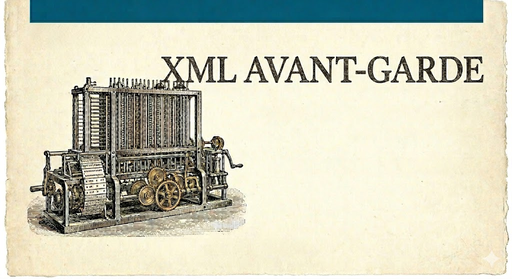

# XML Avant-Garde

**The manual for coming back to XML.**

📖 **Read it here → [vivainio.github.io/xml-avant-garde](https://vivainio.github.io/xml-avant-garde/)**



Hands-on, example-driven notes on the XML family of technologies, written for
someone *returning* to XML rather than meeting it for the first time. Every
concept comes with a small, complete example — no walls of prose before you see
real code.

It covers the core processing stack — **XSLT**, **XPath**, **XQuery**, **XSD** —
plus industry-specific applications built on top: **Schematron** rule validation
and the e-invoicing world of **UBL**, **EN16931**, and **Peppol**, then a tour
of real-world XML in the wild (SVG, SOAP, Office formats, and more).

This is a living book — it grows as I learn more. Topic suggestions are welcome
[in the issues](https://github.com/vivainio/xml-avant-garde/issues).

## Building locally

The site is built with [Zensical](https://zensical.org) and published to GitHub
Pages.

```sh
zensical serve          # live preview at http://localhost:8000
zensical build --clean  # static build into ./site
```

Content lives in [`docs/`](docs/); navigation is configured in
[`zensical.toml`](zensical.toml).
