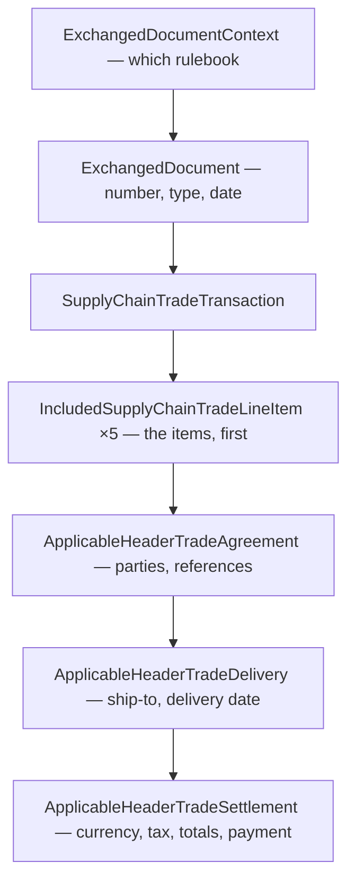

# A CII invoice in detail

The [previous page](cii-invoice.md) used a deliberately small invoice to show the
shape. This page does for [CII](cii-invoice.md) what
[A UBL invoice in detail](ubl-invoice-detail.md) does for UBL: it walks a full,
real example top to bottom — and, by a happy accident of the standards work, it is
**the very same business case**. The official CEN example is invoice `TOSL108`,
with the same five items (a laptop, two returns, a book, network cable) and the
same `1436.5` line total as the OASIS UBL example. Reading the two detail pages
together is the clearest possible way to feel the difference between the syntaxes.

!!! info "Source"
    The document is `CII_business_example_01.xml` from the CEN
    [eInvoicing-EN16931](https://github.com/ConnectingEurope/eInvoicing-EN16931)
    test corpus (EUPL-1.2). Unlike the raw OASIS UBL example, this one **is**
    EN16931-valid — it carries the specification identifier, uses the disciplined
    code lists, and its totals reconcile exactly (we check at the
    [end](#it-all-reconciles)). The currency is NOK and the rates are 25 % / 15 %,
    so the *amounts* differ from the UBL example even though the *items* match.

## The overall shape

A CII invoice is the [three-part spine](cii-invoice.md#the-three-part-spine):
context, document header, then the transaction — and inside the transaction, the
**lines come first**, followed by the three "Applicable…Trade…" blocks.



This is almost the **mirror image of UBL's order**: UBL puts parties and totals
*before* the lines; CII puts the lines first and the parties, tax and totals after.
Keep the [name-decoding rules](cii-invoice.md#decoding-the-names) handy — every
block below is built from the same qualifier vocabulary.

## Context and header

``` xml linenums="16"
<rsm:ExchangedDocumentContext>
  <ram:GuidelineSpecifiedDocumentContextParameter>
    <ram:ID>urn:cen.eu:en16931:2017</ram:ID>                         <!-- (1)! -->
  </ram:GuidelineSpecifiedDocumentContextParameter>
</rsm:ExchangedDocumentContext>
<rsm:ExchangedDocument>
  <ram:ID>TOSL108</ram:ID>                                          <!-- (2)! -->
  <ram:TypeCode>380</ram:TypeCode>                                  <!-- (3)! -->
  <ram:IssueDateTime>
    <udt:DateTimeString format="102">20130630</udt:DateTimeString>  <!-- (4)! -->
  </ram:IssueDateTime>
  <ram:IncludedNote>
    <ram:Content>Ordered in our booth at the convention</ram:Content>  <!-- (5)! -->
  </ram:IncludedNote>
</rsm:ExchangedDocument>
```

1.  **BT-24, the specification identifier** — `urn:cen.eu:en16931:2017`. *This is the
    difference from the raw UBL example*, which omitted it and so failed **BR-01** on
    the spot. Here it is present, so the document announces which rulebook it follows.
2.  **BT-1, invoice number** — `TOSL108`, the same number as the UBL example.
3.  **BT-3, type code** — `380`, commercial invoice (UNCL1001).
4.  **BT-2, issue date** — `20130630` read through `format="102"` (`CCYYMMDD`) =
    2013-06-30. Recall CII carries the date as a coded string, not ISO text.
5.  **A free-text note** — CII wraps notes in `IncludedNote/Content`, where UBL used
    a flat `cbc:Note`.

## The lines come first

In CII the items lead. Line 1 is the fully-loaded specimen; the other four reuse its
vocabulary with less decoration. Note how the **line repeats the document's
three-part spine** — it has its own *Agreement*, *Delivery* and *Settlement*.

``` xml linenums="32"
<ram:IncludedSupplyChainTradeLineItem>
  <ram:AssociatedDocumentLineDocument>
    <ram:LineID>1</ram:LineID>                                      <!-- (1)! -->
    <ram:IncludedNote><ram:Content>Scratch on box</ram:Content></ram:IncludedNote>
  </ram:AssociatedDocumentLineDocument>

  <ram:SpecifiedTradeProduct>                                       <!-- (2)! -->
    <ram:GlobalID schemeID="0088">1234567890128</ram:GlobalID>      <!-- (3)! -->
    <ram:SellerAssignedID>JB007</ram:SellerAssignedID>
    <ram:Name>Laptop computer</ram:Name>
    <ram:Description>Processor: Intel Core 2 Duo …</ram:Description>
    <ram:ApplicableProductCharacteristic>                           <!-- (4)! -->
      <ram:Description>Color</ram:Description><ram:Value>Black</ram:Value>
    </ram:ApplicableProductCharacteristic>
    <ram:DesignatedProductClassification>
      <ram:ClassCode listID="STI">65434568</ram:ClassCode>          <!-- (5)! -->
    </ram:DesignatedProductClassification>
    <ram:OriginTradeCountry><ram:ID>DE</ram:ID></ram:OriginTradeCountry>
  </ram:SpecifiedTradeProduct>

  <ram:SpecifiedLineTradeAgreement>
    <ram:BuyerOrderReferencedDocument>
      <ram:LineID>1</ram:LineID>                                    <!-- (6)! -->
    </ram:BuyerOrderReferencedDocument>
    <ram:GrossPriceProductTradePrice>                               <!-- (7)! -->
      <ram:ChargeAmount>1498</ram:ChargeAmount>
      <ram:BasisQuantity unitCode="NAR">1498</ram:BasisQuantity>
      <ram:AppliedTradeAllowanceCharge>
        <ram:ChargeIndicator><udt:Indicator>false</udt:Indicator></ram:ChargeIndicator>
        <ram:ActualAmount>225</ram:ActualAmount>
      </ram:AppliedTradeAllowanceCharge>
    </ram:GrossPriceProductTradePrice>
    <ram:NetPriceProductTradePrice>                                 <!-- (8)! -->
      <ram:ChargeAmount>1273</ram:ChargeAmount>
      <ram:BasisQuantity unitCode="NAR">1273</ram:BasisQuantity>
    </ram:NetPriceProductTradePrice>
  </ram:SpecifiedLineTradeAgreement>

  <ram:SpecifiedLineTradeDelivery>
    <ram:BilledQuantity unitCode="NAR">1</ram:BilledQuantity>       <!-- (9)! -->
  </ram:SpecifiedLineTradeDelivery>

  <ram:SpecifiedLineTradeSettlement>
    <ram:ApplicableTradeTax>                                        <!-- (10)! -->
      <ram:TypeCode>VAT</ram:TypeCode>
      <ram:CategoryCode>S</ram:CategoryCode>
      <ram:RateApplicablePercent>25</ram:RateApplicablePercent>
    </ram:ApplicableTradeTax>
    <ram:SpecifiedTradeAllowanceCharge>                             <!-- (11)! -->
      <ram:ChargeIndicator><udt:Indicator>false</udt:Indicator></ram:ChargeIndicator>
      <ram:ActualAmount>12</ram:ActualAmount><ram:Reason>Damage</ram:Reason>
    </ram:SpecifiedTradeAllowanceCharge>
    <ram:SpecifiedTradeAllowanceCharge>
      <ram:ChargeIndicator><udt:Indicator>true</udt:Indicator></ram:ChargeIndicator>
      <ram:ActualAmount>12</ram:ActualAmount><ram:Reason>Testing</ram:Reason>
    </ram:SpecifiedTradeAllowanceCharge>
    <ram:SpecifiedTradeSettlementLineMonetarySummation>
      <ram:LineTotalAmount>1273</ram:LineTotalAmount>               <!-- (12)! -->
    </ram:SpecifiedTradeSettlementLineMonetarySummation>
    <ram:ReceivableSpecifiedTradeAccountingAccount>
      <ram:ID>BookingCode001</ram:ID>                               <!-- (13)! -->
    </ram:ReceivableSpecifiedTradeAccountingAccount>
  </ram:SpecifiedLineTradeSettlement>
</ram:IncludedSupplyChainTradeLineItem>
```

1.  **`LineID`** — the line number (`1`), inside `AssociatedDocumentLineDocument` —
    the line's "header about itself", which also carries the line note.
2.  **`SpecifiedTradeProduct`** — *what* is sold, the equivalent of UBL's `cac:Item`.
3.  **`GlobalID` / `SellerAssignedID`** — a global product id (`schemeID="0088"` is
    GS1/GTIN) and the seller's own code. UBL split these into
    `StandardItemIdentification` and `SellersItemIdentification`.
4.  **`ApplicableProductCharacteristic`** — a name/value property ("Color: Black"),
    UBL's `AdditionalItemProperty`.
5.  **`DesignatedProductClassification`** — a taxonomy code (`listID="STI"`), UBL's
    `CommodityClassification`.
6.  **`BuyerOrderReferencedDocument/LineID`** — links the line back to a purchase-order
    line, like UBL's `OrderLineReference`.
7.  **Gross price → applied allowance.** CII models the price build-up *explicitly*:
    a `GrossPriceProductTradePrice` of 1498 with an `AppliedTradeAllowanceCharge`
    of 225 (`ChargeIndicator` false = an allowance)…
8.  **…→ Net price.** …yielding the `NetPriceProductTradePrice` of 1273
    (1498 − 225). UBL expressed the same discount with a `MultiplierFactorNumeric`;
    CII just states both prices.
9.  **`BilledQuantity`** with `unitCode="NAR"` (number of articles). Line net =
    net price × qty = 1273 × 1.
10. **Line-level `ApplicableTradeTax`** — the VAT *category and rate* for this line
    (`S`, 25 %), but **no amount** here; the cash VAT is summed at header level.
11. **Two line-level allowance/charges that cancel** — a 12 allowance ("Damage") and
    a 12 charge ("Testing"). Note the CII shape: `ChargeIndicator` is **wrapped** in
    `udt:Indicator`, not a bare boolean as in UBL.
12. **`LineTotalAmount`** (BT-131) — 1273. The line's own *MonetarySummation*.
13. **`ReceivableSpecifiedTradeAccountingAccount`** — a buyer booking code per line.

!!! warning "`ChargeIndicator` is wrapped, and decides everything"
    Just like UBL, CII uses **one** element — `SpecifiedTradeAllowanceCharge` — for
    both discounts and surcharges, and the boolean inside `ChargeIndicator` is the
    only thing that tells them apart (`true` = charge, `false` = allowance). The CII
    twist is the extra `udt:Indicator` wrapper:
    `<ram:ChargeIndicator><udt:Indicator>true</udt:Indicator></ram:ChargeIndicator>`.

The other four lines, in brief — the same five items as the UBL example:

| Line | Item | Qty | Net amount | VAT cat |
| --- | --- | ---: | ---: | --- |
| 1 | Laptop computer | 1 | 1273.00 | S (25 %) |
| 2 | Returned "Advanced computing" book | **−1** | **−3.96** | S (15 %) |
| 3 | "Computing for dummies" book | 2 | 4.96 | S (15 %) |
| 4 | Returned IBM 5150 desktop | **−1** | **−25.00** | E (exempt) |
| 5 | Network cable | 250 (MTR) | 187.50 | S (25 %) |

!!! note "Negative lines are credits in place"
    Lines 2 and 4 carry a negative `BilledQuantity` and `LineTotalAmount` — returns
    folded into the invoice. As in UBL, the arithmetic simply goes negative and flows
    into the totals.

## ApplicableHeaderTradeAgreement — parties and references

After the lines comes the first header block: *who*, and *on what paperwork*.

### Seller — the full party anatomy

``` xml linenums="287"
<ram:SellerTradeParty>
  <ram:GlobalID schemeID="0088">1238764941386</ram:GlobalID>       <!-- (1)! -->
  <ram:Name>Salescompany ltd.</ram:Name>
  <ram:SpecifiedLegalOrganization>
    <ram:ID>123456789</ram:ID>                                     <!-- (2)! -->
  </ram:SpecifiedLegalOrganization>
  <ram:DefinedTradeContact>                                        <!-- (3)! -->
    <ram:PersonName>Antonio Salesmacher</ram:PersonName>
    <ram:TelephoneUniversalCommunication><ram:CompleteNumber>46211230</ram:CompleteNumber></ram:TelephoneUniversalCommunication>
    <ram:EmailURIUniversalCommunication><ram:URIID>antonio@salescompany.no</ram:URIID></ram:EmailURIUniversalCommunication>
  </ram:DefinedTradeContact>
  <ram:PostalTradeAddress>                                         <!-- (4)! -->
    <ram:PostcodeCode>303</ram:PostcodeCode>
    <ram:LineOne>Main street 34</ram:LineOne>
    <ram:CityName>Big city</ram:CityName>
    <ram:CountryID>NO</ram:CountryID>
  </ram:PostalTradeAddress>
  <ram:SpecifiedTaxRegistration>
    <ram:ID schemeID="VA">NO123456789MVA</ram:ID>                  <!-- (5)! -->
  </ram:SpecifiedTaxRegistration>
</ram:SellerTradeParty>
```

1.  **`GlobalID`** (`schemeID="0088"` = GLN) — the party's global identifier, the
    rough equivalent of UBL's `EndpointID`/`PartyIdentification`.
2.  **`SpecifiedLegalOrganization/ID`** — the legal registration number; CII's answer
    to UBL's `PartyLegalEntity`.
3.  **`DefinedTradeContact`** — contact person, phone, email, all wrapped in CII's
    `…UniversalCommunication` elements.
4.  **`PostalTradeAddress`** — structured address; the country is an ISO code in
    `CountryID`, not free text.
5.  **`SpecifiedTaxRegistration`** with `schemeID="VA"` — the VAT number. UBL put this
    in `PartyTaxScheme`.

!!! tip "One shape, reused everywhere"
    `…TradeParty` is one reusable structure — seller, buyer, ship-to, payee and tax
    representative all draw from it. Learn it once here; the rest read instantly.
    This is exactly the role `cac:Party` plays in UBL.

### Buyer and a third role — the tax representative

The buyer (`ram:BuyerTradeParty`) has the identical structure with different data.
Then a *third* party appears — and it is a different role than UBL's example chose:

``` xml linenums="345"
<ram:SellerTaxRepresentativeTradeParty>                            <!-- (1)! -->
  <ram:Name>Tax handling company AS</ram:Name>
  <ram:PostalTradeAddress>…Newtown, NO…</ram:PostalTradeAddress>
  <ram:SpecifiedTaxRegistration><ram:ID schemeID="VA">NO967611265MVA</ram:ID></ram:SpecifiedTaxRegistration>
</ram:SellerTaxRepresentativeTradeParty>
```

1.  **`SellerTaxRepresentativeTradeParty`** — a fiscal representative who handles VAT
    on the seller's behalf (common when a seller is registered for VAT abroad). It is
    the same "roles are modelled separately" idea as UBL's `PayeeParty` — different
    role, same principle. (This invoice *also* carries a payee, in the settlement
    block below.)

Then the document references — order, contract, and an attachment carried **by
value**:

``` xml linenums="360"
<ram:BuyerOrderReferencedDocument><ram:IssuerAssignedID>123</ram:IssuerAssignedID></ram:BuyerOrderReferencedDocument>
<ram:ContractReferencedDocument><ram:IssuerAssignedID>Contract321</ram:IssuerAssignedID></ram:ContractReferencedDocument>
<ram:AdditionalReferencedDocument>
  <ram:IssuerAssignedID>Doc1</ram:IssuerAssignedID>
  <ram:URIID>http://www.suppliersite.eu/sheet001.html</ram:URIID>      <!-- (1)! -->
  <ram:TypeCode>916</ram:TypeCode>
  <ram:Name>Timesheet</ram:Name>
  <ram:AttachmentBinaryObject mimeCode="application/pdf" filename="EHF.pdf"  <!-- (2)! -->
    >SlZCRVJpMHhMalVOQ2lVTkNqR…(base64)…</ram:AttachmentBinaryObject>
</ram:AdditionalReferencedDocument>
```

1.  **By reference** — a `URIID` pointing at a hosted file.
2.  **By value** — the file itself, **Base64** in `AttachmentBinaryObject`, with
    `mimeCode` and `filename`. The same two attachment modes UBL offered, under
    different names.

## ApplicableHeaderTradeDelivery — where the goods went

``` xml linenums="377"
<ram:ApplicableHeaderTradeDelivery>
  <ram:ShipToTradeParty>                                           <!-- (1)! -->
    <ram:GlobalID schemeID="0088">6754238987643</ram:GlobalID>
    <ram:PostalTradeAddress>…Deliverystreet 2, DeliveryCity, NO…</ram:PostalTradeAddress>
  </ram:ShipToTradeParty>
  <ram:ActualDeliverySupplyChainEvent>                             <!-- (2)! -->
    <ram:OccurrenceDateTime>
      <udt:DateTimeString format="102">20130615</udt:DateTimeString>
    </ram:OccurrenceDateTime>
  </ram:ActualDeliverySupplyChainEvent>
</ram:ApplicableHeaderTradeDelivery>
```

1.  **`ShipToTradeParty`** — the delivery location, separate from the buyer's billing
    identity (UBL's `Delivery/DeliveryLocation`).
2.  **`ActualDeliverySupplyChainEvent`** — *when* delivery happened (2013-06-15).
    Note the "SupplyChainEvent" naming: a delivery is one event in the
    [supply-chain](cii-invoice.md#decoding-the-names) the vocabulary models.

## ApplicableHeaderTradeSettlement — money

The richest block: currency, payee, payment means, the VAT breakdown, document-level
allowances/charges, terms, and the grand totals.

``` xml linenums="389"
<ram:PaymentReference>0003434323213231</ram:PaymentReference>
<ram:InvoiceCurrencyCode>NOK</ram:InvoiceCurrencyCode>            <!-- (1)! -->
<ram:PayeeTradeParty>                                             <!-- (2)! -->
  <ram:ID>2298740918237</ram:ID>
  <ram:Name>Ebeneser Scrooge AS</ram:Name>
  <ram:SpecifiedLegalOrganization><ram:ID>989823401</ram:ID></ram:SpecifiedLegalOrganization>
</ram:PayeeTradeParty>
<ram:SpecifiedTradeSettlementPaymentMeans>                        <!-- (3)! -->
  <ram:TypeCode>30</ram:TypeCode>
  <ram:PayeePartyCreditorFinancialAccount><ram:IBANID>NO9386011117947</ram:IBANID></ram:PayeePartyCreditorFinancialAccount>
  <ram:PayeeSpecifiedCreditorFinancialInstitution><ram:BICID>DNBANOKK</ram:BICID></ram:PayeeSpecifiedCreditorFinancialInstitution>
</ram:SpecifiedTradeSettlementPaymentMeans>
```

1.  **BT-5, currency** — `NOK`.
2.  **`PayeeTradeParty`** — the party to be *paid* when it differs from the seller
    (here "Ebeneser Scrooge AS") — the direct equivalent of UBL's `PayeeParty`.
3.  **`SpecifiedTradeSettlementPaymentMeans`** — how to pay. `TypeCode` `30` (UNCL4461)
    = credit transfer; IBAN under `PayeePartyCreditorFinancialAccount`, BIC under the
    creditor financial institution.

### The VAT breakdown — one group per category

``` xml linenums="411"
<ram:ApplicableTradeTax>
  <ram:CalculatedAmount>365.13</ram:CalculatedAmount>             <!-- (1)! -->
  <ram:TypeCode>VAT</ram:TypeCode>
  <ram:BasisAmount>1460.5</ram:BasisAmount>
  <ram:CategoryCode>S</ram:CategoryCode>
  <ram:RateApplicablePercent>25</ram:RateApplicablePercent>
</ram:ApplicableTradeTax>
<ram:ApplicableTradeTax>… S, 15%, basis 1 → 0.15 …</ram:ApplicableTradeTax>
<ram:ApplicableTradeTax>
  <ram:CalculatedAmount>0</ram:CalculatedAmount>
  <ram:TypeCode>VAT</ram:TypeCode>
  <ram:ExemptionReason>Exempt New Means of Transport</ram:ExemptionReason>  <!-- (2)! -->
  <ram:BasisAmount>-25</ram:BasisAmount>
  <ram:CategoryCode>E</ram:CategoryCode>
  <ram:RateApplicablePercent>0</ram:RateApplicablePercent>
</ram:ApplicableTradeTax>
```

1.  **Category `S` at 25 %** — a taxable `BasisAmount` of 1460.5 → `CalculatedAmount`
    365.13. This is the **header** VAT total per category — the cash amounts the
    lines deliberately omitted.
2.  **Category `E` (exempt)** carries an **`ExemptionReason`** — exempt lines must say
    *why*. A grammar cannot enforce that; [Schematron](../schematron/index.md) does.

| Category | Rate | Taxable base | VAT |
| --- | --- | ---: | ---: |
| Standard | `S` | 1460.5 | 365.13 |
| Standard | `S` | 1.0 | 0.15 |
| Exempt | `E` | −25.0 | 0.00 |
| **Total** | | **1436.5** | **365.28** |

### Document-level allowances, terms, and the totals

``` xml linenums="440"
<ram:SpecifiedTradeAllowanceCharge>                               <!-- (1)! -->
  <ram:ChargeIndicator><udt:Indicator>false</udt:Indicator></ram:ChargeIndicator>
  <ram:ActualAmount>100</ram:ActualAmount>
  <ram:ReasonCode>95</ram:ReasonCode><ram:Reason>Promotion discount</ram:Reason>
  <ram:CategoryTradeTax>                                          <!-- (2)! -->
    <ram:TypeCode>VAT</ram:TypeCode><ram:CategoryCode>S</ram:CategoryCode>
    <ram:RateApplicablePercent>25</ram:RateApplicablePercent>
  </ram:CategoryTradeTax>
</ram:SpecifiedTradeAllowanceCharge>
<ram:SpecifiedTradeAllowanceCharge>… charge (true), 100, "Freight", S 25% …</ram:SpecifiedTradeAllowanceCharge>

<ram:SpecifiedTradePaymentTerms>
  <ram:Description>2 % discount if paid within 2 days …</ram:Description>
  <ram:DueDateDateTime><udt:DateTimeString format="102">20130720</udt:DateTimeString></ram:DueDateDateTime>  <!-- (3)! -->
</ram:SpecifiedTradePaymentTerms>

<ram:SpecifiedTradeSettlementHeaderMonetarySummation>            <!-- (4)! -->
  <ram:LineTotalAmount>1436.5</ram:LineTotalAmount>
  <ram:ChargeTotalAmount>100</ram:ChargeTotalAmount>
  <ram:AllowanceTotalAmount>100</ram:AllowanceTotalAmount>
  <ram:TaxBasisTotalAmount>1436.5</ram:TaxBasisTotalAmount>
  <ram:TaxTotalAmount currencyID="NOK">365.28</ram:TaxTotalAmount>
  <ram:GrandTotalAmount>1801.78</ram:GrandTotalAmount>
  <ram:TotalPrepaidAmount>1000</ram:TotalPrepaidAmount>
  <ram:DuePayableAmount>801.78</ram:DuePayableAmount>
</ram:SpecifiedTradeSettlementHeaderMonetarySummation>
```

1.  **Document-level allowance/charge** — a 100 allowance ("Promotion discount") and a
    100 charge ("Freight"); same wrapped `ChargeIndicator` as the line level.
2.  **`CategoryTradeTax`** — crucially, each document allowance/charge **names the VAT
    category it belongs to** (S, 25 %), so it folds into the right tax base. The
    allowance and charge here are both standard-rate and cancel, which is why the tax
    base equals the line total.
3.  **`DueDateDateTime`** — the payment deadline (2013-07-20), with the human terms in
    `Description`.
4.  **The grand totals block** (BG-22) — every amount a distinct concept, exactly
    paralleling UBL's `LegalMonetaryTotal`:

| CII element | Means | Value |
| --- | --- | ---: |
| `LineTotalAmount` | Σ line nets (BT-106) | 1436.5 |
| `AllowanceTotalAmount` / `ChargeTotalAmount` | doc-level sums | 100 / 100 |
| `TaxBasisTotalAmount` | net VAT is calculated on | 1436.5 |
| `TaxTotalAmount` | total VAT | 365.28 |
| `GrandTotalAmount` | net + VAT | 1801.78 |
| `TotalPrepaidAmount` | already paid | 1000 |
| `DuePayableAmount` | the bottom line | **801.78** |

## It all reconciles

As with the UBL example, the numbers are consistent top to bottom — and these
cross-totals are exactly what the
[EN16931 Schematron](../schematron/abstract-patterns-en16931.md) checks.

**Lines sum to the document line total** (BR-CO-10):

<div class="xslt-result" markdown>
1273.00 + (−3.96) + 4.96 + (−25.00) + 187.50 = **1436.5**
= `…HeaderMonetarySummation/LineTotalAmount` ✓
</div>

**Each VAT category's base is the sum of its lines** (the doc allowance/charge cancel):

| Category | Lines | Σ line net | = `BasisAmount` |
| --- | --- | ---: | ---: |
| S (25 %) | 1, 5 | 1273 + 187.5 | **1460.5** ✓ |
| S (15 %) | 2, 3 | −3.96 + 4.96 | **1.0** ✓ |
| E (0 %) | 4 | −25 | **−25.0** ✓ |

**And the chain to the bottom line:**

<div class="xslt-result" markdown>
Grand = TaxBasis 1436.5 + VAT 365.28 = **1801.78**
Due = Grand 1801.78 − Prepaid 1000 = **801.78** ✓
</div>

## How it compares to the UBL example

Same business case, two syntaxes — the differences are instructive:

| | OASIS UBL example | This CEN CII example |
| --- | --- | --- |
| EN16931-valid? | **No** — no `CustomizationID` (fails BR-01) | **Yes** — carries the spec identifier |
| Order of content | parties & totals, then lines | **lines first**, then parties & totals |
| Leaf vs container | `cbc` vs `cac` namespace | encoded in the **name**, all `ram:` |
| Price discount | `MultiplierFactorNumeric` on the price | explicit **gross → net** price pair |
| `ChargeIndicator` | bare boolean | wrapped in `udt:Indicator` |
| Third party shown | `PayeeParty` | `SellerTaxRepresentativeTradeParty` (+ a payee) |
| Date format | ISO text `2013-06-30` | coded `20130630` + `format="102"` |

Neither is "better" — and a receiver must accept **both**. That is the whole reason
EN16931 keeps its [rules syntax-neutral](../schematron/abstract-patterns-en16931.md),
binding one abstract rulebook to UBL and to CII alike.

## Where next

You have now walked complete invoices in *both* EN16931 syntaxes. To see what
*enforces* the consistency you just verified by hand, go to
[The validation pipeline](validation-pipeline.md); for the lists behind every coded
field, [Genericode code lists](genericode-codelists.md); and for any unfamiliar
term, the [Glossary](glossary.md).
