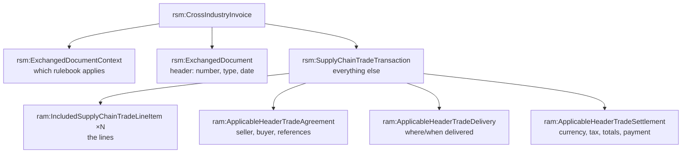

# Anatomy of a CII invoice

**CII** — UN/CEFACT's *Cross Industry Invoice* — is the second of the two XML
syntaxes that can carry an [EN16931](index.md) invoice (the other is
[UBL](ubl-invoice.md)). It is the syntax embedded inside
**[Factur-X / ZUGFeRD](../realworld/facturx-zugferd.md)** hybrid PDF invoices, central
to France's and Germany's e-invoicing mandates. A CII invoice is a single XML
document rooted at
`<rsm:CrossIndustryInvoice>`.

This page walks **the same small invoice** as the [UBL anatomy](ubl-invoice.md) —
identical parties, items and amounts — so you can read the two syntaxes
side by side. The *business terms* are the same; only the elements differ.

## Three namespaces

Where UBL splits leaves (`cbc`) from containers (`cac`), CII splits by **role in
the standard**, and you will see these prefixes everywhere:

| Prefix | Namespace ends in… | Holds |
| --- | --- | --- |
| `rsm` | `…CrossIndustryInvoice:100` | the **message** structure — the root and its three top-level parts |
| `ram` | `…ReusableAggregateBusinessInformationEntity:100` | almost everything — both **aggregates** and **leaf** business fields |
| `udt` | `…UnqualifiedDataType:100` | low-level **typed values** — date strings, ID/amount wrappers |

The mental model is different from UBL's. CII does **not** distinguish leaf from
container by namespace — `ram:` is used for both `ram:SellerTradeParty` (a group)
and `ram:Name` (a value). What CII *does* impose instead is a strict **three-part
spine**, described next.

## The three-part spine

Every CII invoice has exactly three children under the root, in this order:



The last part, `SupplyChainTradeTransaction`, carries the lines first and then
**three "Applicable…Trade…" blocks**: *Agreement* (who, and on what terms),
*Delivery* (where the goods went), and *Settlement* (money — currency, VAT, and the
totals). Almost everything you look for lives in one of those three.

## A complete invoice

``` xml title="invoice-cii.xml" linenums="1"
<?xml version="1.0" encoding="UTF-8"?>
<rsm:CrossIndustryInvoice
    xmlns:rsm="urn:un:unece:uncefact:data:standard:CrossIndustryInvoice:100"
    xmlns:ram="urn:un:unece:uncefact:data:standard:ReusableAggregateBusinessInformationEntity:100"
    xmlns:udt="urn:un:unece:uncefact:data:standard:UnqualifiedDataType:100">

  <rsm:ExchangedDocumentContext>                                       <!-- (1)! -->
    <ram:GuidelineSpecifiedDocumentContextParameter>
      <ram:ID>urn:cen.eu:en16931:2017</ram:ID>
    </ram:GuidelineSpecifiedDocumentContextParameter>
  </rsm:ExchangedDocumentContext>

  <rsm:ExchangedDocument>                                              <!-- (2)! -->
    <ram:ID>INV-001</ram:ID>
    <ram:TypeCode>380</ram:TypeCode>                                   <!-- (3)! -->
    <ram:IssueDateTime>
      <udt:DateTimeString format="102">20260620</udt:DateTimeString>   <!-- (4)! -->
    </ram:IssueDateTime>
  </rsm:ExchangedDocument>

  <rsm:SupplyChainTradeTransaction>

    <ram:IncludedSupplyChainTradeLineItem>                             <!-- (5)! -->
      <ram:AssociatedDocumentLineDocument>
        <ram:LineID>1</ram:LineID>
      </ram:AssociatedDocumentLineDocument>
      <ram:SpecifiedTradeProduct>
        <ram:Name>Empire Burlesque (CD)</ram:Name>
      </ram:SpecifiedTradeProduct>
      <ram:SpecifiedLineTradeAgreement>
        <ram:NetPriceProductTradePrice>
          <ram:ChargeAmount>10.90</ram:ChargeAmount>                   <!-- (6)! -->
        </ram:NetPriceProductTradePrice>
      </ram:SpecifiedLineTradeAgreement>
      <ram:SpecifiedLineTradeDelivery>
        <ram:BilledQuantity unitCode="C62">2</ram:BilledQuantity>      <!-- (7)! -->
      </ram:SpecifiedLineTradeDelivery>
      <ram:SpecifiedLineTradeSettlement>
        <ram:SpecifiedTradeSettlementLineMonetarySummation>
          <ram:LineTotalAmount>21.80</ram:LineTotalAmount>            <!-- (8)! -->
        </ram:SpecifiedTradeSettlementLineMonetarySummation>
      </ram:SpecifiedLineTradeSettlement>
    </ram:IncludedSupplyChainTradeLineItem>

    <ram:ApplicableHeaderTradeAgreement>                               <!-- (9)! -->
      <ram:SellerTradeParty>
        <ram:Name>Northwind Traders Oy</ram:Name>
        <ram:PostalTradeAddress>
          <ram:CityName>Tampere</ram:CityName>
          <ram:CountryID>FI</ram:CountryID>
        </ram:PostalTradeAddress>
      </ram:SellerTradeParty>
      <ram:BuyerTradeParty>
        <ram:Name>Contoso Wholesale AB</ram:Name>
      </ram:BuyerTradeParty>
    </ram:ApplicableHeaderTradeAgreement>

    <ram:ApplicableHeaderTradeDelivery/>                               <!-- (10)! -->

    <ram:ApplicableHeaderTradeSettlement>                              <!-- (11)! -->
      <ram:InvoiceCurrencyCode>EUR</ram:InvoiceCurrencyCode>
      <ram:ApplicableTradeTax>                                         <!-- (12)! -->
        <ram:CalculatedAmount>5.45</ram:CalculatedAmount>
        <ram:TypeCode>VAT</ram:TypeCode>
        <ram:BasisAmount>21.80</ram:BasisAmount>
        <ram:CategoryCode>S</ram:CategoryCode>
        <ram:RateApplicablePercent>25</ram:RateApplicablePercent>
      </ram:ApplicableTradeTax>
      <ram:SpecifiedTradeSettlementHeaderMonetarySummation>            <!-- (13)! -->
        <ram:LineTotalAmount>21.80</ram:LineTotalAmount>
        <ram:TaxBasisTotalAmount>21.80</ram:TaxBasisTotalAmount>
        <ram:TaxTotalAmount currencyID="EUR">5.45</ram:TaxTotalAmount>
        <ram:GrandTotalAmount>27.25</ram:GrandTotalAmount>
        <ram:DuePayableAmount>27.25</ram:DuePayableAmount>
      </ram:SpecifiedTradeSettlementHeaderMonetarySummation>
    </ram:ApplicableHeaderTradeSettlement>

  </rsm:SupplyChainTradeTransaction>
</rsm:CrossIndustryInvoice>
```

1.  **BT-24, Specification identifier** — the same field as UBL's
    `cbc:CustomizationID`, but reached via a much deeper path:
    `ExchangedDocumentContext / GuidelineSpecifiedDocumentContextParameter / ID`.
    This is the field rule **BR-01** checks, and the
    [abstract Schematron pattern](../schematron/abstract-patterns-en16931.md) binds
    its `$BT-24` parameter to exactly this path.
2.  **`ExchangedDocument`** — the document header. `ram:ID` is **BT-1**, the invoice
    number.
3.  **BT-3, Invoice type code** — `380` ("commercial invoice"), the same UNCL1001
    value as UBL.
4.  **BT-2, Issue date.** Note the CII twist: the date is a child
    `udt:DateTimeString` with **`format="102"`**, meaning `CCYYMMDD` — so
    `20260620` is 2026-06-20. The date format is a coded attribute, not the ISO
    text UBL uses.
5.  **BG-25, an invoice line.** In CII the lines come *first* inside the
    transaction, before the header blocks — the reverse of UBL's order.
6.  **BT-146, item net price** — the unit price, inside the line's *Agreement*.
7.  **BT-129, billed quantity** with `unitCode="C62"` (one/piece), inside the
    line's *Delivery*.
8.  **BT-131, line net amount** — `2 × 10.90 = 21.80`, inside the line's
    *Settlement*. Notice the line itself has the same three-part Agreement /
    Delivery / Settlement spine as the whole document.
9.  **BG-4 Seller and BG-7 Buyer**, both inside `ApplicableHeaderTradeAgreement`.
    The party shape (`Name`, `PostalTradeAddress`, `CountryID`) parallels UBL's
    `cac:Party`.
10. **`ApplicableHeaderTradeDelivery`** — present but empty here. CII often requires
    the element even when there is nothing to say; the schema fixes the order and
    presence of these three blocks.
11. **`ApplicableHeaderTradeSettlement`** — currency (**BT-5**), the tax breakdown,
    and the totals.
12. **BG-23, a VAT breakdown group** — one per category. `CategoryCode` `S`
    (standard), 25 %, on a basis of 21.80 → 5.45 tax.
13. **BG-22, the document totals** — the amounts rule **BR-CO-10** and friends tie
    together. `GrandTotalAmount` 27.25 = net 21.80 + VAT 5.45.

## Business terms vs elements

EN16931 defines a syntax-neutral **semantic model**: numbered *business terms* (BT)
and *business groups* (BG). The CII *binding* maps those numbers to `rsm:`/`ram:`
elements — the same numbers UBL maps to `cbc:`/`cac:`:

| EN16931 | Means | CII element (relative path) |
| --- | --- | --- |
| BT-24 | Specification identifier | `…ExchangedDocumentContext/…ContextParameter/ram:ID` |
| BT-1 | Invoice number | `rsm:ExchangedDocument/ram:ID` |
| BT-2 | Issue date | `…/ram:IssueDateTime/udt:DateTimeString` |
| BT-3 | Invoice type code | `rsm:ExchangedDocument/ram:TypeCode` |
| BT-5 | Currency | `…Settlement/ram:InvoiceCurrencyCode` |
| BG-4 | Seller | `…Agreement/ram:SellerTradeParty` |
| BG-25 | Invoice line | `ram:IncludedSupplyChainTradeLineItem` |
| BT-131 | Line net amount | `…LineMonetarySummation/ram:LineTotalAmount` |
| BT-106 | Sum of line net amounts | `…HeaderMonetarySummation/ram:LineTotalAmount` |

!!! note "The same model, a different syntax"
    Compare this table with the [UBL one](ubl-invoice.md#business-terms-vs-elements):
    BT-1 is `cbc:ID` in UBL and `rsm:ExchangedDocument/ram:ID` in CII — the
    *business term is identical*, only the binding differs. This is exactly why
    EN16931's Schematron is written as one
    [abstract pattern bound twice](../schematron/abstract-patterns-en16931.md) —
    one rulebook, two syntaxes.

## Decoding the names

CII's element names are long and repetitive — `SpecifiedTradeSettlementHeaderMonetarySummation`
is not unusual. They look intimidating, but they are **systematic**: every name is
built from a small vocabulary of qualifier words, so once you learn the pieces the
names parse themselves.

### Why the names are built this way

UN/CEFACT designs its vocabularies with **CCTS** — the *Core Component Technical
Specification*. Every element is a **Business Information Entity (BIE)** whose name
is mechanically composed as *Object · Property · Representation*. That is why the
names are verbose and why the *same* concept keeps its full name everywhere it
appears — there is no short alias. Three BIE kinds map directly onto what you see:

| CCTS kind | What it is | Example here |
| --- | --- | --- |
| **ABIE** (aggregate) | a group of other entities | `ram:SellerTradeParty` |
| **ASBIE** (association) | a group that *links to* another aggregate | `ram:ApplicableHeaderTradeAgreement` |
| **BBIE** (basic) | a single typed value | `ram:LineTotalAmount` |

This is the deeper reason CII does not colour-code leaf vs container by namespace
the way UBL does with `cbc`/`cac`: the distinction is encoded in the *name's*
structure instead, and all three kinds share the `ram:` namespace.

### The qualifier vocabulary

The recurring leading words are **context qualifiers** — they say *how* the thing is
attached, and they are the main thing to learn:

| Word | Meaning | Seen in |
| --- | --- | --- |
| **Exchanged** | belongs to the document being exchanged (the message) | `ExchangedDocument`, `ExchangedDocumentContext` |
| **Included** | a child contained in its parent | `IncludedSupplyChainTradeLineItem` (lines inside the transaction) |
| **Specified** | a concrete instance filled in for *this* document | `SpecifiedTradeProduct`, `SpecifiedLineTradeAgreement` |
| **Applicable** | a rule/context that *applies to* the parent | `ApplicableHeaderTradeAgreement`, `ApplicableTradeTax` |
| **Associated** | linked metadata about the parent | `AssociatedDocumentLineDocument` |
| **Header** vs **Line** | scope: whole-document vs one line | `…HeaderMonetarySummation` vs `…LineMonetarySummation` |

### The `Trade*` family

`Trade` marks the business-of-trading domain. The nouns after it name the thing:

| Name | Is | EN16931 sense |
| --- | --- | --- |
| `…SupplyChainTradeTransaction` | the whole trade | the body of the invoice |
| `…TradeParty` | a participant | seller / buyer (BG-4 / BG-7) |
| `…TradeAgreement` | the *terms* agreed | prices, references, order |
| `…TradeDelivery` | the *movement* of goods | where/when delivered |
| `…TradeSettlement` | the *money* | currency, tax, totals, payment |
| `…TradeProduct` | the item sold | the product (BG-31) |
| `…TradePrice` | a price | net/gross unit price |
| `…TradeTax` | a tax | a VAT breakdown line |
| `…MonetarySummation` | a totals block | summed amounts (a "summation") |

!!! note "Why an invoice talks about the \"supply chain\""
    `SupplyChainTradeTransaction` and `IncludedSupplyChainTradeLineItem` surprise
    people: this is an *invoice*, what is the supply chain doing here? The answer is
    that CII's vocabulary is **not invoice-specific**. It is one member of a family
    of UN/CEFACT *Cross Industry* documents — Cross Industry Order, Despatch Advice,
    Remittance Advice, and the Invoice — that all describe the **same trade as it
    moves along a supply chain**, reusing one shared set of `ram:` components. So
    `SupplyChainTradeTransaction` means "the trade transaction within a supply
    chain", and a line is an `IncludedSupplyChainTradeLineItem` — a line *in* that
    transaction. The name is generic on purpose: the *same* element does duty in an
    order and a despatch advice, not just the invoice. (UBL, designed
    invoice-first, simply calls it `InvoiceLine`.)

Read in those pieces, the scary names decompose cleanly. For example:

<div class="xslt-result" markdown>
`SpecifiedTradeSettlementHeaderMonetarySummation`
= **Specified** (this document's) · **Trade Settlement** (the money side) ·
**Header** (document-level, not per-line) · **Monetary Summation** (a totals block)

→ "the document-level totals block" — i.e. UBL's `cac:LegalMonetaryTotal`.
</div>

### `udt` vs `qdt` — the datatype layer

Both namespaces hold the low-level wrappers that carry a typed value plus its
metadata attributes:

- **`udt`** — *Unqualified Data Type*: the raw CCTS primitives. `udt:DateTimeString`
  with its `format` attribute (`102` = `CCYYMMDD`) is the one you meet constantly;
  amount and ID wrappers live here too.
- **`qdt`** — *Qualified Data Type*: a `udt` type **restricted** for invoicing —
  e.g. a code list narrowed to the allowed values. You will not always see `qdt` in
  a minimal invoice, but it appears in the schemas.

!!! tip "Don't memorise the names — parse them"
    You never need to recall `SpecifiedLineTradeDelivery` from scratch. Build it:
    a *line*'s (`Line`) *delivery* (`TradeDelivery`) *as filled in here*
    (`Specified`). Every CII name yields to that decomposition.

## UBL and CII, side by side

The two syntaxes carry the same four header fields completely differently:

| Field | UBL | CII |
| --- | --- | --- |
| Invoice number | `cbc:ID` | `rsm:ExchangedDocument/ram:ID` |
| Issue date | `cbc:IssueDate` (`2026-06-20`) | `udt:DateTimeString format="102"` (`20260620`) |
| Currency | `cbc:DocumentCurrencyCode` | `ram:InvoiceCurrencyCode` |
| Seller name | `cac:…Party/cac:PartyName/cbc:Name` | `ram:SellerTradeParty/ram:Name` |

CII's paths are **longer and more deeply nested** (the line net amount sits five
elements deep), and it leans on a fixed structural spine rather than UBL's
`cbc`/`cac` colour-coding. Neither is "better"; receivers must accept both, which
is the whole reason EN16931 keeps the rules syntax-neutral.

## Reading the invoice with XPath

Because it is just XML, every [XPath](../xpath/index.md) technique applies — you
just bind the `rsm`/`ram` prefixes first. The totals rule BR-CO-10 — *document line
total equals the sum of the lines* — reads:

``` xml
sum(//ram:IncludedSupplyChainTradeLineItem
      /ram:SpecifiedLineTradeSettlement
      /ram:SpecifiedTradeSettlementLineMonetarySummation/ram:LineTotalAmount)
  = //ram:SpecifiedTradeSettlementHeaderMonetarySummation/ram:LineTotalAmount
```

And a human-readable summary is ordinary [XSLT](../xslt/index.md):

``` xml
<xsl:value-of select="rsm:ExchangedDocument/ram:ID"/> —
<xsl:value-of select="//ram:BuyerTradeParty/ram:Name"/>:
<xsl:value-of select="//ram:DuePayableAmount"/>
<xsl:value-of select="//ram:InvoiceCurrencyCode"/>
```

<div class="xslt-result" markdown>
INV-001 — Contoso Wholesale AB: 27.25 EUR
</div>

The output is identical to the [UBL version](ubl-invoice.md#reading-the-invoice-with-xpath) —
same invoice, same answer, different paths.

## Next

To see this vocabulary stretched across a full, real document, continue to
[A CII invoice in detail](cii-invoice-detail.md) — the verbatim CEN EN16931
example (the same `TOSL108` business case as the UBL walkthrough) taken apart block
by block. Or jump to [The validation pipeline](validation-pipeline.md) — the layered
checks every invoice runs through, regardless of whether it arrived as UBL or CII.
