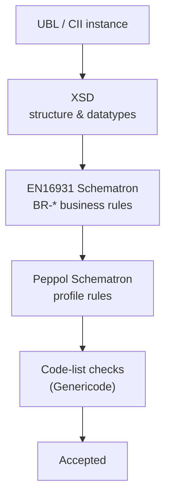

# Real-world e-invoicing

The earlier sections teach the XML technologies one at a time: [XSD](../xsd/index.md)
for structure, [Schematron](../schematron/index.md) for business rules,
[XPath](../xpath/index.md) and [XSLT](../xslt/index.md) underneath both. This
section is where they meet a real problem — **European electronic invoicing** —
and stop being abstract.

Almost every example in this site has quietly used the same domain: a UBL invoice,
the EN16931 rule BR-01, a currency code. That is not a coincidence. E-invoicing is
the canonical modern XML application: a public semantic standard, two XML syntaxes,
a layered validation stack, and shared code lists — exactly the four technologies
this site covers, assembled into one pipeline.

!!! tip "Drowning in acronyms?"
    EN16931, UBL, CIUS, Peppol BIS… this domain is dense with them. The
    [Glossary](glossary.md) defines every term on these pages in plain language —
    keep it open in a tab.

## The cast

| Thing | What it is | Built on |
| --- | --- | --- |
| **EN16931** | The European *semantic* standard — the data model and business rules for a core invoice | the concepts; syntax-neutral |
| **UBL** | One XML *syntax* that carries an EN16931 invoice (OASIS) | [XSD](../xsd/index.md) |
| **CII** | The other XML syntax (UN/CEFACT Cross Industry Invoice) | [XSD](../xsd/index.md) |
| **Schematron rules** | The EN16931 business rules (BR-*) as runnable assertions | [Schematron](../schematron/index.md) → [XSLT](../xslt/index.md) |
| **Genericode** | The code lists (currency, country, VAT category…) as data | XML |
| **Peppol BIS** | A *profile* that narrows EN16931 for cross-border exchange | a CIUS of EN16931 |

## How the layers stack

A document is not "valid" or "invalid" against a single thing — it passes through
a **stack**, and each layer catches what the layer below cannot.

## The pages

1. [Anatomy of a UBL invoice](ubl-invoice.md) — walk a small invoice: namespaces,
   `cbc`/`cac`, and how EN16931's BT-/BG- business terms map onto the XML.
2. [A UBL invoice in detail](ubl-invoice-detail.md) — the full OASIS example taken
   apart block by block, with the totals reconciled by hand.
3. [Anatomy of a CII invoice](cii-invoice.md) — the *other* EN16931 syntax
   (UN/CEFACT, behind Factur-X/ZUGFeRD): the same invoice in `rsm:`/`ram:`, its
   three-part spine, and its verbose naming conventions decoded.
4. [A CII invoice in detail](cii-invoice-detail.md) — the verbatim CEN EN16931 CII
   example (the same `TOSL108` business case as the UBL one) walked block by block,
   with totals reconciled.
5. [The validation pipeline](validation-pipeline.md) — XSD, then EN16931
   Schematron, then profile and code-list checks: what each layer is for.
6. [Genericode code lists](genericode-codelists.md) — the `.gc` format, and
   looking codes up efficiently with [`xsl:key`](../xslt/keys.md) or a
   [`map`](../xslt/json.md).
7. [Peppol and CIUS profiles](peppol-cius.md) — how EN16931 is specialised for
   real networks, and why a profile may only *narrow*, never loosen.
8. [The Peppol network](peppol-network.md) — the four-corner model, Access Points,
   SML/SMP discovery, and AS4: how an invoice is actually delivered.

!!! note "Neutral data, with two real exceptions"
    Most invoices on these pages use made-up parties and amounts — the
    *structure*, namespaces, rule identifiers and code lists are real, the business
    data is not. The exceptions are the two *in detail* pages:
    [A UBL invoice in detail](ubl-invoice-detail.md) walks the verbatim public OASIS
    UBL 2.1 example, and [A CII invoice in detail](cii-invoice-detail.md) walks the
    verbatim CEN EN16931 CII example.
