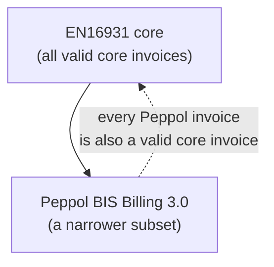

# Peppol and CIUS profiles

EN16931 defines a *core* invoice — deliberately broad, so it can fit every
European country and industry. No real network exchanges the bare core, though.
Each one tightens it into a **profile**: a specific, interoperable subset with a
few extra rules. The dominant one for cross-border exchange is **Peppol BIS
Billing 3.0**. This page explains what a profile is, the single rule that governs
how far it may go, and how an invoice declares which profile it follows.

## CIUS vs extension

EN16931 names two ways to specialise the core, and the distinction is strict:

| | **CIUS** (Core Invoice Usage Specification) | **Extension** |
| --- | --- | --- |
| Can it *narrow* the core? | yes — make optional fields mandatory, restrict code lists, forbid fields | yes |
| Can it *add* new business terms? | **no** | yes |
| Result still readable by a plain EN16931 receiver? | **yes** | not fully |

**Peppol BIS Billing 3.0 is a CIUS.** It only narrows — which is what keeps it
interoperable: any conforming EN16931 receiver can read a Peppol invoice, because
Peppol added no terms the core does not already define.

!!! warning "A profile may only narrow, never loosen"
    This is the cardinal rule. A CIUS can turn a *may* into a *shall*; it can
    **never** turn a *shall* into a *may*. If EN16931 requires BT-24, no profile
    can make it optional. Formally: the set of documents a profile accepts must be
    a **subset** of those EN16931 accepts. A profile's Schematron therefore only
    ever *adds* assertions on top of the core's — it cannot remove them.



## How an invoice declares its profile

Two fields carry the declaration, and a profile pins their values:

| Field | BT | Says |
| --- | --- | --- |
| `cbc:CustomizationID` | BT-24 | *which rulebook* — the specification identifier |
| `cbc:ProfileID` | BT-23 | *which business process* the document is part of |

For plain EN16931 the customization is just `urn:cen.eu:en16931:2017`. A Peppol
invoice carries a longer URN that names *both* the core it complies with *and* the
Peppol layer on top:

``` xml title="a Peppol BIS Billing 3.0 invoice" linenums="1"
<cbc:CustomizationID
  >urn:cen.eu:en16931:2017#compliant#urn:fdc:peppol.eu:2017:poacc:billing:3.0</cbc:CustomizationID>  <!-- (1)! -->
<cbc:ProfileID>urn:fdc:peppol.eu:2017:poacc:billing:01:1.0</cbc:ProfileID>  <!-- (2)! -->
```

1.  Read it as *"compliant with EN16931:2017, **and** with the Peppol billing 3.0
    customization."* The `#compliant#` marker is what states the subset
    relationship from the diagram above.
2.  `ProfileID` selects the *process* (here, plain billing). It tells the receiver
    what exchange this document belongs to, separate from which rules validate it.

This is the field [BR-01](validation-pipeline.md#layer-3-en16931-schematron-business-rules)
checks for presence — and a Peppol-specific rule additionally checks that, when
the CustomizationID is the Peppol URN, the Peppol rules are the ones that apply.

## What Peppol adds

On top of the core BR-* rules, the Peppol profile's Schematron (the
`PEPPOL-EN16931-*` rule set) layers its own assertions — all *narrowing*:

- **More mandatory fields** — e.g. both parties must carry an *electronic address*
  (`cbc:EndpointID`) with a recognised scheme, so the four-corner network can
  route the document.
- **Restricted code lists** — narrower than the core's: Peppol pins specific
  identifier schemes (EAS for electronic addresses, ICD for party identifiers).
- **Tighter formats** — additional constraints on identifiers and references the
  core leaves open.

``` xml title="required by Peppol, optional in the core"
<cac:Party>
  <cbc:EndpointID schemeID="0192">991234567</cbc:EndpointID>   <!-- scheme 0192 = Norwegian org. no. -->
  ...
</cac:Party>
```

A document missing that endpoint is **valid EN16931** but **invalid Peppol** — the
profile layer ([layer 4](validation-pipeline.md#layer-4-profile-rules-peppol-cius))
rejects it.

## Why this design holds together

Everything in this section is the same idea seen from different angles:

- One **semantic model** (EN16931), bound to two **syntaxes** (UBL, CII) — the
  [abstract pattern](../schematron/abstract-patterns-en16931.md) trick.
- One **core rulebook**, specialised by **profiles** that may only narrow — so a
  Peppol invoice is always a valid core invoice.
- Shared **[code lists](genericode-codelists.md)** referenced by identity, not
  copied into each rule.
- A **layered [pipeline](validation-pipeline.md)** where XSD, core Schematron, and
  profile Schematron each do the job they are best at.

Each layer is one of the technologies this site teaches, doing exactly what it was
designed for. E-invoicing is not a special case — it is the everyday XML stack,
shown at full scale.

## Where next

You have now followed an invoice from its [structure](ubl-invoice.md), through the
[validation pipeline](validation-pipeline.md) and its [code lists](genericode-codelists.md),
to the [profile](peppol-cius.md) that makes it exchangeable. To revisit the
technologies underneath, head back to [XSD](../xsd/index.md),
[Schematron](../schematron/index.md), [XPath](../xpath/index.md), or
[XSLT](../xslt/index.md) — or the site [home](../index.md).
