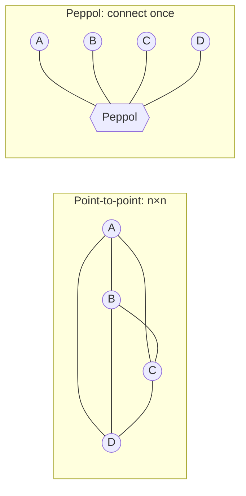
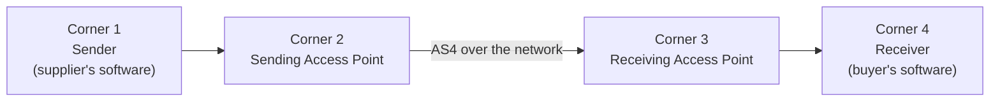
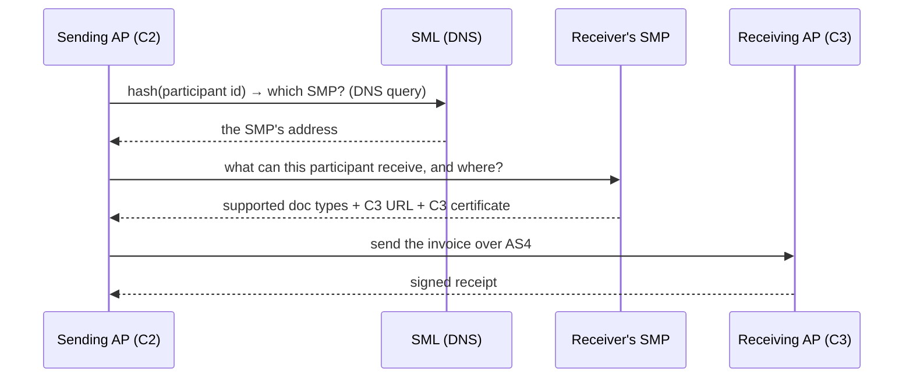

# The Peppol network

[Peppol and CIUS profiles](peppol-cius.md) covered the *document* side — how Peppol
narrows EN16931 into a validatable profile. But Peppol is much more than a file
format. It is a **delivery network**: the infrastructure that actually moves an
invoice from one company's software to another's, anywhere in the world, without
the two ever agreeing on anything bilaterally. This page explains what that network
*is* and how a document travels across it.

!!! note "Format vs network — two separate things"
    "Peppol" names both a **document specification** (Peppol BIS, a CIUS of
    EN16931) and a **transport network**. You can send a valid Peppol BIS invoice
    by email and it is still a Peppol document; sending it *over the Peppol network*
    is a separate capability. This page is about the network; the
    [profile page](peppol-cius.md) is about the document.

## The problem it solves

Without a network, every company that wants to exchange invoices electronically
must build a point-to-point connection to every partner — agree on transport,
addresses, certificates, formats. With *n* participants that is an **n × n** mess.

Peppol replaces it with **connect once, reach everyone**: you join through a single
provider, and you can transact with every other participant on the network. This is
the same idea as email or the phone system — you don't have an account with the
recipient's provider, yet the message arrives.



## The four-corner model

Peppol's architecture is the **four-corner model**. You and your partner are the
outer corners; two service providers sit in the middle and do the actual
networking.



| Corner | Who | Role |
| --- | --- | --- |
| **C1** | the sender | creates the business document (the invoice) |
| **C2** | the sender's **Access Point** | packages and transmits it onto the network |
| **C3** | the receiver's **Access Point** | receives it and hands it on |
| **C4** | the receiver | consumes the document in their software |

The crucial property: **C1 and C4 never talk directly, and need no prior
relationship.** They each have a contract only with their *own* provider (C2, C3).
The providers interoperate because they all follow the same Peppol specifications.

## Access Points

An **Access Point (AP)** is a certified service provider — corners 2 and 3. To
become one, a provider is vetted by a Peppol Authority and issued a Peppol
certificate; from then on it can send and receive on behalf of its customers.

A company does **not** run its own Access Point (usually) — it subscribes to one,
the way you use an email provider rather than running a mail server. Many ERP and
accounting vendors are themselves APs, or partner with one.

## Addressing: participant identifiers

Every participant has a **Peppol Participant Identifier** — a structured address,
not an email or URL. It is a scheme plus a value:

``` text
0192:991234567
└─┬─┘ └───┬───┘
  │       └── the actual identifier (here a Norwegian organisation number)
  └────────── the scheme (0192 = Norwegian legal entity, from the EAS code list)
```

The scheme code (`0192`, `0088` for GLN, `0208` for Belgian enterprise number, …)
comes from the **EAS** ([Electronic Address Scheme](glossary.md#identifiers-and-the-network)) list. This
is the same value that appears in the invoice's
[`cbc:EndpointID`](ubl-invoice-detail.md) — the document's address and the network
address are the *same identifier*.

## Finding the recipient: SML and SMP

Here is the clever part. When C2 has a document for participant `0192:991234567`, how
does it know *which* Access Point (C3) serves that participant, and at what URL? Two
services answer that — a directory lookup, then a metadata lookup.



**SML — Service Metadata Locator.** A single, central directory for the whole
network, run by OpenPeppol and built on **DNS**. Given a participant identifier,
C2 hashes it into a DNS name and looks it up; the SML answers with the address of
the **SMP** that holds that participant's metadata. One global phone book, pointing
at the right local directory.

**SMP — Service Metadata Publisher.** Each participant is registered with an SMP
(typically run by their Access Point). The SMP publishes, per participant:

- **which document types and processes** they can receive (e.g. "Peppol BIS Billing
  3.0 invoices") — so C2 can refuse to send something the receiver can't accept;
- the **URL of the receiving Access Point** (C3);
- C3's **certificate**, so C2 can encrypt to the right party.

!!! tip "Capability discovery prevents dead letters"
    Because the SMP advertises exactly which documents a participant accepts, the
    sender knows *before transmitting* whether delivery is possible. The same
    `CustomizationID` / `ProfileID` values from the
    [document](peppol-cius.md#how-an-invoice-declares-its-profile) are what the SMP
    lists as capabilities — the document layer and the network layer use the same
    identifiers.

## Transport: AS4

The actual transmission between Access Points uses **AS4** — a standardised,
secure messaging protocol (the AS4 profile of OASIS ebMS3, adopted by the EU's
*eDelivery* building block). It gives the network:

- **message-level signing and encryption**, on top of TLS;
- **reliable delivery** with signed receipts, so the sender has proof the message
  was handed over;
- **payload-agnostic** transport — AS4 carries the invoice as a payload and does not
  care that it is UBL.

Because AS4 is an open standard, any conformant Access Point can talk to any other —
that is what makes "connect once" work.

## Trust: the Peppol PKI

The network is closed and trusted, not open like email. **OpenPeppol** acts as the
root of a public-key infrastructure: it (via Peppol Authorities) issues certificates
to Access Points and SMPs. Every AS4 message is signed with a Peppol-issued
certificate, and receivers reject anything not chaining back to the Peppol root.
This is how a receiver can trust a document from a sender it has never met — the
trust is in the network's PKI, not in the bilateral relationship.

## Is there a central Peppol server?

Almost none — and this is the most common misconception. Invoices do **not** pass
through any Peppol-operated hub. Delivery is strictly peer-to-peer: the sending
Access Point opens an **AS4** connection *directly* to the receiving Access Point.
There is no central relay, message broker, or store-and-forward server, and
OpenPeppol never sees the traffic or the documents.

Only two things are genuinely central, and neither is in the message path:

- **The SML** — a **DNS zone** managed centrally on OpenPeppol's behalf. You do not
  "call" it like an API; you do an ordinary DNS lookup that resolves to the right
  SMP. Central as *who controls the root*, distributed as *how it is queried*.
- **The PKI root** — OpenPeppol operates the root certificate authority every
  Access Point and SMP certificate chains back to. A central *trust anchor*, but
  certificates are validated locally, not by calling home.

Everything else is **federated**: many independent SMPs (each holding only its own
participants' metadata) and many independent Access Points (any conformant one talks
to any other). What makes it interoperate is not a server but a shared set of
**interchange specifications** — the *Peppol eDelivery Network* specs, layered on
open OASIS/CEF standards rather than invented from scratch:

| Concern | Peppol spec | Built on |
| --- | --- | --- |
| Transport between APs | Peppol AS4 profile | OASIS **ebMS3 / AS4** (CEF eDelivery) |
| Recipient metadata | Peppol SMP spec | OASIS **BDXR SMP** |
| Locator / discovery | Peppol SML spec | OASIS **BDXL** + DNS |
| Trust | Peppol certificate policy | X.509 PKI |

!!! note "Federated like email, with a shared phone book"
    The right mental model: Peppol is a set of interchange specs plus a central
    DNS directory and a central trust root — **not** a central server that messages
    flow through. Mail servers deliver to each other directly using shared protocols
    and DNS; Peppol works the same way, with an added PKI that makes the network
    closed and trusted.

## Who runs it: OpenPeppol and the Authorities

**OpenPeppol** is the international non-profit (AISBL, based in Belgium) that owns
the specifications and governs the network. It began as an EU project —
*Pan-European Public Procurement OnLine* — but is now used well beyond Europe
(Australia, New Zealand, Singapore, Japan, and others have adopted it). OpenPeppol
delegates regional governance to **Peppol Authorities** — typically a national
agency — who accredit the Access Points operating in their jurisdiction.

## How the layers fit together

The network and the document specifications are independent layers that meet at the
participant identifier and the document-type identifier:

| Layer | What it does | Covered in |
| --- | --- | --- |
| **Document** | the invoice content & rules (Peppol BIS / EN16931) | [Peppol and CIUS profiles](peppol-cius.md) |
| **Validation** | XSD + Schematron checks on that document | [The validation pipeline](validation-pipeline.md) |
| **Addressing** | participant IDs, capability discovery (SML, SMP) | this page |
| **Transport** | secure delivery between Access Points (AS4) | this page |
| **Trust** | certificates anchored in the Peppol PKI | this page |

A complete send, end to end: C1 produces a [BIS invoice](peppol-cius.md), C2
[validates](validation-pipeline.md) it, looks the receiver up via **SML → SMP**,
and transmits over **AS4** to C3, which delivers to C4 — every step keyed off the
one participant identifier that also sits in the invoice's `cbc:EndpointID`.

## Where next

That completes the picture: a [structured document](ubl-invoice-detail.md),
[narrowed by a profile](peppol-cius.md), [validated in layers](validation-pipeline.md),
and delivered across this network. For any unfamiliar term — Access Point, SMP,
SML, four-corner — see the [Glossary](glossary.md#identifiers-and-the-network), or
return to the [Overview](index.md).
