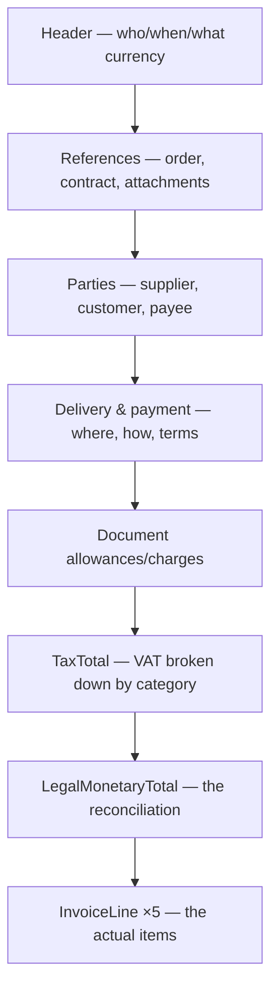

# A UBL invoice in detail

The [previous page](ubl-invoice.md) used a deliberately small invoice to show the
shape. This page does the opposite: it takes the **official OASIS UBL 2.1 example
invoice** — `UBL-Invoice-2.1-Example.xml`, ~490 lines — and walks it top to bottom,
explaining every block. It is the best specimen to learn from precisely because it
is *maximal*: it exercises almost every optional structure a UBL invoice can carry,
and — as we will check at the end — its amounts reconcile exactly.

!!! info "Source"
    The document is the published example shipped with the UBL 2.1 standard:
    [`UBL-Invoice-2.1-Example.xml`](https://docs.oasis-open.org/ubl/os-UBL-2.1/xml/UBL-Invoice-2.1-Example.xml)
    (OASIS). It dates from 2009 and predates [EN16931](index.md), so it is *richer*
    than the EN16931 core and not EN16931-valid as-is (see the
    [last section](#how-it-relates-to-en16931)). That makes it ideal for seeing the
    full vocabulary; the profiles narrow from here, they do not add.

## The overall shape

Read top to bottom, a UBL invoice is five bands: **header**, **references**,
**parties**, **monetary/payment context**, and **lines**. The totals sit just
before the lines.



Throughout, remember the rule from [Anatomy](ubl-invoice.md#three-namespaces):
**`cbc:` is a single value, `cac:` is a container.**

## The header

``` xml linenums="5"
<cbc:UBLVersionID>2.1</cbc:UBLVersionID>                                <!-- (1)! -->
<cbc:ID>TOSL108</cbc:ID>                                                <!-- (2)! -->
<cbc:IssueDate>2009-12-15</cbc:IssueDate>
<cbc:InvoiceTypeCode listID="UN/ECE 1001 Subset" listAgencyID="6">380</cbc:InvoiceTypeCode>  <!-- (3)! -->
<cbc:Note languageID="en">Ordered in our booth at the convention.</cbc:Note>
<cbc:TaxPointDate>2009-11-30</cbc:TaxPointDate>                         <!-- (4)! -->
<cbc:DocumentCurrencyCode listID="ISO 4217 Alpha" listAgencyID="6">EUR</cbc:DocumentCurrencyCode>
<cbc:AccountingCost>Project cost code 123</cbc:AccountingCost>          <!-- (5)! -->
```

1.  **`UBLVersionID`** — which UBL release the document follows (2.1). Distinct from
    the *specification* identifier EN16931 adds; this one is about the syntax
    version itself.
2.  **`ID`** — the invoice number (EN16931 BT-1). `TOSL108` here.
3.  **`InvoiceTypeCode`** — `380` = "commercial invoice", from code list UNCL1001.
    Note the **`listID` / `listAgencyID` attributes**: they name *which* code list
    the value comes from and who maintains it. You will see this attribute pattern
    on every coded field — it is how UBL points at a
    [code list](genericode-codelists.md) inline.
4.  **`TaxPointDate`** — the date the VAT becomes chargeable, which can differ from
    the issue date.
5.  **`AccountingCost`** — a buyer's cost-accounting reference, carried through so
    the receiver can book the invoice automatically.

!!! note "Code-list attributes are metadata, not values"
    `listID="ISO 4217 Alpha"` does not change the value `EUR` — it annotates it.
    Validators mostly key off the element value against the bound
    [`.gc` list](genericode-codelists.md); the attributes document provenance.
    EN16931 and Peppol tighten *which* attributes are allowed.

## References — tying the invoice to its paperwork

An invoice rarely stands alone; this block links it to the surrounding documents.

``` xml linenums="14"
<cac:InvoicePeriod>                                  <!-- (1)! -->
  <cbc:StartDate>2009-11-01</cbc:StartDate>
  <cbc:EndDate>2009-11-30</cbc:EndDate>
</cac:InvoicePeriod>
<cac:OrderReference>                                 <!-- (2)! -->
  <cbc:ID>123</cbc:ID>
</cac:OrderReference>
<cac:ContractDocumentReference>                      <!-- (3)! -->
  <cbc:ID>Contract321</cbc:ID>
  <cbc:DocumentType>Framework agreement</cbc:DocumentType>
</cac:ContractDocumentReference>
```

1.  **`InvoicePeriod`** — the billing period this invoice covers.
2.  **`OrderReference`** — the purchase order it answers (`123`). The lines later
    point at individual order lines via `OrderLineReference`.
3.  **`ContractDocumentReference`** — the governing contract.

Then two **attachments**, showing UBL's two ways to carry a supporting document —
*by link* and *by value*:

``` xml linenums="25"
<cac:AdditionalDocumentReference>
  <cbc:ID>Doc1</cbc:ID>
  <cbc:DocumentType>Timesheet</cbc:DocumentType>
  <cac:Attachment>
    <cac:ExternalReference>                          <!-- (1)! -->
      <cbc:URI>http://www.suppliersite.eu/sheet001.html</cbc:URI>
    </cac:ExternalReference>
  </cac:Attachment>
</cac:AdditionalDocumentReference>
<cac:AdditionalDocumentReference>
  <cbc:ID>Doc2</cbc:ID>
  <cbc:DocumentType>Drawing</cbc:DocumentType>
  <cac:Attachment>
    <cbc:EmbeddedDocumentBinaryObject mimeCode="application/pdf"  <!-- (2)! -->
      >UjBsR09EbGhjZ0dTQUxNQUFBUUNBRU1tQ1p0dU1GUXhEUzhi</cbc:EmbeddedDocumentBinaryObject>
  </cac:Attachment>
</cac:AdditionalDocumentReference>
```

1.  **By reference** — an `ExternalReference/URI` pointing at a file hosted
    elsewhere.
2.  **By value** — the file itself, **Base64-encoded** inside
    `EmbeddedDocumentBinaryObject`, with a `mimeCode` saying it is a PDF. This is
    how a Peppol invoice ships, say, a PDF rendering inside the XML.

## The parties

UBL distinguishes **roles**, not just "sender" and "receiver". This invoice carries
three: the supplier, the customer, and a separate payee.

### Supplier — the full anatomy of a party

The seller block is the richest; every other party is a subset of this shape.

``` xml linenums="42"
<cac:AccountingSupplierParty>
  <cac:Party>
    <cbc:EndpointID schemeID="GLN" schemeAgencyID="9">1234567890123</cbc:EndpointID>  <!-- (1)! -->
    <cac:PartyIdentification>
      <cbc:ID schemeID="ZZZ">Supp123</cbc:ID>                       <!-- (2)! -->
    </cac:PartyIdentification>
    <cac:PartyName><cbc:Name>Salescompany ltd.</cbc:Name></cac:PartyName>
    <cac:PostalAddress>                                            <!-- (3)! -->
      <cbc:StreetName>Main street</cbc:StreetName>
      <cbc:BuildingNumber>1</cbc:BuildingNumber>
      <cbc:CityName>Big city</cbc:CityName>
      <cbc:PostalZone>54321</cbc:PostalZone>
      <cac:Country><cbc:IdentificationCode listID="ISO3166-1">DK</cbc:IdentificationCode></cac:Country>
    </cac:PostalAddress>
    <cac:PartyTaxScheme>                                           <!-- (4)! -->
      <cbc:CompanyID schemeID="DKVAT">DK12345</cbc:CompanyID>
      <cac:TaxScheme><cbc:ID>VAT</cbc:ID></cac:TaxScheme>
    </cac:PartyTaxScheme>
    <cac:PartyLegalEntity>                                         <!-- (5)! -->
      <cbc:RegistrationName>The Sellercompany Incorporated</cbc:RegistrationName>
      <cbc:CompanyID schemeID="CVR">5402697509</cbc:CompanyID>
    </cac:PartyLegalEntity>
    <cac:Contact>                                                  <!-- (6)! -->
      <cbc:Telephone>4621230</cbc:Telephone>
      <cbc:ElectronicMail>antonio@salescompany.dk</cbc:ElectronicMail>
    </cac:Contact>
    <cac:Person>                                                   <!-- (7)! -->
      <cbc:FirstName>Antonio</cbc:FirstName>
      <cbc:FamilyName>M</cbc:FamilyName>
      <cbc:JobTitle>Sales manager</cbc:JobTitle>
    </cac:Person>
  </cac:Party>
</cac:AccountingSupplierParty>
```

*(Abridged — the original also carries `Postbox`, `Department`, `CountrySubentity`
and a `RegistrationAddress`.)*

1.  **`EndpointID`** — the party's *routable electronic address*; `schemeID="GLN"`
    says it is a Global Location Number. This is the field Peppol makes mandatory
    so the network can deliver the document. The `schemeID` names the
    [identifier scheme](glossary.md#identifiers-and-the-network).
2.  **`PartyIdentification`** — a business identifier for the party. `schemeID="ZZZ"`
    is the UBL convention for "mutually agreed / unspecified scheme".
3.  **`PostalAddress`** — the address as separate typed fields, with the country as
    an ISO 3166-1 code, *not* free text. Structured so software can read it.
4.  **`PartyTaxScheme`** — the party's VAT registration: the VAT number
    (`CompanyID`) under a named `TaxScheme` (`VAT`). This is what the tax rules
    cross-check.
5.  **`PartyLegalEntity`** — the *legal* identity, which can differ from the trading
    name: the registered company name and a company-registry number (`CVR` is the
    Danish business register).
6.  **`Contact`** — a contact point (phone, email).
7.  **`Person`** — a named individual at the party.

!!! tip "One shape, reused everywhere"
    `cac:Party` is a single reusable structure. The supplier, customer, payee,
    delivery party — all use the same element vocabulary. Learn it once here and the
    rest of the document's parties read instantly.

### Customer

The buyer (`cac:AccountingCustomerParty`) has the identical structure — endpoint,
identification, name, address (in Belgium, `BE`), tax scheme, legal entity,
contact, person. Nothing new to learn; same shape, different data.

### Payee — why a third party?

``` xml linenums="150"
<cac:PayeeParty>                                     <!-- (1)! -->
  <cac:PartyIdentification><cbc:ID schemeID="GLN">098740918237</cbc:ID></cac:PartyIdentification>
  <cac:PartyName><cbc:Name>Ebeneser Scrooge Inc.</cbc:Name></cac:PartyName>
  <cac:PartyLegalEntity><cbc:CompanyID schemeID="UK:CH">6411982340</cbc:CompanyID></cac:PartyLegalEntity>
</cac:PayeeParty>
```

1.  **`PayeeParty`** — the party to be *paid*, when that differs from the seller
    (factoring, a parent company, a collections agent). Its presence is exactly why
    UBL models roles separately: "who sold" and "who gets the money" are not always
    the same entity.

## Delivery, payment, and terms

``` xml linenums="161"
<cac:Delivery>                                       <!-- (1)! -->
  <cbc:ActualDeliveryDate>2009-12-15</cbc:ActualDeliveryDate>
  <cac:DeliveryLocation>
    <cbc:ID schemeID="GLN">6754238987648</cbc:ID>
    <cac:Address>…Deliverystreet 12, DeliveryCity, BE…</cac:Address>
  </cac:DeliveryLocation>
</cac:Delivery>
<cac:PaymentMeans>                                    <!-- (2)! -->
  <cbc:PaymentMeansCode listID="UN/ECE 4461">31</cbc:PaymentMeansCode>
  <cbc:PaymentDueDate>2009-12-31</cbc:PaymentDueDate>
  <cbc:PaymentID>Payref1</cbc:PaymentID>
  <cac:PayeeFinancialAccount>                         <!-- (3)! -->
    <cbc:ID>DK1212341234123412</cbc:ID>
    <cac:FinancialInstitutionBranch>
      <cac:FinancialInstitution><cbc:ID>DKDKABCD</cbc:ID></cac:FinancialInstitution>
    </cac:FinancialInstitutionBranch>
  </cac:PayeeFinancialAccount>
</cac:PaymentMeans>
<cac:PaymentTerms>                                    <!-- (4)! -->
  <cbc:Note>Penalty percentage 10% from due date</cbc:Note>
</cac:PaymentTerms>
```

1.  **`Delivery`** — when and *where* the goods went, separate from the buyer's
    billing address.
2.  **`PaymentMeans`** — how to pay. `PaymentMeansCode` `31` (UNCL4461) =
    credit transfer; `PaymentDueDate` is the deadline; `PaymentID` is the reference
    the payer should quote.
3.  **`PayeeFinancialAccount`** — the bank account (IBAN-style `ID`) and its
    institution (a BIC under `FinancialInstitution`).
4.  **`PaymentTerms`** — free-text or structured terms; here a late-payment penalty.

## Document-level allowances and charges

Before the lines, the invoice records adjustments that apply to the **whole
document** rather than one line:

``` xml linenums="196"
<cac:AllowanceCharge>
  <cbc:ChargeIndicator>true</cbc:ChargeIndicator>     <!-- (1)! -->
  <cbc:AllowanceChargeReason>Packing cost</cbc:AllowanceChargeReason>
  <cbc:Amount currencyID="EUR">100</cbc:Amount>
</cac:AllowanceCharge>
<cac:AllowanceCharge>
  <cbc:ChargeIndicator>false</cbc:ChargeIndicator>    <!-- (2)! -->
  <cbc:AllowanceChargeReason>Promotion discount</cbc:AllowanceChargeReason>
  <cbc:Amount currencyID="EUR">100</cbc:Amount>
</cac:AllowanceCharge>
```

1.  **`ChargeIndicator` = `true`** → this is a **charge** (adds to the total): a
    100 EUR packing cost.
2.  **`ChargeIndicator` = `false`** → this is an **allowance** (a deduction): a
    100 EUR promotion discount.

!!! warning "One element, two meanings — `ChargeIndicator` decides"
    UBL uses the *same* `cac:AllowanceCharge` element for both surcharges and
    discounts. The boolean `ChargeIndicator` is the only thing that distinguishes
    them. Read it first, always. The same element reappears at line level and even
    at price level below.

## TaxTotal — VAT broken down by category

The tax block states one **grand total**, then a **subtotal per tax category** —
the heart of correct VAT reporting.

``` xml linenums="206"
<cac:TaxTotal>
  <cbc:TaxAmount currencyID="EUR">292.20</cbc:TaxAmount>          <!-- (1)! -->
  <cac:TaxSubtotal>
    <cbc:TaxableAmount currencyID="EUR">1460.5</cbc:TaxableAmount>
    <cbc:TaxAmount currencyID="EUR">292.1</cbc:TaxAmount>
    <cac:TaxCategory>
      <cbc:ID schemeID="UN/ECE 5305">S</cbc:ID>                  <!-- (2)! -->
      <cbc:Percent>20</cbc:Percent>
      <cac:TaxScheme><cbc:ID>VAT</cbc:ID></cac:TaxScheme>
    </cac:TaxCategory>
  </cac:TaxSubtotal>
  <cac:TaxSubtotal>… category AA, 10%, taxable 1, tax 0.1 …</cac:TaxSubtotal>
  <cac:TaxSubtotal>
    <cbc:TaxableAmount currencyID="EUR">-25</cbc:TaxableAmount>
    <cbc:TaxAmount currencyID="EUR">0</cbc:TaxAmount>
    <cac:TaxCategory>
      <cbc:ID schemeID="UN/ECE 5305">E</cbc:ID>                  <!-- (3)! -->
      <cbc:Percent>0</cbc:Percent>
      <cbc:TaxExemptionReasonCode listID="CWA 15577">AAM</cbc:TaxExemptionReasonCode>
      <cbc:TaxExemptionReason>Exempt New Means of Transport</cbc:TaxExemptionReason>
      <cac:TaxScheme><cbc:ID>VAT</cbc:ID></cac:TaxScheme>
    </cac:TaxCategory>
  </cac:TaxSubtotal>
</cac:TaxTotal>
```

1.  **Grand total VAT** for the document: 292.20 EUR.
2.  **Category `S`** (standard rate), `Percent` 20: a taxable base of 1460.5 →
    292.1 tax. The category code `S` comes from UNCL5305.
3.  **Category `E`** (exempt), with a **`TaxExemptionReasonCode`** and human reason.
    Exempt lines must say *why* — a grammar cannot enforce that, but
    [Schematron](../schematron/index.md) can.

The three categories present here:

| Category | Code | Rate | Taxable base | VAT |
| --- | --- | --- | --- | --- |
| Standard | `S` | 20% | 1460.5 | 292.1 |
| Reduced | `AA` | 10% | 1.0 | 0.1 |
| Exempt | `E` | 0% | −25.0 | 0.0 |
| **Total** | | | **1436.5** | **292.2** |

We will see in a moment that each taxable base equals the sum of the line amounts
in that category — the numbers are not arbitrary.

## LegalMonetaryTotal — the reconciliation

This block is where everything must add up. Each amount is a distinct concept:

``` xml linenums="245"
<cac:LegalMonetaryTotal>
  <cbc:LineExtensionAmount currencyID="EUR">1436.5</cbc:LineExtensionAmount>   <!-- (1)! -->
  <cbc:TaxExclusiveAmount currencyID="EUR">1436.5</cbc:TaxExclusiveAmount>     <!-- (2)! -->
  <cbc:TaxInclusiveAmount currencyID="EUR">1729</cbc:TaxInclusiveAmount>       <!-- (3)! -->
  <cbc:AllowanceTotalAmount currencyID="EUR">100</cbc:AllowanceTotalAmount>    <!-- (4)! -->
  <cbc:ChargeTotalAmount currencyID="EUR">100</cbc:ChargeTotalAmount>
  <cbc:PrepaidAmount currencyID="EUR">1000</cbc:PrepaidAmount>                 <!-- (5)! -->
  <cbc:PayableRoundingAmount currencyID="EUR">0.30</cbc:PayableRoundingAmount> <!-- (6)! -->
  <cbc:PayableAmount currencyID="EUR">729</cbc:PayableAmount>                  <!-- (7)! -->
</cac:LegalMonetaryTotal>
```

1.  **`LineExtensionAmount`** — sum of all line net amounts. Must equal Σ lines
    (the EN16931 rule **BR-CO-10**).
2.  **`TaxExclusiveAmount`** — the net total VAT is calculated on. Here the
    document-level allowance (−100) and charge (+100) cancel, so it equals the line
    total.
3.  **`TaxInclusiveAmount`** — net plus VAT.
4.  **`AllowanceTotalAmount` / `ChargeTotalAmount`** — the sums of the document-level
    allowances and charges from the block above.
5.  **`PrepaidAmount`** — already paid (1000), so it is subtracted from what is due.
6.  **`PayableRoundingAmount`** — a small rounding adjustment (0.30).
7.  **`PayableAmount`** — the bottom line: what the customer actually pays, 729 EUR.

The chain, as EN16931 expresses it:

<div class="xslt-result" markdown>
**Payable** = Tax-inclusive − Prepaid + Rounding
= 1729 − 1000 + 0  → **729 EUR**

(and Tax-inclusive 1729 ≈ Tax-exclusive 1436.5 + VAT 292.2 = 1728.7, with the
0.30 captured as the rounding amount).
</div>

## The invoice lines

Five lines, and they are not all positive — two are **returns** (negative quantity
and amount), modelling credits inline. Line 1 is the fully-loaded example:

``` xml linenums="255"
<cac:InvoiceLine>
  <cbc:ID>1</cbc:ID>                                              <!-- (1)! -->
  <cbc:Note>Scratch on box</cbc:Note>
  <cbc:InvoicedQuantity unitCode="C62">1</cbc:InvoicedQuantity>   <!-- (2)! -->
  <cbc:LineExtensionAmount currencyID="EUR">1273</cbc:LineExtensionAmount>
  <cac:OrderLineReference><cbc:LineID>1</cbc:LineID></cac:OrderLineReference>  <!-- (3)! -->
  <cac:AllowanceCharge>                                           <!-- (4)! -->
    <cbc:ChargeIndicator>false</cbc:ChargeIndicator>
    <cbc:AllowanceChargeReason>Damage</cbc:AllowanceChargeReason>
    <cbc:Amount currencyID="EUR">12</cbc:Amount>
  </cac:AllowanceCharge>
  <cac:TaxTotal><cbc:TaxAmount currencyID="EUR">254.6</cbc:TaxAmount></cac:TaxTotal>  <!-- (5)! -->
  <cac:Item>                                                      <!-- (6)! -->
    <cbc:Description languageID="EN">Processor: Intel Core 2 Duo …</cbc:Description>
    <cbc:Name>Labtop computer</cbc:Name>
    <cac:SellersItemIdentification><cbc:ID>JB007</cbc:ID></cac:SellersItemIdentification>
    <cac:StandardItemIdentification>
      <cbc:ID schemeID="GTIN">1234567890124</cbc:ID>             <!-- (7)! -->
    </cac:StandardItemIdentification>
    <cac:CommodityClassification>
      <cbc:ItemClassificationCode listID="UNSPSC">12344321</cbc:ItemClassificationCode>  <!-- (8)! -->
    </cac:CommodityClassification>
    <ClassifiedTaxCategory                                        <!-- (9)! -->
      xmlns="urn:oasis:names:specification:ubl:schema:xsd:CommonAggregateComponents-2">
      <cbc:ID schemeID="UN/ECE 5305">S</cbc:ID>
      <cbc:Percent>20</cbc:Percent>
      <TaxScheme><cbc:ID>VAT</cbc:ID></TaxScheme>
    </ClassifiedTaxCategory>
    <cac:AdditionalItemProperty>                                  <!-- (10)! -->
      <cbc:Name>Color</cbc:Name><cbc:Value>black</cbc:Value>
    </cac:AdditionalItemProperty>
  </cac:Item>
  <cac:Price>                                                     <!-- (11)! -->
    <cbc:PriceAmount currencyID="EUR">1273</cbc:PriceAmount>
    <cbc:BaseQuantity unitCode="C62">1</cbc:BaseQuantity>
    <cac:AllowanceCharge>                                         <!-- (12)! -->
      <cbc:ChargeIndicator>false</cbc:ChargeIndicator>
      <cbc:MultiplierFactorNumeric>0.15</cbc:MultiplierFactorNumeric>
      <cbc:Amount currencyID="EUR">225</cbc:Amount>
      <cbc:BaseAmount currencyID="EUR">1500</cbc:BaseAmount>
    </cac:AllowanceCharge>
  </cac:Price>
</cac:InvoiceLine>
```

1.  **`ID`** — line number within the invoice (not the product code).
2.  **`InvoicedQuantity`** with **`unitCode="C62"`** — `C62` (UN/ECE Rec 20) is the
    code for "one / piece". The line net is `LineExtensionAmount` = 1273.
3.  **`OrderLineReference`** — links this line back to a line of the purchase order.
4.  **Line-level allowance** — a 12 EUR discount for damage, scoped to this line.
5.  **Line-level `TaxTotal`** — 254.6 = 1273 × 20%.
6.  **`Item`** — *what* is being sold: a description plus a short name.
7.  **`StandardItemIdentification`** — a global product id; `schemeID="GTIN"` =
    barcode number. (`SellersItemIdentification` above is the seller's own code.)
8.  **`CommodityClassification`** — a category code from a published taxonomy
    (`UNSPSC`; the line also carries a `CPV` one). For procurement analytics.
9.  **`ClassifiedTaxCategory`** — the VAT category for this item (`S`, 20%). **Note
    the namespace trick:** the element redeclares the *default* namespace to the
    `cac` URI, so `ClassifiedTaxCategory` and its `TaxScheme` child live in the
    `cac` namespace *without* a prefix — exactly equivalent to writing
    `cac:ClassifiedTaxCategory`. A good reminder that
    [namespaces are about the URI, not the prefix](../xsd/index.md).
10. **`AdditionalItemProperty`** — arbitrary name/value attributes ("Color: black").
11. **`Price`** — the *unit* price (1273 per `BaseQuantity` of 1), as distinct from
    the line total in (2).
12. **Price-level allowance** — a contract discount expressed as a factor (0.15)
    off a `BaseAmount` (1500), i.e. how the net unit price was derived.

The other four lines reuse this vocabulary with less decoration:

| Line | Item | Qty | Net amount | VAT cat |
| --- | --- | ---: | ---: | --- |
| 1 | Laptop computer | 1 | 1273.00 | S (20%) |
| 2 | Returned book | **−1** | **−3.96** | AA (10%) |
| 3 | "Computing for dummies" | 2 | 4.96 | AA (10%) |
| 4 | Returned IBM 5150 | **−1** | **−25.00** | E (exempt) |
| 5 | Network cable | 250 | 187.50 | S (20%) |

!!! note "Negative lines are credits in place"
    Lines 2 and 4 have negative quantities and amounts — returns folded into the
    same invoice. UBL does not need a separate credit note for this; the line
    arithmetic simply goes negative and flows into the totals like any other line.

## It all reconciles

This is why the example is worth studying: the numbers are *consistent* top to
bottom. Two checks anyone can run.

**Lines sum to the document line total** (EN16931 BR-CO-10):

<div class="xslt-result" markdown>
1273.00 + (−3.96) + 4.96 + (−25.00) + 187.50 = **1436.5**
= `LegalMonetaryTotal/LineExtensionAmount` ✓
</div>

**Each tax category's base is the sum of its lines:**

| Category | Lines | Σ line net | = TaxSubtotal base |
| --- | --- | ---: | ---: |
| S (20%) | 1, 5 | 1273 + 187.5 | **1460.5** ✓ |
| AA (10%) | 2, 3 | −3.96 + 4.96 | **1.0** ✓ |
| E (0%) | 4 | −25 | **−25.0** ✓ |

And the per-line VAT amounts sum to the grand total: 254.6 − 0.396 + 0.496 + 0 +
37.5 = **292.2** ✓. These cross-totals are exactly the constraints the
[EN16931 Schematron](../schematron/abstract-patterns-en16931.md) checks — here you
can see them hold by hand.

## How it relates to EN16931

This raw UBL example is a *superset* of what a modern e-invoice carries, and it is
**not** EN16931-valid as it stands:

- It has **no `cbc:CustomizationID`** — so rule **BR-01** fails immediately. A
  conforming invoice must declare its specification identifier (see
  [Anatomy](ubl-invoice.md) and [Peppol profiles](peppol-cius.md)).
- It uses **free-text `listID` values** like `"UN/ECE 1001 Subset"` that EN16931 /
  Peppol replace with fixed, validated [code lists](genericode-codelists.md).
- It carries elements EN16931 does not use; a [CIUS](peppol-cius.md) *narrows* this
  vocabulary down to the agreed core.

That is the right way to read it: UBL defines the **full** language, EN16931 picks a
disciplined **subset**, and Peppol narrows further still. Seeing the maximal
document first makes the constraints in the rest of this section concrete — every
rule you meet is removing or pinning something you have now seen in the raw.

## Where next

You have walked a complete invoice end to end. To see what *enforces* the
consistency you just verified by hand, go to
[The validation pipeline](validation-pipeline.md); for the lists behind every coded
field, [Genericode code lists](genericode-codelists.md); and for any unfamiliar
term, the [Glossary](glossary.md).
