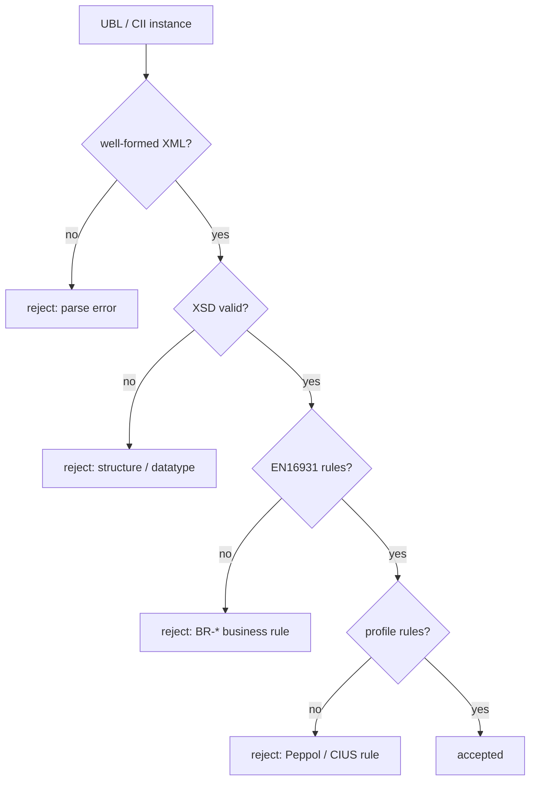

# The validation pipeline

An e-invoice is never checked against one thing. It runs a **pipeline** of layers,
each using a different technology and each catching a different class of error.
Knowing the layers explains why an invoice can be "schema-valid" yet still
rejected — and where to look when it is.



## Layer 1 — well-formedness

The cheapest gate: is it parseable XML at all? Matched tags, one root, proper
escaping. Every later layer assumes it. Nothing domain-specific here — it is the
same check any XML parser does.

## Layer 2 — XSD: structure and datatypes

The [XSD](../xsd/index.md) (UBL's published schema, or CII's) answers *structural*
questions: is `cbc:ID` allowed here, do the children appear in the required order,
is `cbc:IssueDate` a valid `xs:date`, is an amount a decimal?

``` xml title="caught by XSD"
<cbc:IssueDate>2026-13-45</cbc:IssueDate>   <!-- not a real date → datatype error -->
```

What XSD **cannot** see is meaning. This invoice is fully XSD-valid:

``` xml
<cbc:LineExtensionAmount currencyID="EUR">10.90</cbc:LineExtensionAmount>
...
<cac:LegalMonetaryTotal>
  <cbc:LineExtensionAmount currencyID="EUR">999.00</cbc:LineExtensionAmount>  <!-- total ≠ Σ lines -->
</cac:LegalMonetaryTotal>
```

A decimal is a decimal; the schema has no way to say "this total must equal the
sum of the lines." That is the next layer's job.

!!! note "Why not just write a stricter XSD?"
    XSD's identity constraints and facets can express a surprising amount, but
    *cross-field arithmetic* and *conditional co-occurrence* ("if X then Y is
    required") are beyond it. Pushing them into XSD produces unreadable schemas.
    The standard splits the work deliberately — see
    [why Schematron complements XSD](../schematron/index.md#why-it-complements-xsd).

## Layer 3 — EN16931 Schematron: business rules

This is the heart of the standard: several hundred numbered **business rules**
(BR-*) expressed as [Schematron](../schematron/index.md) assertions. They are the
rules a grammar cannot reach:

| Rule | Says | Kind |
| --- | --- | --- |
| **BR-01** | An invoice shall have a specification identifier (BT-24) | presence |
| **BR-CO-10** | Sum of line net amounts must equal the document line total | arithmetic |
| **BR-CO-15** | Tax-inclusive amount = tax-exclusive amount + total VAT | arithmetic |
| **BR-S-08** | Per standard-rated VAT line, taxable base ties to the line totals | conditional |

These are distributed as **public Schematron** (EUPL/Apache-2.0), authored as one
abstract rule model bound to both UBL and CII — the subject of
[Abstract patterns and EN16931](../schematron/abstract-patterns-en16931.md).
Recall that Schematron does not run directly: it is **compiled to
[XSLT](../xslt/index.md)** and produces an **SVRL** report listing which
assertions fired.

``` xml title="caught by EN16931"
<!-- structurally fine, but no cbc:CustomizationID anywhere → BR-01 fires (fatal) -->
```

## Layer 4 — profile rules: Peppol / CIUS

EN16931 is the *core*. Real networks tighten it with a **profile** — a CIUS such
as **Peppol BIS Billing 3.0** — that adds its own Schematron on top: extra
mandatory fields, restricted code lists, identifier-scheme requirements. A profile
may only *narrow*, never loosen, EN16931 (the rule behind that constraint is the
subject of [Peppol and CIUS profiles](peppol-cius.md)).

``` xml title="caught by the Peppol profile"
<!-- valid EN16931, but missing the Peppol-required Endpoint scheme → PEPPOL-EN16931-* fires -->
```

## Layer 5 — code lists

Threaded through layers 3–4 rather than standing alone: every coded field
(`cbc:DocumentCurrencyCode`, `cbc:InvoiceTypeCode`, the VAT category code…) must
hold a value from the correct published list. Those lists ship as
**[Genericode](genericode-codelists.md)**, and the check is typically *compiled
into* the Schematron — an assertion that the value exists in the loaded `.gc`
file.

``` xml title="caught by a code-list check"
<cbc:DocumentCurrencyCode>EU</cbc:DocumentCurrencyCode>   <!-- not in ISO 4217 → fails -->
```

## The layers as a table

| Layer | Technology | Catches | Misses |
| --- | --- | --- | --- |
| Well-formed | XML parser | broken markup | everything else |
| Structure | [XSD](../xsd/index.md) | wrong element/order/datatype | meaning, arithmetic |
| Business rules | [Schematron](../schematron/index.md) (→ [XSLT](../xslt/index.md)) | BR-* cross-field & arithmetic | profile specifics |
| Profile | Peppol/CIUS Schematron | network-specific tightening | — |
| Code lists | [Genericode](genericode-codelists.md) in Schematron | invalid coded values | — |

!!! tip "Read the SVRL, not just pass/fail"
    Because layers 3–5 are Schematron, a failure comes back as an **SVRL** report
    naming the exact rule (`BR-CO-10`), its severity, and a human message. When an
    invoice is rejected "by validation", that report tells you which layer and
    which rule — far more useful than a bare boolean.

## Next

The code-list layer deserves its own look — the format those lists ship in, and
how to look values up without re-scanning thousands of rows:
[Genericode code lists](genericode-codelists.md).
