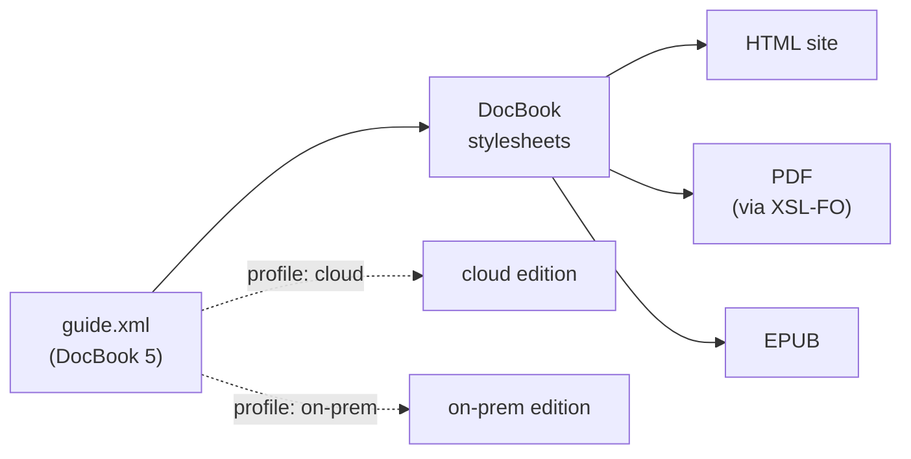

# DocBook — semantic markup and single-source publishing

**DocBook** is the grandparent of structured technical documentation: a
vocabulary for books, articles, and manuals where you mark up **meaning**, not
appearance. You do not write "bold, monospaced" — you write
`<command>`, `<filename>`, `<warning>`. One source document then becomes HTML,
PDF, and EPUB, each rendering those meanings its own way. This page is about
DocBook the *format*; the [stylesheets that render it](../xslt/at-scale.md) are
studied separately as a large XSLT codebase.

## A small specimen

``` xml title="guide.xml" linenums="1"
<?xml version="1.0" encoding="UTF-8"?>
<article xmlns="http://docbook.org/ns/docbook"   <!-- (1)! -->
         xmlns:xlink="http://www.w3.org/1999/xlink"
         version="5.2" xml:lang="en">
  <info>
    <title>Installing the widget</title>
    <author><personname>A. Writer</personname></author>
  </info>

  <section xml:id="install">                      <!-- (2)! -->
    <title>Installation</title>
    <para>Run <command>widget init</command> in your project root. It writes
      a <filename>widget.toml</filename> you can edit.</para>

    <warning>                                      <!-- (3)! -->
      <para>Never run <command>widget reset</command> on a production
        database — see <xref linkend="recovery"/>.</para>
    </warning>

    <para condition="cloud">On the hosted plan, the daemon starts
      automatically.</para>                        <!-- (4)! -->
  </section>
</article>
```

1.  **The namespace.** Every element lives in `http://docbook.org/ns/docbook`,
    declared once as the default namespace on the root. This is *the* thing that
    changed between DocBook 4 and 5 — see below.
2.  **Structure carries identity.** `xml:id` gives the section a stable handle;
    cross-references point at it, and it survives into the output as an HTML
    anchor or a PDF bookmark.
3.  **Semantic, not visual.** `<warning>`, `<command>`, `<filename>` say *what*
    something is. HTML output may render `<warning>` as a coloured callout box;
    print may render it as a framed note — the source does not care.
4.  **Profiling.** `condition="cloud"` is conditional text. The same source
    produces a "cloud" edition and an "on-prem" edition by *filtering* on this
    attribute at build time — single-source publishing in one attribute.

## A fuller page, as its skeleton

The specimen above is deliberately tiny. Real DocBook pages are *deep* — and
that depth is the whole point, but it also makes the raw markup tiring to read.
Here is a fuller, ~70-line chapter — the **Recovery** section is the one the
small specimen's `<xref linkend="recovery"/>` was pointing at — rendered with
[`unxml`](../appendix/unxml.md) as its **semantic skeleton**:

``` text title="unxml backups.xml — the chapter as an outline"
chapter(
    version="5.2",
    xml:id="backups",
    xml:lang="en",
    xmlns="http://docbook.org/ns/docbook",
    xmlns:xlink="http://www.w3.org/1999/xlink")
  title = Backups and recovery
  para = The <command>widget</command> daemon keeps its state in a single database. This chapter explains how to snapshot that state and how to restore it after a mishap.
  section(xml:id="how-backups-work")
    title = How backups work
    para = A backup is a consistent, point-in-time copy written to the directory named by the <envar>WIDGET_BACKUP_DIR</envar> environment variable. Each run produces two artefacts:
    itemizedlist
      listitem
        para = a compressed data file, <filename>snapshot.wgz</filename>;
      listitem
        para = a manifest, <filename>snapshot.toml</filename>, recording the schema version and a checksum.
    note
      para = Backups are incremental by default. Pass <option>--full</option> to force a complete copy.
  section(xml:id="creating-a-backup")
    title = Creating a backup
    para = Run <command>widget backup</command> from any directory:
    screen =
      | $ widget backup --full
      | Writing snapshot.wgz ... done (4.2 MiB)
      | Manifest written to /var/backups/widget/snapshot.toml
    para =
      | To schedule it, point your scheduler at the same command. A minimal
      |       configuration block looks like this:
    programlisting(language="toml") =
      | [backup]
      | dir = "/var/backups/widget"
      | schedule = "0 3 * * *"   # 03:00 daily
      | keep = 7                 # retain a week of snapshots
    tip
      para = Set <envar>WIDGET_BACKUP_DIR</envar> to a volume on a different disk than the live database.
  section(xml:id="recovery")
    title = Recovery
    para = To restore from a snapshot, stop the daemon and run <command>widget restore</command> with the path to a manifest:
    orderedlist
      listitem
        para = Stop the service: <command>widget stop</command>.
      listitem
        para = Restore: <command>widget restore</command> <replaceable>manifest.toml</replaceable>.
      listitem
        para = Verify and restart: <command>widget start</command>.
    warning
      para = Restoring overwrites the live database. Never run <command>widget restore</command> against a production instance without first taking a fresh backup.
    para = The restore command accepts these options:
    variablelist
      varlistentry
        term
          option = --dry-run
        listitem
          para =
            | Validate the manifest and report what would change,
            |           without writing anything.
      varlistentry
        term
          option = --force
        listitem
          para =
            | Skip the schema-version check. Use only when migrating
            |           between major versions.
```

Instances are normally shown as raw XML on this site, but DocBook is the case
that justifies the flattened view: what you are reading *is* the document — a
clean nested outline of `section`s, lists, and admonitions. Notice how `unxml`
draws the line. The *block* structure loses its angle brackets entirely; but the
*inline* prose — a `<para>` with a `<command>` or `<filename>` in it — is kept as
one flowing line of verbatim XML, because there the markup *is* the content and
the original reads best. Flatten the scaffolding, quote the prose. What remains
is exactly the structure the [stylesheets walk](../xslt/at-scale.md) to produce
HTML, PDF, and EPUB — which is why one source can feed many outputs.

??? note "The raw DocBook source (73 lines)"
    ``` xml
    <chapter xmlns="http://docbook.org/ns/docbook"
             xmlns:xlink="http://www.w3.org/1999/xlink"
             version="5.2" xml:id="backups" xml:lang="en">
      <title>Backups and recovery</title>
    
      <para>The <command>widget</command> daemon keeps its state in a single
        database. This chapter explains how to snapshot that state and how to
        restore it after a mishap.</para>
    
      <section xml:id="how-backups-work">
        <title>How backups work</title>
        <para>A backup is a consistent, point-in-time copy written to the directory
          named by the <envar>WIDGET_BACKUP_DIR</envar> environment variable. Each
          run produces two artefacts:</para>
        <itemizedlist>
          <listitem><para>a compressed data file, <filename>snapshot.wgz</filename>;</para></listitem>
          <listitem><para>a manifest, <filename>snapshot.toml</filename>, recording the
            schema version and a checksum.</para></listitem>
        </itemizedlist>
        <note>
          <para>Backups are incremental by default. Pass
            <option>--full</option> to force a complete copy.</para>
        </note>
      </section>
    
      <section xml:id="creating-a-backup">
        <title>Creating a backup</title>
        <para>Run <command>widget backup</command> from any directory:</para>
        <screen>$ widget backup --full
    Writing snapshot.wgz ... done (4.2 MiB)
    Manifest written to /var/backups/widget/snapshot.toml</screen>
        <para>To schedule it, point your scheduler at the same command. A minimal
          configuration block looks like this:</para>
        <programlisting language="toml">[backup]
    dir = "/var/backups/widget"
    schedule = "0 3 * * *"   # 03:00 daily
    keep = 7                 # retain a week of snapshots</programlisting>
        <tip>
          <para>Set <envar>WIDGET_BACKUP_DIR</envar> to a volume on a different
            disk than the live database.</para>
        </tip>
      </section>
    
      <section xml:id="recovery">
        <title>Recovery</title>
        <para>To restore from a snapshot, stop the daemon and run
          <command>widget restore</command> with the path to a manifest:</para>
        <orderedlist>
          <listitem><para>Stop the service: <command>widget stop</command>.</para></listitem>
          <listitem><para>Restore: <command>widget restore</command>
            <replaceable>manifest.toml</replaceable>.</para></listitem>
          <listitem><para>Verify and restart: <command>widget start</command>.</para></listitem>
        </orderedlist>
        <warning>
          <para>Restoring overwrites the live database. Never run
            <command>widget restore</command> against a production instance without
            first taking a fresh backup.</para>
        </warning>
        <para>The restore command accepts these options:</para>
        <variablelist>
          <varlistentry>
            <term><option>--dry-run</option></term>
            <listitem><para>Validate the manifest and report what would change,
              without writing anything.</para></listitem>
          </varlistentry>
          <varlistentry>
            <term><option>--force</option></term>
            <listitem><para>Skip the schema-version check. Use only when migrating
              between major versions.</para></listitem>
          </varlistentry>
        </variablelist>
      </section>
    </chapter>
    ```

## The namespace pattern it shows: a vocabulary growing up

DocBook is the textbook case of a vocabulary **acquiring a namespace when it
matured**:

- **DocBook 4 and earlier** were defined by a **DTD**. DTDs predate XML
  Namespaces and have no concept of them, so a DocBook 4 `<article>` was in *no
  namespace at all* — just a bare element name validated against a DTD.
- **DocBook 5** redefined the language as a **RELAX NG** schema and moved every
  element into `http://docbook.org/ns/docbook`. The version jump was, in large
  part, *the addition of a namespace* — which is why a DocBook 5 document fails
  against a DocBook 4 toolchain and vice versa, even when the elements look
  identical.

That is the same lifecycle you see across this section: a format starts informal,
and the moment it needs to coexist with others — be embedded, be extended, be
mixed — it claims a namespace to make its names globally unambiguous.

!!! info "Validated with RELAX NG, not XSD"
    DocBook 5 is one of the most prominent vocabularies whose **normative schema
    is RELAX NG**, not [XSD](../xsd/index.md). RELAX NG's grammar model expresses
    DocBook's "this element allows this loose soup of inline children" patterns
    far more naturally than XSD's content models do. A W3C XML Schema and a DTD
    are *generated* from the RELAX NG for tools that need them, but the RELAX NG
    is the source of truth. If you have only met XSD, DocBook is the reason to
    know RELAX NG exists.

## Single source, many outputs

The payoff of all that structure is one input and many renderings:



- The **HTML** and **EPUB** paths are XSLT straight to (X)HTML.
- The **PDF** path is XSLT to [XSL-FO](xsl-fo-fop.md), then a formatter (Apache
  FOP) to PDF — exactly the *generated, not authored* vocabulary pattern that
  page describes.
- **Profiling** (the `condition` attribute above) prunes the tree *before*
  rendering, so each edition is a real subset, not CSS hiding.

This is why DocBook persists in toolchains decades on: the cost of rich semantic
markup is paid once, and every output format — including ones that did not exist
when the document was written — collects the dividend.

!!! tip "Where the engine is dissected"
    The stylesheets that perform these transforms are themselves one of the
    largest readable XSLT codebases anywhere. The Modern XSLT section walks the
    **DocBook xslTNG** stylesheets as a case study in
    [XSLT at scale](../xslt/at-scale.md) — modes, function libraries, and
    import-precedence customization layers in a real 50-file project.

## The modern move: author light, generate DocBook

If you started a documentation project today, you would probably *not* type
DocBook by hand. The field reached a clear conclusion: **XML is an excellent
machine format and an awkward human authoring format.** Angle brackets are
verbose, and writers resent them.

So the modern pattern inverts the roles. Authors write **lightweight markup** —
most often **[AsciiDoc](https://asciidoc.org/)** (via *Asciidoctor*) or
Markdown — and a tool *generates* DocBook from it:

``` asciidoc title="guide.adoc — the same content, hand-friendly"
== Installation

Run `widget init` in your project root. It writes a `widget.toml` you can edit.

WARNING: Never run `widget reset` on a production database.
```

`asciidoctor -b docbook guide.adoc` turns that into the `<section>` /
`<command>` / `<warning>` tree shown above. AsciiDoc was, in fact, *designed* as
a more writable front-end for DocBook — the XML never disappears, it just stops
being the thing humans touch. DocBook (or HTML, or PDF) becomes the durable
**interchange and output** layer underneath.

That is the same theme this whole section keeps hitting: **XML earns its keep
where interchange, validation, and longevity matter — less so where people
type.** Within XML proper there is no newer documentation vocabulary displacing
DocBook; the one thriving modern XML doc format,
**[JATS](https://jats.nlm.nih.gov/)** (the Journal Article Tag Suite), lives in
exactly the niche where archival XML still wins outright: scholarly publishing.
The XML stayed; the *typing* moved on.
