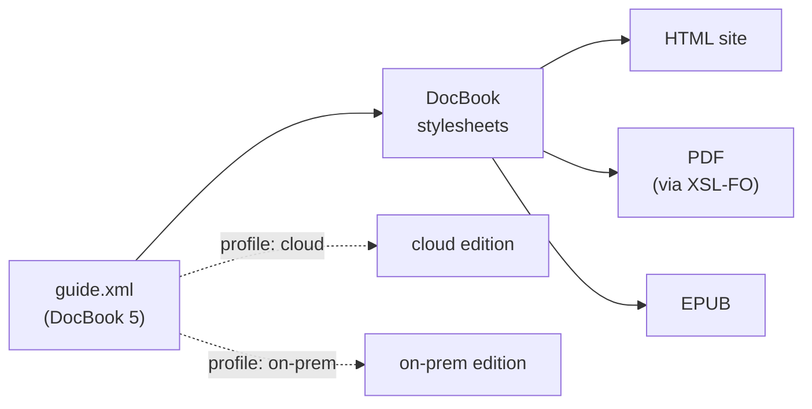

# DocBook — semantic markup and single-source publishing

**DocBook** is the grandparent of structured technical documentation: a
vocabulary for books, articles, and manuals where you mark up **meaning**, not
appearance. You do not write "bold, monospaced" — you write
`<command>`, `<filename>`, `<warning>`. One source document then becomes HTML,
PDF, and EPUB, each rendering those meanings its own way. This page is about
DocBook the *format*; the [stylesheets that render it](../xslt/at-scale.md) are
studied separately as a large XSLT codebase.

## A small specimen

``` xml title="guide.xml" linenums="1"
<?xml version="1.0" encoding="UTF-8"?>
<article xmlns="http://docbook.org/ns/docbook"   <!-- (1)! -->
         xmlns:xlink="http://www.w3.org/1999/xlink"
         version="5.2" xml:lang="en">
  <info>
    <title>Installing the widget</title>
    <author><personname>A. Writer</personname></author>
  </info>

  <section xml:id="install">                      <!-- (2)! -->
    <title>Installation</title>
    <para>Run <command>widget init</command> in your project root. It writes
      a <filename>widget.toml</filename> you can edit.</para>

    <warning>                                      <!-- (3)! -->
      <para>Never run <command>widget reset</command> on a production
        database — see <xref linkend="recovery"/>.</para>
    </warning>

    <para condition="cloud">On the hosted plan, the daemon starts
      automatically.</para>                        <!-- (4)! -->
  </section>
</article>
```

1.  **The namespace.** Every element lives in `http://docbook.org/ns/docbook`,
    declared once as the default namespace on the root. This is *the* thing that
    changed between DocBook 4 and 5 — see below.
2.  **Structure carries identity.** `xml:id` gives the section a stable handle;
    cross-references point at it, and it survives into the output as an HTML
    anchor or a PDF bookmark.
3.  **Semantic, not visual.** `<warning>`, `<command>`, `<filename>` say *what*
    something is. HTML output may render `<warning>` as a coloured callout box;
    print may render it as a framed note — the source does not care.
4.  **Profiling.** `condition="cloud"` is conditional text. The same source
    produces a "cloud" edition and an "on-prem" edition by *filtering* on this
    attribute at build time — single-source publishing in one attribute.

## The namespace pattern it shows: a vocabulary growing up

DocBook is the textbook case of a vocabulary **acquiring a namespace when it
matured**:

- **DocBook 4 and earlier** were defined by a **DTD**. DTDs predate XML
  Namespaces and have no concept of them, so a DocBook 4 `<article>` was in *no
  namespace at all* — just a bare element name validated against a DTD.
- **DocBook 5** redefined the language as a **RELAX NG** schema and moved every
  element into `http://docbook.org/ns/docbook`. The version jump was, in large
  part, *the addition of a namespace* — which is why a DocBook 5 document fails
  against a DocBook 4 toolchain and vice versa, even when the elements look
  identical.

That is the same lifecycle you see across this section: a format starts informal,
and the moment it needs to coexist with others — be embedded, be extended, be
mixed — it claims a namespace to make its names globally unambiguous.

!!! info "Validated with RELAX NG, not XSD"
    DocBook 5 is one of the most prominent vocabularies whose **normative schema
    is RELAX NG**, not [XSD](../xsd/index.md). RELAX NG's grammar model expresses
    DocBook's "this element allows this loose soup of inline children" patterns
    far more naturally than XSD's content models do. A W3C XML Schema and a DTD
    are *generated* from the RELAX NG for tools that need them, but the RELAX NG
    is the source of truth. If you have only met XSD, DocBook is the reason to
    know RELAX NG exists.

## Single source, many outputs

The payoff of all that structure is one input and many renderings:



- The **HTML** and **EPUB** paths are XSLT straight to (X)HTML.
- The **PDF** path is XSLT to [XSL-FO](xsl-fo-fop.md), then a formatter (Apache
  FOP) to PDF — exactly the *generated, not authored* vocabulary pattern that
  page describes.
- **Profiling** (the `condition` attribute above) prunes the tree *before*
  rendering, so each edition is a real subset, not CSS hiding.

This is why DocBook persists in toolchains decades on: the cost of rich semantic
markup is paid once, and every output format — including ones that did not exist
when the document was written — collects the dividend.

!!! tip "Where the engine is dissected"
    The stylesheets that perform these transforms are themselves one of the
    largest readable XSLT codebases anywhere. The Modern XSLT section walks the
    **DocBook xslTNG** stylesheets as a case study in
    [XSLT at scale](../xslt/at-scale.md) — modes, function libraries, and
    import-precedence customization layers in a real 50-file project.
