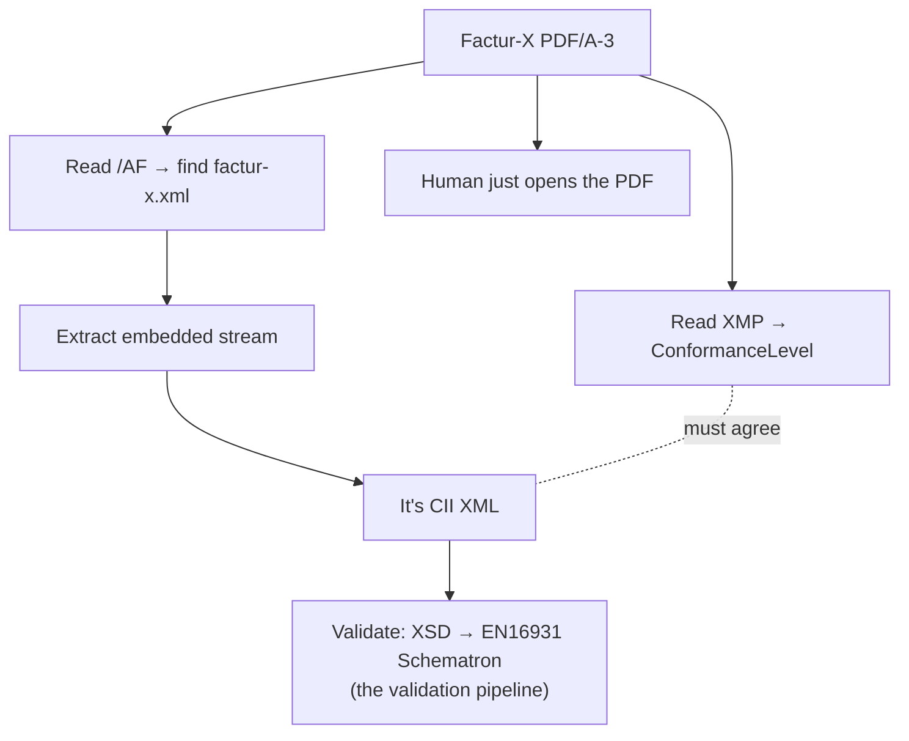

# Factur-X & ZUGFeRD — XML embedded in a PDF

The [e-invoicing section](../einvoicing/index.md) showed the structured invoice as
[CII XML](../einvoicing/cii-invoice.md). This page shows how that exact XML travels
*in the wild* in France and Germany: **embedded inside a human-readable PDF**. One
file serves two audiences — a person opens a normal invoice PDF; a machine pulls the
CII XML out of it. **Factur-X** (France, FNFE-MPE) and **ZUGFeRD** (Germany, FeRD)
are two national names for one specification; since version 2.1 they are
byte-compatible.

!!! abstract "The pattern this page shows"
    Every other vocabulary in this tour *is* XML at the top level. This one is not:
    the document is a **binary PDF**, and XML rides inside it two ways — the invoice
    as an **embedded file**, and the metadata describing it as **XMP, which is
    RDF/XML**. The lesson is how XML lives as a *payload* in a non-XML container, and
    how it is discovered and identified there.

## The container: PDF/A-3

PDF/A is the ISO standard for *archival* PDFs — self-contained, no external
dependencies, renderable decades from now. **PDF/A-3** (ISO 19005-3) adds exactly
one capability over PDF/A-2 that this whole format hangs on: it permits **arbitrary
embedded file attachments**. The machine-readable CII XML is embedded as one such
attachment, and the PDF pages are its human-readable rendering of the same data.

## Wiring the attachment: `/EmbeddedFiles` and `/AF`

A PDF is a graph of *objects* written in PDF's own dictionary syntax — not XML. The
attachment is described by a **file-specification dictionary**:

``` text title="PDF object syntax (not XML)"
<< /Type /Filespec
   /F (factur-x.xml)                 % (1)!
   /UF (factur-x.xml)
   /AFRelationship /Alternative      % (2)!
   /EF << /F 42 0 R >> >>            % (3)!
```

1.  **The filename is fixed.** A receiver finds the data by name, so it must match
    exactly. The name changed across versions — see the table below.
2.  **`/AFRelationship`** declares *how* the attachment relates to the document:
    `/Alternative` means "the same content in another form" (the XML is an alternative
    representation of the printed invoice). More on the values below.
3.  **`/EF`** ("embedded file") points at the object holding the actual bytes — a
    stream object (`42 0 R`) whose content is the CII XML.

The file spec is then linked from the document catalog's **`/AF`** ("Associated
Files") array, which is the PDF/A-3 feature that says *"this attachment is associated
data for the document,"* not a stray attachment:

``` text title="document catalog (PDF object syntax)"
<< /Type /Catalog
   /AF [ 41 0 R ]                    % the filespec above
   /Names << /EmbeddedFiles << /Names [ (factur-x.xml) 41 0 R ] >> >>
   /Metadata 99 0 R >>              % the XMP packet — see below
```

The filename and `/AFRelationship` value are the two things that changed as the
standard evolved:

| Version | Embedded filename | `/AFRelationship` |
| --- | --- | --- |
| ZUGFeRD 1.0 | `ZUGFeRD-invoice.xml` | `Alternative` |
| ZUGFeRD 2.0 | `zugferd-invoice.xml` | `Alternative` |
| **ZUGFeRD 2.1 / Factur-X** | **`factur-x.xml`** | `Alternative` (see note) |

!!! warning "`/AFRelationship`: `Alternative`, with one twist — and a spec erratum"
    ZUGFeRD 2.1 changes the value to **`Source`** for the BASIC / EN 16931 / EXTENDED
    profiles *when the recipient is outside Germany and the PDF was produced from the
    XML* — i.e. the XML is the source the PDF was rendered from. Confusingly, some
    official sample files use `/Data`, which the specification itself flags as
    incorrect. When in doubt, `Alternative` is the safe, widely-accepted value.

## The metadata: XMP is RDF/XML

Here is where the format becomes an XML topic. Every PDF can carry an **XMP** packet
— Adobe's *Extensible Metadata Platform* — and XMP **is RDF/XML**. Factur-X requires
the XMP to carry an extension schema announcing that a Factur-X invoice is embedded
and *which profile* it uses:

``` xml title="XMP packet (RDF/XML), abridged"
<rdf:RDF xmlns:rdf="http://www.w3.org/1999/02/22-rdf-syntax-ns#">
  <rdf:Description rdf:about=""
      xmlns:fx="urn:factur-x:pdfa:CrossIndustryDocument:invoice:1p0#">  <!-- (1)! -->
    <fx:DocumentType>INVOICE</fx:DocumentType>                          <!-- (2)! -->
    <fx:DocumentFileName>factur-x.xml</fx:DocumentFileName>             <!-- (3)! -->
    <fx:Version>1.0</fx:Version>
    <fx:ConformanceLevel>EN 16931</fx:ConformanceLevel>                 <!-- (4)! -->
  </rdf:Description>
</rdf:RDF>
```

1.  **The Factur-X namespace** (`fx`), with `1p0` ("1.0") in the URI — the version of
    the *XMP schema*, not the invoice. (ZUGFeRD 1.0/2.0 used a `zf`-prefixed
    namespace instead.)
2.  **`DocumentType`** — `INVOICE` or `CREDITNOTE`.
3.  **`DocumentFileName`** — must **match the actual attachment name** (`factur-x.xml`).
    A reader can find the data from the metadata alone.
4.  **`ConformanceLevel`** — the profile (here `EN 16931`). This is the metadata-level
    declaration of the same profile the embedded XML declares internally (next
    section).

!!! note "PDF/A forbids undeclared XMP namespaces"
    Because the `fx:` schema is custom, PDF/A requires the XMP to *also* carry a
    `pdfaExtension` block (itself more RDF/XML) formally describing that schema — its
    namespace, prefix, and each property. So a Factur-X PDF actually contains XML
    metadata *describing the schema of* its XML metadata. Tooling generates this; it
    is the price of a custom namespace in a strict archival format.

## The embedded XML is just CII

Pull `factur-x.xml` out of the PDF and you have exactly the document the
[CII detail page](../einvoicing/cii-invoice-detail.md) walked — same `rsm:`/`ram:`
elements, same EN16931 business terms. The profile is therefore declared **twice,
and the two must agree**:

| Where | How the profile appears |
| --- | --- |
| In the PDF's XMP | `<fx:ConformanceLevel>EN 16931</fx:ConformanceLevel>` |
| In the embedded CII | `…GuidelineSpecifiedDocumentContextParameter/ram:ID` = a profile URN |

That `ram:ID` is the same [BT-24 specification identifier](../einvoicing/cii-invoice-detail.md#context-and-header)
you have already seen — and the CII example in the e-invoicing section carries
`urn:cen.eu:en16931:2017`, which is precisely the **EN 16931** profile URN. Wrap that
exact XML in a PDF/A-3 with the XMP above and you have a Factur-X *EN 16931* invoice.

## The profiles

Factur-X / ZUGFeRD 2.x defines five profiles of increasing richness. The URN is what
goes in the embedded CII's `ram:ID`:

| Profile | EN16931-compliant? | Profile URN (`ram:ID`) |
| --- | --- | --- |
| MINIMUM | No (no full tax detail) | `urn:factur-x.eu:1p0:minimum` |
| BASIC WL | No (no lines) | `urn:factur-x.eu:1p0:basicwl` |
| BASIC | **Yes** | `urn:cen.eu:en16931:2017#compliant#urn:factur-x.eu:1p0:basic` |
| **EN 16931** (COMFORT) | **Yes** (full core) | `urn:cen.eu:en16931:2017` |
| EXTENDED | Yes + extra terms | `urn:cen.eu:en16931:2017#conformant#urn:factur-x.eu:1p0:extended` |

The URN structure itself encodes the relationship to EN16931 from the
[profiles section](../einvoicing/peppol-cius.md): `…#compliant#…` is a
[CIUS](../einvoicing/glossary.md#profiles-narrowing-the-core-for-real-networks)
(narrows the core), while `…#conformant#…` marks an **extension** (EXTENDED adds
terms beyond the core, for logistics and customs). MINIMUM and BASIC WL fall *below*
EN16931 and are intended for accounting hand-off, not as full e-invoices. Germany's
**XRECHNUNG** B2G format rides on the same machinery as a further profile.

## How a receiver processes one



A machine ignores the rendered pages and works entirely from the extracted CII,
running it through the same [validation pipeline](../einvoicing/validation-pipeline.md)
as any other EN16931 invoice. A person ignores the XML and reads the PDF. Neither is
aware of the other's copy — that is the whole point.

## Why this shape exists

Pure-XML invoicing (Peppol, plain UBL/CII) is cleaner, but it asks every recipient —
including small businesses and auditors — to own software that *renders* XML.
Factur-X sidesteps that during the transition: the document is still a familiar,
archival PDF anyone can open, while the structured data rides along for those who can
use it. That hybrid is why France's and Germany's B2B e-invoicing mandates lean on
it, and why CII is worth knowing even if you never touch the Peppol network.

## Where next

The embedded XML is ordinary EN16931 CII, so everything else in the e-invoicing
section applies to it: [Anatomy of a CII invoice](../einvoicing/cii-invoice.md) and
[in detail](../einvoicing/cii-invoice-detail.md) for the payload, and
[The validation pipeline](../einvoicing/validation-pipeline.md) for what checks it
once extracted. For more XML-as-metadata, XMP's RDF lineage connects to the wider
RDF/semantic-web world beyond this tour.
