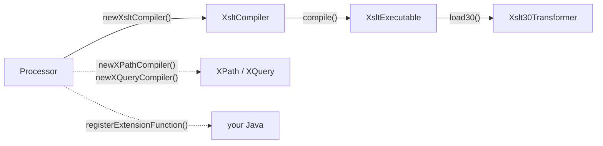

# Saxon from Java — parameters and Java extensions

The [Java APIs page](api-java.md) introduced Saxon as the way to run modern
[XSLT 3.0 / XPath 3.1 / XQuery 3.1](../xslt/moving-to-3.md) on the JVM. This page
goes one level deeper into the part that turns Saxon from "a transformer you call"
into "a language you embed and extend": **feeding parameters in from Java**, and
**calling your own Java code back out** from inside a stylesheet. Both run on the
free, open-source **Saxon-HE**; everything below was compiled and run against
`net.sf.saxon:Saxon-HE:12.5`.

The idiomatic API is **`s9api`** (`net.sf.saxon.s9api.*`) — a small, typed object
model that wraps Saxon's internals. Four object families do almost everything:



A `Processor` is the shared, thread-safe factory you create once. Compilers turn
source into a reusable `…Executable`; loading an executable gives a *per-run*
transformer or selector. Values that cross the boundary are `XdmValue` and its kin
(`XdmItem`, `XdmAtomicValue`, `XdmNode`), and names are always `QName` — the
namespace-aware name object, never a raw string.

## Passing parameters in

XSLT has two different things people both call "parameters", and Saxon keeps them
on separate methods. Both take a `Map<QName, XdmValue>`.

``` java title="building values and setting parameters"
Processor proc = new Processor(false);               // (1)!
XsltExecutable exec = proc.newXsltCompiler()
        .compile(new StreamSource(new File("report.xsl")));
Xslt30Transformer t = exec.load30();                 // a fresh per-run transformer

// 1. global xsl:param declared at the top of the stylesheet
t.setStylesheetParameters(Map.of(
        new QName("who"),      new XdmAtomicValue("Saxon"),
        new QName("currency"), new XdmAtomicValue("EUR")));   // (2)!

// 2. params to the *initial named template* — the entry point you call below
t.setInitialTemplateParameters(
        Map.of(new QName("punct"), new XdmAtomicValue("!")),
        false);                                       // (3)!
```

1.  `new Processor(false)` — `false` means "not schema-aware", i.e. Saxon-HE. There
    is one `Processor` per application; compilers and transformers are spun off it.
2.  **Global stylesheet parameters** feed the top-level `<xsl:param>` elements —
    the stylesheet's configuration knobs. The `QName` must match the param's name
    (and namespace, if any); the document's prefix is irrelevant, only the
    [URI is](xml-in-code.md#the-namespace-problem-in-every-language).
3.  **Initial-template parameters** are different: they are arguments to the
    *specific template you invoke*, not document-wide. The boolean is the
    **tunnel** flag — `true` makes them tunnel parameters that flow through
    `apply-templates` to deep descendants without being re-declared at each level.

### Choosing the entry point

`Xslt30Transformer` does not have a single "go" method — XSLT 3.0 lets you start a
transform three ways, and each is a method:

``` java title="three ways to start"
Serializer out = proc.newSerializer(new File("out.xml"));

t.applyTemplates(new StreamSource(new File("data.xml")), out);  // (1)!
t.callTemplate(new QName("main"), out);                         // (2)!
XdmValue r = t.callFunction(new QName(NS, "format-total"),      // (3)!
                            new XdmValue[]{ new XdmAtomicValue(100) });
```

1.  **Push a source document** through the template rules — the classic
    "match templates against an input tree" model. This is the one that consumes
    `setStylesheetParameters`.
2.  **Call a named template** with no input document — handy for generating output
    from parameters alone (a report header, a config file). This consumes the
    `setInitialTemplateParameters` set above.
3.  **Call a named `xsl:function`** directly and get its `XdmValue` back — using a
    stylesheet as a library of pure functions, no serialization needed.

## Extension functions — calling Java from XSLT

The reverse direction is the interesting one: making your own Java reachable from
inside a stylesheet or XPath expression — a database lookup, a crypto routine, a
date formatter the language lacks. Saxon offers two levels.

### The simple, portable way: `ExtensionFunction`

`net.sf.saxon.s9api.ExtensionFunction` is a four-method interface (one of them a
`default`), built entirely from s9api types. You implement it, register it on the
`Processor`, and it is callable under whatever namespace you gave its name —
**and it works in Saxon-HE**.

``` java title="an extension function ex:shout()" linenums="1"
ExtensionFunction shout = new ExtensionFunction() {
    public QName getName() {                                    // (1)!
        return new QName("http://acme.example/fn", "shout");
    }
    public SequenceType getResultType() {                      // (2)!
        return SequenceType.makeSequenceType(
                ItemType.STRING, OccurrenceIndicator.ONE);
    }
    public SequenceType[] getArgumentTypes() {                 // (3)!
        return new SequenceType[]{
            SequenceType.makeSequenceType(ItemType.STRING, OccurrenceIndicator.ONE)
        };
    }
    public XdmValue call(XdmValue[] args) throws SaxonApiException {  // (4)!
        String in = args[0].itemAt(0).getStringValue();
        return new XdmAtomicValue(in.toUpperCase());
    }
};
proc.registerExtensionFunction(shout);                         // (5)!
```

1.  The function's **name is a `QName`** — a local name in a namespace *you* own.
    Mint a URI for your extensions (`http://acme.example/fn` here); never put them
    in a W3C or vendor namespace.
2.  `getResultType` is a `default` method (you may omit it and Saxon assumes
    `item()*`), but declaring it lets Saxon type-check calls. `SequenceType` pairs
    an `ItemType` with an `OccurrenceIndicator` (`ONE`, `ZERO_OR_ONE`,
    `ZERO_OR_MORE`, `ONE_OR_MORE`) — the Java spelling of XPath's `xs:string`,
    `xs:string?`, `xs:string*`.
3.  Argument types, in order — here a single required string. Saxon uses these to
    bind and convert the call's arguments before your code runs.
4.  The body. Arguments arrive as `XdmValue[]`; you return an `XdmValue`. Everything
    is in Saxon's data model, so `getStringValue()`, `XdmAtomicValue`, and friends
    are how you cross in and out of plain Java.
5.  One call wires it into the `Processor`; every stylesheet and XPath compiled from
    that processor can now see it.

Bind the namespace in the stylesheet and call it like any other function:

``` xml title="report.xsl (using the extension)"
<xsl:stylesheet version="3.0"
    xmlns:xsl="http://www.w3.org/1999/XSL/Transform"
    xmlns:ex="http://acme.example/fn"            <!-- (1)! -->
    exclude-result-prefixes="ex" expand-text="yes">
  <xsl:param name="who" as="xs:string" select="'world'"
             xmlns:xs="http://www.w3.org/2001/XMLSchema"/>
  <xsl:template name="main">
    <xsl:param name="punct" as="xs:string" select="'.'"
               xmlns:xs="http://www.w3.org/2001/XMLSchema"/>
    <out>{ex:shout('hello ' || $who)}{$punct}</out>   <!-- (2)! -->
  </xsl:template>
</xsl:stylesheet>
```

1.  `ex:` is bound to the **same URI** your `getName()` returned. That URI is the
    only link between the stylesheet and the Java class — the prefix is cosmetic.
2.  `ex:shout(...)` calls into Java; `$who` and `$punct` are the two parameters set
    from Java above. With the parameters from the previous section
    (`who="Saxon"`, `punct="!"`), `callTemplate("main")` produces:

``` xml title="output"
<out>HELLO SAXON!</out>
```

### The full-control way: `ExtensionFunctionDefinition`

When you need *variable arity*, access to the **evaluation context** (the current
node, the static base URI), or lazy argument evaluation, drop to
`net.sf.saxon.lib.ExtensionFunctionDefinition` — a lower-level abstract class that
works in terms of Saxon's *internal* types rather than s9api:

``` java title="the lower-level shape"
public class LookupFn extends ExtensionFunctionDefinition {
    public StructuredQName getFunctionQName() {                // internal QName type
        return new StructuredQName("ex", "http://acme.example/fn", "lookup");
    }
    public int getMinimumNumberOfArguments() { return 1; }     // (1)!
    public int getMaximumNumberOfArguments() { return 2; }
    public net.sf.saxon.value.SequenceType[] getArgumentTypes() { /* … */ }
    public net.sf.saxon.value.SequenceType getResultType(
            net.sf.saxon.value.SequenceType[] suppliedArgs) { /* … */ }
    public ExtensionFunctionCall makeCallExpression() {        // (2)!
        return new ExtensionFunctionCall() {
            public Sequence call(XPathContext ctx, Sequence[] args) { /* … */ }
        };
    }
}
proc.registerExtensionFunction(new LookupFn());                // (3)!
```

1.  **Variable arity** — `ex:lookup($key)` or `ex:lookup($key, $default)` from the
    one definition. The simple `ExtensionFunction` interface above is fixed-arity.
2.  `makeCallExpression()` returns the object that actually runs, and its `call`
    receives the `XPathContext` — so this is the level at which you can read the
    context node or integrate with Saxon's lazy evaluation.
3.  The **same** `registerExtensionFunction` method takes either kind — there is an
    overload for `ExtensionFunction` and one for `ExtensionFunctionDefinition`.

!!! warning "Reflexive `java:` functions are not the HE path"
    Saxon also supports *reflexive* extension functions — binding a namespace
    straight to a class (`xmlns:m="java:java.lang.Math"`) and calling
    `m:sqrt(2.0)` with no registration. It is convenient, but it is gated behind
    **Saxon-PE/EE** (and is a code-execution surface you may not want stylesheets
    to have). The **integrated** functions above are the portable, Saxon-HE-safe,
    explicitly-allow-listed way — you decide exactly which Java each processor can
    reach. This is the same HE/PE/EE line drawn on the
    [Java APIs page](api-java.md#4-transform-xslt-with-saxon).

## XPath and XQuery with external variables

The same value-passing idea applies when you run a bare [XPath](../xpath/index.md)
or [XQuery](../xquery/index.md) from Java: declare the variable on the compiler,
bind it on the selector.

``` java title="XPath with a $threshold variable"
XPathCompiler xpc = proc.newXPathCompiler();
xpc.declareNamespace("i", "urn:example:invoice");          // (1)!
xpc.declareVariable(new QName("threshold"));
XPathSelector sel = xpc.compile("//i:total[. > $threshold]").load();
sel.setContextItem(proc.newDocumentBuilder().build(new File("invoice.xml")));
sel.setVariable(new QName("threshold"), new XdmAtomicValue(50));   // (2)!
XdmValue hits = sel.evaluate();
```

1.  Saxon's XPath takes namespaces as a plain `declareNamespace(prefix, uri)` —
    much nicer than JAXP's `NamespaceContext` ([shown on the Java page](api-java.md#2-navigate-xpath-with-a-namespacecontext)).
2.  The variable is declared at compile time, bound at run time — so the same
    compiled `XPathExecutable` can be re-run with different values. XQuery is the
    twin: `XQueryEvaluator.setExternalVariable(QName, XdmValue)` feeds a
    `declare variable $x external;`.

## Things to note

- One **`Processor`** per application; **compile once** into an `…Executable` and
  reuse it — the compile is the costly step, not the run.
- **Two kinds of XSLT parameter**: global `setStylesheetParameters` (stylesheet
  config) versus per-invocation `setInitialTemplateParameters` (with a *tunnel*
  flag). They are not interchangeable.
- **Three entry points** — `applyTemplates` (push a document), `callTemplate`
  (named entry, no input), `callFunction` (use the stylesheet as a function
  library).
- **Integrated extension functions** let stylesheets call your Java and run on
  free Saxon-HE; reach for `ExtensionFunctionDefinition` only when you need
  variable arity or the evaluation context. Avoid reflexive `java:` binding unless
  you are on PE/EE and accept the security surface.
- Values crossing the boundary are always **`XdmValue`/`QName`** — Saxon's typed,
  namespace-aware model, never raw strings.

Compare with the broader [Java API survey](api-java.md), or the
[.NET](api-dotnet.md), [Python](api-python.md) and [Rust](api-rust.md) pages — the
latter two reach this same Saxon engine through
[Saxon-C](api-java.md#saxon-beyond-the-jvm-saxon-c-saxonche).
