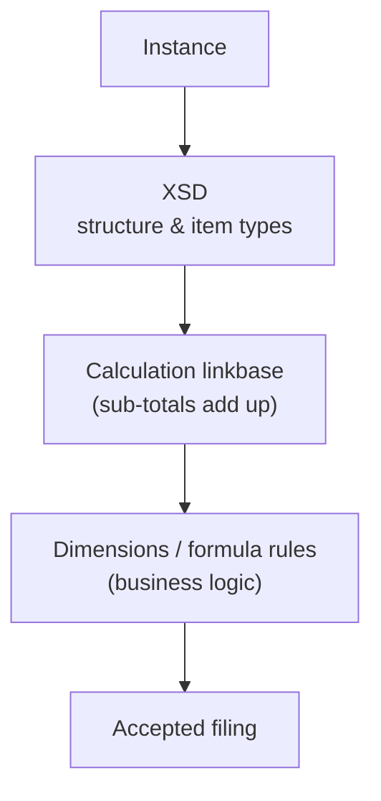

# XBRL — namespacing taken to the limit

The tour ends with the most namespace-saturated vocabulary in common use.
**XBRL** (eXtensible Business Reporting Language) is how companies file financial
statements to regulators — the SEC in the US, ESMA in Europe. It is the natural
escalation from [e-invoicing](../einvoicing/index.md): same idea (a public model
+ your data), turned up to eleven. The defining move is that you do not just *use*
a namespace — you **define your own namespace of business concepts** (a
*taxonomy*) and then report facts against it.

## Two documents, many namespaces

XBRL splits into two artifacts that the [SOAP](soap-wsdl.md) / WSDL split
foreshadowed:

| Artifact | What it is | Built on |
| --- | --- | --- |
| **Taxonomy** | An [XSD](../xsd/index.md) defining *concepts* (Revenue, Assets…) plus linkbases for labels, calculations, hierarchy | XSD + XLink |
| **Instance** | A document reporting *facts* — values for those concepts, in time periods and currencies | the `xbrli:` namespace |

## The instance

``` xml title="instance.xbrl" linenums="1"
<xbrli:xbrl xmlns:xbrli="http://www.xbrl.org/2003/instance"
            xmlns:link="http://www.xbrl.org/2003/linkbase"
            xmlns:xlink="http://www.w3.org/1999/xlink"
            xmlns:iso4217="http://www.xbrl.org/2003/iso4217"
            xmlns:us-gaap="http://fasb.org/us-gaap/2024">
  <link:schemaRef xlink:type="simple" xlink:href="acme-2025.xsd"/>   <!-- (1)! -->
  <xbrli:context id="FY2025">                                        <!-- (2)! -->
    <xbrli:entity>
      <xbrli:identifier scheme="http://www.sec.gov/CIK">0000320193</xbrli:identifier>
    </xbrli:entity>
    <xbrli:period>
      <xbrli:startDate>2025-01-01</xbrli:startDate>
      <xbrli:endDate>2025-12-31</xbrli:endDate>
    </xbrli:period>
  </xbrli:context>
  <xbrli:unit id="USD">                                              <!-- (3)! -->
    <xbrli:measure>iso4217:USD</xbrli:measure>
  </xbrli:unit>
  <us-gaap:Revenues contextRef="FY2025" unitRef="USD" decimals="-6">391035000000</us-gaap:Revenues>  <!-- (4)! -->
</xbrli:xbrl>
```

1.  `schemaRef` points at the **taxonomy** — the schema this instance reports
    against. The link uses `xlink:` ([XLink again](svg.md), the same spec SVG
    borrowed), so even the *act of referencing the schema* is namespaced.
2.  A `context` answers *who* and *when*: which entity (by SEC CIK number) and over
    which period. Every reported fact references a context. This is XBRL's way of
    avoiding repeating "for Acme Corp, fiscal year 2025" on every single number.
3.  A `unit` answers *in what*: here US dollars, named by the value
    `iso4217:USD` — a **prefixed value**, not a prefixed element. The `iso4217:`
    namespace exists so currency codes are globally unambiguous.
4.  The fact itself. `us-gaap:Revenues` is a concept from the **US-GAAP taxonomy**;
    `contextRef`/`unitRef` wire it to the context and unit above; `decimals="-6"`
    says it is accurate to the nearest million. One number, fully self-describing.

Five namespaces in the root, and that is a *minimal* instance — a real SEC filing
declares dozens. Notice the proportions: the bulk is *context/unit scaffolding*,
with the actual facts (the `us-gaap:` lines) a small fraction of the document.

## Defining your own concepts: the taxonomy

This is where XBRL goes beyond every other vocabulary in this section. A company
that needs a concept the standard taxonomy lacks **mints its own namespace** and
declares concepts in it. Each concept is an `xs:element` — but a very particular
one:

``` text title="unxml --xsd acme-2025.xsd (excerpt)"
schema http://acme.example/2025 (elementFormDefault=qualified)
  ns acme = http://acme.example/2025
  ns xbrli = http://www.xbrl.org/2003/instance
  import http://www.xbrl.org/2003/instance from xbrl-instance-2003-12-31.xsd   # (1)!
  element Revenues : xbrli:monetaryItemType nillable substitutes xbrli:item    # (2)!
```

1.  The taxonomy `import`s the core XBRL instance schema — your concepts are built
    on XBRL's base types, the same [`import`](../xsd/modular-schemas.md) mechanism
    from the XSD chapter.
2.  The whole game is on this line. A concept is an element whose type is an XBRL
    item type (`monetaryItemType`, `stringItemType`, …) and which
    **`substitutes xbrli:item`** — XSD
    [substitution groups](../xsd/modular-schemas.md). That single
    `substitutionGroup` is what makes `acme:Revenues` reportable *anywhere* the
    XBRL spec allows an `xbrli:item`, without the spec knowing your concept exists.
    It is the extension mechanism of [Atom](atom-feeds.md), implemented with
    substitution groups instead of wildcards.

!!! info "The XBRL-specific attributes live in the XBRL namespace too"
    Concepts also carry `xbrli:periodType` (instant vs duration) and
    `xbrli:balance` (debit/credit) attributes. They are attributes from the
    *XBRL* namespace attached to *your* element — foreign-namespace attributes,
    exactly like `xlink:href` on an [SVG `<use>`](svg.md). XBRL is built almost
    entirely by composing other namespaces this way.

## The validation stack, scaled up

XBRL closes the loop with the [e-invoicing validation pipeline](../einvoicing/validation-pipeline.md),
just with more layers:



Where EN16931 used [Schematron](../schematron/index.md) for business rules, XBRL
uses *linkbases* and a Formula spec — but the principle is identical: XSD checks
shape, a higher layer checks that the numbers make sense (e.g. that line items sum
to the reported total).

## Things to note

- You can **define your own namespace of concepts** and have them slot into a
  standard via **substitution groups** — XSD's most far-reaching extension
  mechanism, here doing industrial-scale work.
- **Context** and **unit** factoring keeps thousands of facts from repeating their
  who/when/in-what — a namespaced answer to data normalization.
- Real documents pile up *many* namespaces; the value of a flattening view like
  `unxml` grows with the document.
- The shape rhymes with everything before it: a public model, your data, and a
  layered validation stack — [XSD](../xsd/index.md) for structure, something
  higher for business rules.

---

That is the tour. Across every vocabulary the same handful of namespace moves
kept reappearing — default vs prefixed, borrowing (`xlink`, `fo`, `ds`, Dublin Core),
versioning by URI, and three flavors of extension (wildcard, container, reserved
prefix, substitution group). Once you can spot those, most namespaced XML reads
as familiar shapes — only more or less verbose. And when it is verbose, there's
always [`unxml`](index.md#reading-xml-with-unxml).
