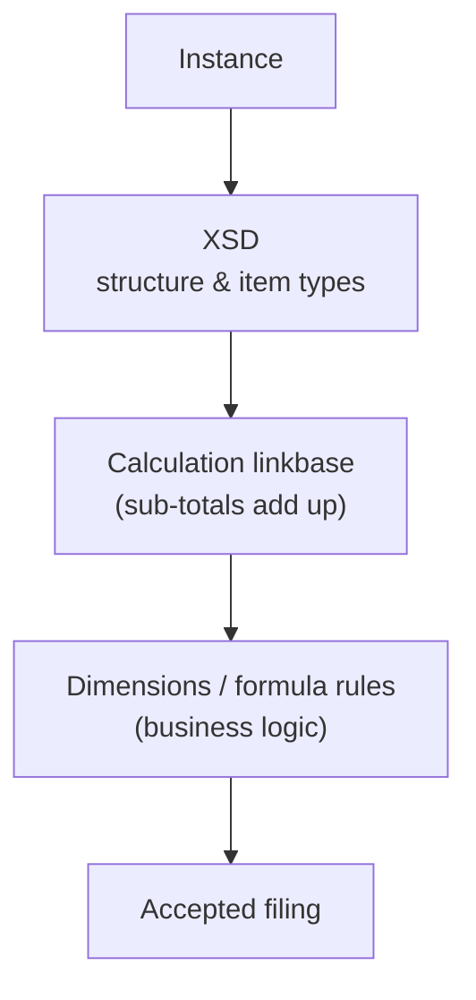

# XBRL — namespacing taken to the limit

The tour ends with the most namespace-saturated vocabulary in common use.
**XBRL** (eXtensible Business Reporting Language) is how companies file financial
statements to regulators — the SEC in the US, ESMA in Europe. It is the natural
escalation from [e-invoicing](../einvoicing/index.md): same idea (a public model
+ your data), turned up to eleven. The defining move is that you do not just *use*
a namespace — you **define your own namespace of business concepts** (a
*taxonomy*) and then report facts against it.

## Two documents, many namespaces

XBRL splits into two artifacts that the [SOAP](soap-wsdl.md) / WSDL split
foreshadowed:

| Artifact | What it is | Built on |
| --- | --- | --- |
| **Taxonomy** | An [XSD](../xsd/index.md) defining *concepts* (Revenue, Assets…) plus linkbases for labels, calculations, hierarchy | XSD + XLink |
| **Instance** | A document reporting *facts* — values for those concepts, in time periods and currencies | the `xbrli:` namespace |

## The instance

``` xml title="instance.xbrl" linenums="1"
<xbrli:xbrl xmlns:xbrli="http://www.xbrl.org/2003/instance"
            xmlns:link="http://www.xbrl.org/2003/linkbase"
            xmlns:xlink="http://www.w3.org/1999/xlink"
            xmlns:iso4217="http://www.xbrl.org/2003/iso4217"
            xmlns:us-gaap="http://fasb.org/us-gaap/2024">
  <link:schemaRef xlink:type="simple" xlink:href="acme-2025.xsd"/>   <!-- (1)! -->
  <xbrli:context id="FY2025">                                        <!-- (2)! -->
    <xbrli:entity>
      <xbrli:identifier scheme="http://www.sec.gov/CIK">0000320193</xbrli:identifier>
    </xbrli:entity>
    <xbrli:period>
      <xbrli:startDate>2025-01-01</xbrli:startDate>
      <xbrli:endDate>2025-12-31</xbrli:endDate>
    </xbrli:period>
  </xbrli:context>
  <xbrli:unit id="USD">                                              <!-- (3)! -->
    <xbrli:measure>iso4217:USD</xbrli:measure>
  </xbrli:unit>
  <us-gaap:Revenues contextRef="FY2025" unitRef="USD" decimals="-6">391035000000</us-gaap:Revenues>  <!-- (4)! -->
</xbrli:xbrl>
```

1.  `schemaRef` points at the **taxonomy** — the schema this instance reports
    against. The link uses `xlink:` ([XLink again](svg.md), the same spec SVG
    borrowed), so even the *act of referencing the schema* is namespaced.
2.  A `context` answers *who* and *when*: which entity (by SEC CIK number) and over
    which period. Every reported fact references a context. This is XBRL's way of
    avoiding repeating "for Acme Corp, fiscal year 2025" on every single number.
3.  A `unit` answers *in what*: here US dollars, named by the value
    `iso4217:USD` — a **prefixed value**, not a prefixed element. The `iso4217:`
    namespace exists so currency codes are globally unambiguous.
4.  The fact itself. `us-gaap:Revenues` is a concept from the **US-GAAP taxonomy**;
    `contextRef`/`unitRef` wire it to the context and unit above; `decimals="-6"`
    says it is accurate to the nearest million. One number, fully self-describing.

Five namespaces in the root, and that is a *minimal* instance — a real SEC filing
declares dozens. Notice the proportions: the bulk is *context/unit scaffolding*,
with the actual facts (the `us-gaap:` lines) a small fraction of the document.

## A fuller filing, flattened

The minimal instance fits on a screen. A real one does not — and that is exactly
where a flattening view earns its keep. Below is a still-abridged but *realistic*
10-K excerpt: nine namespaces, four contexts (two reporting periods, one
balance-sheet instant, one **dimensional** geographic segment), three units
(dollars, shares, and a *compound* dollars-per-share), cover-page `dei:` facts, an
income statement with a prior-year comparative, a balance sheet, a company-minted
concept, and a footnote wired to a fact by an XLink arc. As raw markup it is a
wall of `xbrli:` ceremony; run through `unxml` the **shape** surfaces:

``` text title="unxml acme-10k-2025.xbrl"
xbrli:xbrl(
    xmlns:acme="http://acme.example/2025",
    xmlns:dei="http://xbrl.sec.gov/dei/2024",
    xmlns:iso4217="http://www.xbrl.org/2003/iso4217",
    xmlns:link="http://www.xbrl.org/2003/linkbase",
    xmlns:us-gaap="http://fasb.org/us-gaap/2024",
    xmlns:xbrldi="http://xbrl.org/2006/xbrldi",
    xmlns:xbrli="http://www.xbrl.org/2003/instance",
    xmlns:xlink="http://www.w3.org/1999/xlink")
  link:schemaRef(xlink:href="acme-2025.xsd", xlink:type="simple")
  xbrli:context(id="FY2025")                                       # (1)!
    xbrli:entity
      xbrli:identifier(scheme="http://www.sec.gov/CIK") = 0000320193
    xbrli:period
      xbrli:startDate = 2025-01-01
      xbrli:endDate = 2025-12-31
  xbrli:context(id="FY2024")                                       # (2)!
    xbrli:entity
      xbrli:identifier(scheme="http://www.sec.gov/CIK") = 0000320193
    xbrli:period
      xbrli:startDate = 2024-01-01
      xbrli:endDate = 2024-12-31
  xbrli:context(id="AsOf2025-12-31")                               # (3)!
    xbrli:entity
      xbrli:identifier(scheme="http://www.sec.gov/CIK") = 0000320193
    xbrli:period
      xbrli:instant = 2025-12-31
  xbrli:context(id="FY2025-Americas")
    xbrli:entity
      xbrli:identifier(scheme="http://www.sec.gov/CIK") = 0000320193
      xbrli:segment
        xbrldi:explicitMember(dimension="us-gaap:StatementGeographicalAxis") = acme:AmericasMember  # (4)!
    xbrli:period
      xbrli:startDate = 2025-01-01
      xbrli:endDate = 2025-12-31
  xbrli:unit(id="USD")
    xbrli:measure = iso4217:USD
  xbrli:unit(id="shares")
    xbrli:measure = xbrli:shares
  xbrli:unit(id="USDPerShare")                                     # (5)!
    xbrli:divide
      xbrli:unitNumerator
        xbrli:measure = iso4217:USD
      xbrli:unitDenominator
        xbrli:measure = xbrli:shares
  dei:EntityRegistrantName(contextRef="FY2025") = Acme Corporation # (6)!
  dei:EntityCentralIndexKey(contextRef="FY2025") = 0000320193
  dei:DocumentType(contextRef="FY2025") = 10-K
  dei:DocumentFiscalYearFocus(contextRef="FY2025") = 2025
  dei:EntityCommonStockSharesOutstanding(contextRef="AsOf2025-12-31", decimals="0", unitRef="shares") = 15204137000
  us-gaap:Revenues(contextRef="FY2025", decimals="-6", unitRef="USD") = 391035000000           # (7)!
  us-gaap:Revenues(contextRef="FY2024", decimals="-6", unitRef="USD") = 383285000000
  us-gaap:Revenues(contextRef="FY2025-Americas", decimals="-6", unitRef="USD") = 167045000000  # (8)!
  us-gaap:CostOfRevenue(contextRef="FY2025", decimals="-6", unitRef="USD") = 210352000000
  us-gaap:GrossProfit(contextRef="FY2025", decimals="-6", unitRef="USD") = 180683000000
  us-gaap:OperatingExpenses(contextRef="FY2025", decimals="-6", unitRef="USD") = 57467000000
  us-gaap:OperatingIncomeLoss(contextRef="FY2025", decimals="-6", unitRef="USD") = 123216000000
  us-gaap:NetIncomeLoss(contextRef="FY2025", decimals="-6", unitRef="USD") = 99803000000
  us-gaap:EarningsPerShareBasic(contextRef="FY2025", decimals="2", unitRef="USDPerShare") = 6.57
  us-gaap:Assets(contextRef="AsOf2025-12-31", decimals="-6", unitRef="USD") = 364980000000
  us-gaap:Liabilities(contextRef="AsOf2025-12-31", decimals="-6", unitRef="USD") = 308030000000
  us-gaap:StockholdersEquity(contextRef="AsOf2025-12-31", decimals="-6", unitRef="USD") = 56950000000
  acme:SubscribersEndOfPeriod(contextRef="AsOf2025-12-31", decimals="0") = 1025000000  # (9)!
  link:footnoteLink(xlink:role="http://www.xbrl.org/2003/role/link", xlink:type="extended")  # (10)!
    link:loc(xlink:href="#fact-rev", xlink:label="rev", xlink:type="locator")
    link:footnoteArc(xlink:arcrole="…/fact-footnote", xlink:from="rev", xlink:to="fn1", xlink:type="arc")
    link:footnote(xlink:label="fn1", xlink:role="…/footnote", xml:lang="en") = Includes a 53rd week.
```

1.  A **duration** context: a fact tagged `FY2025` is a flow measured *over* the
    year (revenue, net income).
2.  The prior year, declared once. The comparative column on every financial
    statement is just facts pointing at a second period context — no duplicated
    structure.
3.  An **instant** context: `period` is a single `instant`, not a start/end. Stocks
    (assets, equity, shares outstanding) are measured *at a point*; the period type
    is part of the concept's definition in the taxonomy, and the instance must use
    the matching context kind.
4.  A **dimensional** context. The `segment` carries an `xbrldi:explicitMember`
    pinning an *axis* (`StatementGeographicalAxis`) to a *member*
    (`acme:AmericasMember`). This is how one concept — `Revenues` — is reported many
    times, sliced by geography, product, or scenario, without inventing a new
    element per slice.
5.  A **compound unit** built with `divide`: dollars over shares. Earnings-per-share
    is dimensionally a ratio, and the unit says so structurally rather than as free
    text.
6.  The `dei:` (Document and Entity Information) block — the cover-page facts every
    SEC filing carries (registrant name, CIK, form type). A whole separate
    namespace just for the filing's metadata.
7.  The first real fact, and the same concept as the minimal example. `decimals="-6"`
    = accurate to the nearest million; `contextRef`/`unitRef` resolve upward to the
    scaffolding.
8.  The **same** `us-gaap:Revenues` concept, third occurrence — this one bound to the
    dimensional `FY2025-Americas` context. The fact element is identical; only the
    `contextRef` changes the meaning.
9.  `acme:SubscribersEndOfPeriod` — a concept the standard taxonomy has no word for,
    in the company's **own** namespace, sitting in the same flat list of facts as the
    `us-gaap:` ones. The next section is how that element comes to exist.
10. A **footnote linkbase embedded in the instance**: an XLink `extended` link with a
    `loc` (points at a fact), an `arc` (the relationship), and a `resource` (the note
    text). The same `xlink:` machinery that links taxonomies, here annotating a single
    number. (The long `…/fact-footnote` and `…/footnote` role URIs are abbreviated
    above for the page — the real ones are full `xbrl.org` URLs.)

Read flat, the document is plainly *three lists*: contexts, units, then facts that
reference them by id. The verbosity that makes raw XBRL daunting is almost entirely
the `xbrli:` scaffolding, and the flattening makes the signal-to-ceremony ratio
visible at a glance — which is the whole argument for a tool like this on
namespace-saturated formats.

## Defining your own concepts: the taxonomy

This is where XBRL goes beyond every other vocabulary in this section. A company
that needs a concept the standard taxonomy lacks **mints its own namespace** and
declares concepts in it. Each concept is an `xs:element` — but a very particular
one:

``` text title="unxml --xsd acme-2025.xsd (excerpt)"
schema http://acme.example/2025 (elementFormDefault=qualified)
  ns acme = http://acme.example/2025
  ns xbrli = http://www.xbrl.org/2003/instance
  import http://www.xbrl.org/2003/instance from xbrl-instance-2003-12-31.xsd   # (1)!
  element Revenues : xbrli:monetaryItemType nillable substitutes xbrli:item    # (2)!
```

1.  The taxonomy `import`s the core XBRL instance schema — your concepts are built
    on XBRL's base types, the same [`import`](../xsd/modular-schemas.md) mechanism
    from the XSD chapter.
2.  The whole game is on this line. A concept is an element whose type is an XBRL
    item type (`monetaryItemType`, `stringItemType`, …) and which
    **`substitutes xbrli:item`** — XSD
    [substitution groups](../xsd/modular-schemas.md). That single
    `substitutionGroup` is what makes `acme:Revenues` reportable *anywhere* the
    XBRL spec allows an `xbrli:item`, without the spec knowing your concept exists.
    It is the extension mechanism of [Atom](atom-feeds.md), implemented with
    substitution groups instead of wildcards.

!!! info "The XBRL-specific attributes live in the XBRL namespace too"
    Concepts also carry `xbrli:periodType` (instant vs duration) and
    `xbrli:balance` (debit/credit) attributes. They are attributes from the
    *XBRL* namespace attached to *your* element — foreign-namespace attributes,
    exactly like `xlink:href` on an [SVG `<use>`](svg.md). XBRL is built almost
    entirely by composing other namespaces this way.

## The validation stack, scaled up

XBRL closes the loop with the [e-invoicing validation pipeline](../einvoicing/validation-pipeline.md),
just with more layers:



Where EN16931 used [Schematron](../schematron/index.md) for business rules, XBRL
uses *linkbases* and a Formula spec — but the principle is identical: XSD checks
shape, a higher layer checks that the numbers make sense (e.g. that line items sum
to the reported total).

### A calculation rule, concretely

The second layer is a **calculation linkbase** — another XLink document, separate
from both the instance and the schema. It does not contain numbers; it states
*relationships between concepts*, and a validator then checks the reported facts
against them. The rule "GrossProfit = Revenues − CostOfRevenue" is two arcs with
**weights**:

``` text title="unxml acme-calc.xml"
link:linkbase
  link:calculationLink(xlink:role="http://acme.example/role/IncomeStatement", xlink:type="extended")
    link:loc(xlink:href="acme-2025.xsd#us-gaap_GrossProfit",   xlink:label="gp",  xlink:type="locator")   # (1)!
    link:loc(xlink:href="acme-2025.xsd#us-gaap_Revenues",      xlink:label="rev", xlink:type="locator")
    link:loc(xlink:href="acme-2025.xsd#us-gaap_CostOfRevenue", xlink:label="cor", xlink:type="locator")
    link:calculationArc(weight="1.0",  xlink:from="gp", xlink:to="rev", xlink:arcrole="…/summation-item")  # (2)!
    link:calculationArc(weight="-1.0", xlink:from="gp", xlink:to="cor", xlink:arcrole="…/summation-item")
```

1.  `loc` elements are **locators** — they give a short local `label` to a concept
    defined elsewhere (in the taxonomy `.xsd`). The arcs below wire labels together,
    not the long element names; this is the XLink indirection from
    [XML Signature](xml-dsig.md) and [SVG `<use>`](svg.md), applied to math.
2.  Each `summation-item` arc says "this child contributes to that parent." The
    `weight` is the multiplier: `+1.0` adds Revenues into GrossProfit, `-1.0`
    subtracts CostOfRevenue. The total is *implied by the graph of arcs*, never
    written down.

A validator walks those arcs, fetches the matching facts **for each context**
(`FY2025`: 391035 − 210352 = 180683, which equals the reported `GrossProfit` —
consistent), and flags any context where the arithmetic does not hold:

``` text title="a calculation inconsistency"
[ERROR] calc:inconsistentCalculation
  concept=us-gaap:GrossProfit context=FY2025
  computed=180,683,000,000 (Revenues − CostOfRevenue)
  reported=170,000,000,000   difference=10,683,000,000
```

Two subtleties make this its own layer rather than a `<xs:assert>`: the check is
**per context** (the same rule re-runs for FY2025, FY2024, and every dimensional
slice), and tolerance is governed by each fact's `decimals` — two facts reported to
the nearest million are only compared to that precision, so rounding never trips a
false positive.

## Things to note

- You can **define your own namespace of concepts** and have them slot into a
  standard via **substitution groups** — XSD's most far-reaching extension
  mechanism, here doing industrial-scale work.
- **Context** and **unit** factoring keeps thousands of facts from repeating their
  who/when/in-what — a namespaced answer to data normalization.
- Real documents pile up *many* namespaces; the value of a flattening view like
  `unxml` grows with the document.
- The shape rhymes with everything before it: a public model, your data, and a
  layered validation stack — [XSD](../xsd/index.md) for structure, something
  higher for business rules.

---

That is the tour. Across every vocabulary the same handful of namespace moves
kept reappearing — default vs prefixed, borrowing (`xlink`, `fo`, `ds`, Dublin Core),
versioning by URI, and three flavors of extension (wildcard, container, reserved
prefix, substitution group). Once you can spot those, most namespaced XML reads
as familiar shapes — only more or less verbose. And when it is verbose, there's
always [`unxml`](index.md#reading-xml-with-unxml).
