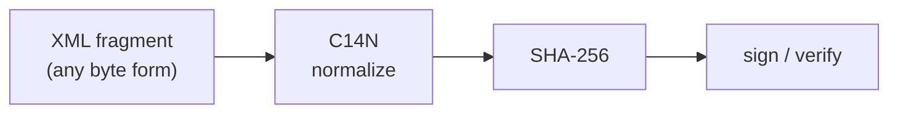

# XML Signature — why namespaces force canonicalization

This page exists because of a problem the earlier ones only hinted at: **two XML
documents can be byte-different but mean exactly the same thing.** That is fine
when you are reading them — and fatal when you are trying to *sign* them. XML
Signature (XML-DSig) is the standard that signs XML, and the reason it is
interesting here is that namespaces are the chief troublemaker it has to tame.

XML-DSig is everywhere you do not see it: **SAML** single sign-on, signed
[SOAP](soap-wsdl.md) messages (WS-Security), signed [UBL](../einvoicing/ubl-invoice.md)
invoices, eIDAS documents.

## An enveloped signature

The most common shape is an **enveloped** signature: the `Signature` element sits
*inside* the document it signs.

``` xml title="signed.xml" linenums="1"
<Envelope xmlns="urn:example:po">
  <Order>Widget x100</Order>
  <Signature xmlns="http://www.w3.org/2000/09/xmldsig#">          <!-- (1)! -->
    <SignedInfo>
      <CanonicalizationMethod Algorithm="http://www.w3.org/2001/10/xml-exc-c14n#"/>  <!-- (2)! -->
      <SignatureMethod Algorithm="http://www.w3.org/2001/04/xmldsig-more#rsa-sha256"/>
      <Reference URI="">                                          <!-- (3)! -->
        <Transforms>
          <Transform Algorithm="http://www.w3.org/2000/09/xmldsig#enveloped-signature"/>
        </Transforms>
        <DigestMethod Algorithm="http://www.w3.org/2001/04/xmlenc#sha256"/>
        <DigestValue>j6lwx3rvEPO0vKtMup4NbeVu8nk=</DigestValue>   <!-- (4)! -->
      </Reference>
    </SignedInfo>
    <SignatureValue>MC0CFFrVLt...==</SignatureValue>             <!-- (5)! -->
    <KeyInfo>
      <X509Data><X509Certificate>MIIB...</X509Certificate></X509Data>
    </KeyInfo>
  </Signature>
</Envelope>
```

1.  The signature uses its *own* default namespace (`…/xmldsig#`), nested inside
    a document that has a *different* default namespace (`urn:example:po`). Two
    default namespaces, one document, scoped by element — exactly the situation
    that makes byte-level comparison meaningless.
2.  `CanonicalizationMethod` is the heart of the matter — see below. The value
    `…/xml-exc-c14n#` is **Exclusive C14N**.
3.  `Reference URI=""` means "the whole containing document". The
    `enveloped-signature` transform then says "but first remove the `Signature`
    element itself" — otherwise the signature would have to cover its own
    not-yet-computed value, which is impossible.
4.  `DigestValue` is the hash of the *canonicalized, transformed* `Order` content.
5.  `SignatureValue` is the hash of the canonicalized `SignedInfo`, encrypted with
    the signer's private key. `KeyInfo` carries the certificate to verify it.

## The namespace problem, concretely

A digital signature signs **bytes**. But these two fragments are the *same* XML:

``` xml title="A"
<po:Order xmlns:po="urn:example:po" qty="100" sku="W1"/>
```
``` xml title="B"
<x:Order  sku="W1"   qty="100" xmlns:x="urn:example:po" ></x:Order>
```

Different prefix (`po` vs `x`), different attribute order, different whitespace,
empty-element syntax vs explicit close tag — **different bytes, identical
meaning** ([XPath](../xpath/index.md) would see one and the same node either way).
If you signed A's bytes, B would fail verification even though nothing
*meaningful* changed. Any intermediary that reformats the XML — a SOAP stack, an
XML database, a pretty-printer — would silently break the signature.

**Canonicalization (C14N)** is the fix: before hashing, both signer and verifier
run the XML through a deterministic normalizer that fixes a single byte
representation — attribute order alphabetized, prefixes and namespace declarations
regularized, whitespace and empty-element forms standardized. Sign the
*canonical* form and A and B hash identically.



!!! warning "Exclusive vs inclusive C14N — a real footgun"
    Plain (inclusive) C14N pulls **all in-scope namespace declarations** into the
    fragment it canonicalizes — including ones declared on ancestors that have
    nothing to do with the signed content. Move that signed fragment into a
    different document (the everyday case for [SOAP](soap-wsdl.md), where messages
    are wrapped and rewrapped) and the inherited declarations differ, so the hash
    changes and verification fails. **Exclusive C14N** (`xml-exc-c14n#`, used
    above) only keeps the namespaces the fragment *actually uses*, which is why
    WS-Security mandates it. Picking the wrong one is a classic interop bug.

## Things to note

- Because namespaces (and attribute order, and whitespace) let the *same* document
  take *many* byte forms, signing XML requires a **canonicalization** step that
  signing JSON or plain text does not.
- The `Reference`/`Transform` machinery is a tiny pipeline: select a part of the
  document, transform it, hash it — and it must be reproducible bit-for-bit on the
  far end.
- **Exclusive vs inclusive C14N** is a namespace-scoping decision with direct
  security and interop consequences.
- Signatures, like everything else here, are just another namespaced vocabulary
  (`…/xmldsig#`) that nests cleanly inside whatever it protects.

Next: [GPX and KML](geo-gpx-kml.md) — back to friendlier ground, with two
geospatial vocabularies and two different ways of allowing extensions.
