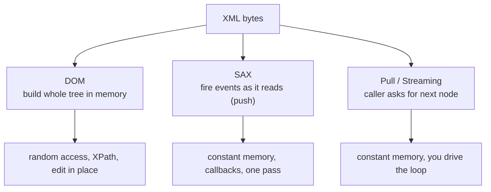

# Working with XML in code

The rest of this site is about XML as a *language* — schemas, [XPath](../xpath/index.md),
[XSLT](../xslt/index.md). This page (and the three that follow) is about XML as
something a **program** opens, reads, changes, and writes back. Every language
that touches XML ends up offering the same small set of tools, because they all
answer the same three questions:

1. **How do I get the document into memory?** — the *parsing model*.
2. **How do I find things in it?** — navigation and XPath, and with it the
   eternal **namespace** problem.
3. **How do I produce XML back out?** — serialization, and validating that what I
   produced is correct.

This page covers the concepts language-agnostically; the
[Java](api-java.md), [.NET](api-dotnet.md) and [Python](api-python.md) pages then
show the *same five tasks* in each runtime, so you can map one onto another.

## The running example

All four pages process the same tiny, namespaced document — two namespaces so the
namespace handling is never hypothetical:

``` xml title="invoice.xml"
<inv:invoice xmlns:inv="urn:example:invoice"
             xmlns:p="urn:example:party">
  <inv:id>INV-42</inv:id>
  <inv:total currency="EUR">100.00</inv:total>
  <p:supplier>
    <p:name>Acme Records</p:name>
  </p:supplier>
</inv:invoice>
```

## Three ways to read XML

The single most important choice when reading XML is the **parsing model**. There
are three, and every library is built on one or more of them.



### DOM — the whole tree in memory

The parser reads the entire document and hands you a **tree** of node objects you
can walk in any direction, query with XPath, and modify in place. This is what
people mean by "an XML document object". It is the friendliest model and the
right default — until the document does not fit in memory.

- **Good for:** anything you need to query repeatedly, edit, or transform; files
  up to tens of MB.
- **Bad for:** a 4 GB data export — DOM may use 5–10× the file size in RAM.

### SAX — events pushed at you

SAX (Simple API for XML) never builds a tree. It reads forward and **calls your
handler** for each event: `startElement`, `characters`, `endElement`. You keep
whatever state you care about and discard the rest, so memory stays flat
regardless of file size. The cost is inversion of control — *the parser* drives,
and you reconstruct context by hand.

### Pull / streaming — you ask for the next node

The pull model (StAX's `XMLStreamReader` in Java, `XmlReader` in .NET,
`iterparse` in lxml) is streaming like SAX — constant memory, forward-only — but
**you** drive the loop, calling "give me the next node" and deciding what to do.
Most people find it easier than SAX's callbacks while keeping the same scalability.

!!! tip "The decision in one line"
    **Reach for a tree (DOM) by default; switch to pull/streaming the moment the
    document might not fit in memory.** SAX is the older push variant of streaming
    — still common in existing code, rarely the first choice for new code.

A common hybrid for huge files: **stream** to the start of each record, then build
a small **DOM subtree** for just that record, process it with XPath, and free it.
You get XPath's convenience at constant memory. Every API page shows this pattern.

## The namespace problem, in every language

Here is the thing that surprises people coming from JSON. Take our document and
ask, in essentially any XML library:

```text
find every  //total  element
```

You get **nothing**. `total` is in the `urn:example:invoice` namespace, and an
unprefixed name in [XPath 1.0](../xpath/index.md) means *no namespace*. This is the
exact rule from the [XPath chapter](../xpath/node-tests-predicates.md) and the
[SVG page](svg.md#querying-namespaced-svg-with-xpath) — and in code it bites
through a small object every library makes you build: a **map from prefix to
namespace URI**.

| Runtime | What you build |
| --- | --- |
| Java | a `NamespaceContext` passed to `XPath` |
| .NET | an `XmlNamespaceManager` passed to `SelectNodes` |
| Python (lxml) | a `namespaces=` dict on `.xpath()` |

The critical, non-obvious rule: **the prefix you use in your query is yours, not
the document's.** Only the URI matters. Our document uses `inv:`, but in code you
can bind *any* prefix — say `i` — to `urn:example:invoice` and query `//i:total`.
The document could even use a *different* prefix for the same namespace; your
query still works, because you both resolve to the same URI. Prefixes are local
nicknames; the URI is the identity. (XPath 2.0+ adds a *default element
namespace* so you can sometimes skip the prefix, but the prefix-map approach works
everywhere.)

```text
your prefix map:   i  -> urn:example:invoice
your query:        //i:total
matches:           <inv:total>   (same URI, different nickname — fine)
```

## Validating and transforming from code

The two big declarative technologies on this site have programmatic front doors
too, and they appear on every runtime page:

- **Schema validation** — load an [XSD](../xsd/index.md) (or several) into a
  schema object, then validate a document against it, getting back a list of
  errors with line numbers. This is the [validation pipeline](../einvoicing/validation-pipeline.md)'s
  first layer, invoked from code.
- **XSLT transformation** — compile a [stylesheet](../xslt/index.md) once, then run
  it over many inputs. Compiling once and reusing is the key performance habit, and
  it is how the [XSL-FO pipeline](xsl-fo-fop.md) is actually driven.

## Data binding — XML as objects

Finally, the highest-level option: skip nodes entirely and map XML **straight to
classes**. You generate (or annotate) classes from an XSD, and the library
marshals objects to XML and back.

- **Java:** JAXB (`@XmlRootElement`, `xjc` to generate from XSD).
- **.NET:** `XmlSerializer` (`xsd.exe /classes`), or `System.Text` for simple cases.
- **Python:** no built-in binding; `xsdata` or `generateDS` generate dataclasses.

Binding is wonderful when the schema is stable and you mostly want typed objects;
it is awkward when documents are loosely structured, carry mixed content, or lean
on the [extension wildcards](atom-feeds.md) we saw earlier — there, the node-level
APIs stay more honest.

## Where to go next

Pick your runtime — each page works the same five tasks on the
`invoice.xml` above:

- [**Java (JAXP & Saxon)**](api-java.md)
- [**.NET**](api-dotnet.md)
- [**Python (lxml)**](api-python.md)
