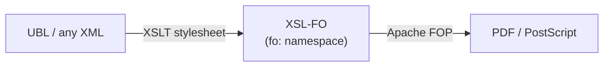

# XSL-FO and Apache FOP — a vocabulary you generate

Almost every vocabulary so far was meant to be *authored* — by a person or an
app. **XSL-FO** (the Formatting Objects half of XSL) is different: you rarely
write it by hand. You write [XSLT](../xslt/index.md) that *produces* it, and a
formatter — most often **Apache FOP** — turns it into a PDF. It is the natural
sequel to the XSLT chapter, and it closes the loop the
[e-invoicing section](../einvoicing/index.md) opened: the same UBL invoice you
validated can be transformed into a printable document.



## What FO looks like

XSL-FO lives in one namespace, `http://www.w3.org/1999/XSL/Format`, conventionally
prefixed `fo:`. A document declares its page geometry once, then pours content
into it.

``` xml title="invoice.fo" linenums="1"
<fo:root xmlns:fo="http://www.w3.org/1999/XSL/Format">
  <fo:layout-master-set>                                       <!-- (1)! -->
    <fo:simple-page-master master-name="A4"
                           page-width="210mm" page-height="297mm">
      <fo:region-body margin="20mm"/>
    </fo:simple-page-master>
  </fo:layout-master-set>
  <fo:page-sequence master-reference="A4">                     <!-- (2)! -->
    <fo:flow flow-name="xsl-region-body">                      <!-- (3)! -->
      <fo:block font-size="18pt" font-weight="bold" space-after="6pt">
        Invoice TOSL108</fo:block>
      <fo:block>Total: 100.00 EUR</fo:block>
    </fo:flow>
  </fo:page-sequence>
</fo:root>
```

1.  `layout-master-set` defines the *page templates* — size, margins, named
    regions (body, header, footer). You describe the paper before the content.
2.  A `page-sequence` binds a stream of content to a page master. A document can
    have several, e.g. a title page master then a body master.
3.  `flow` is the content that fills `region-body` and breaks across as many pages
    as needed. `fo:block` is the workhorse — roughly a paragraph — and its
    properties (`font-size`, `space-after`) are deliberately **CSS-like**, because
    XSL-FO and CSS share formatting heritage.

Read top to bottom it is almost a page description: a page master, then a flow of
blocks. Verbose, though — which is exactly why you let a machine generate it
rather than typing it.

## The stylesheet that emits it

This is where two namespaces share one document. The stylesheet is in the
**XSLT** namespace (`xsl:`); the *output* it constructs is in the **FO**
namespace (`fo:`). Both are declared on the root, and the processor copies the
non-`xsl:` elements through to the result.

``` xml title="invoice-to-fo.xsl" linenums="1"
<xsl:stylesheet version="3.0"
                xmlns:xsl="http://www.w3.org/1999/XSL/Transform"
                xmlns:fo="http://www.w3.org/1999/XSL/Format">
  <xsl:template match="/invoice">
    <fo:root>                                          <!-- (1)! -->
      <fo:layout-master-set>
        <fo:simple-page-master master-name="A4"
                               page-width="210mm" page-height="297mm">
          <fo:region-body margin="20mm"/>
        </fo:simple-page-master>
      </fo:layout-master-set>
      <fo:page-sequence master-reference="A4">
        <fo:flow flow-name="xsl-region-body">
          <fo:block font-size="18pt" font-weight="bold">
            Invoice <xsl:value-of select="@id"/>          <!-- (2)! -->
          </fo:block>
          <fo:block>Total: <xsl:value-of select="total"/> EUR</fo:block>
        </fo:flow>
      </fo:page-sequence>
    </fo:root>
  </xsl:template>
</xsl:stylesheet>
```

1.  Everything under here is **literal result output** — the processor emits these
    `fo:` elements verbatim because they are not in the `xsl:` namespace. This is
    the [producing-XML-output](../xslt/output.md) technique from the XSLT chapter,
    aimed at FO instead of HTML.
2.  The `xsl:` elements (`value-of`, `template`, `for-each`) are *instructions* —
    they are consumed, not copied. The namespace split is what lets the processor
    tell "build this" from "this is literal". It is the same mechanism behind every
    [XSLT template](../xslt/templates.md), now producing print.

!!! tip "The two `XSL/...` namespaces are easy to swap"
    `http://www.w3.org/1999/XSL/**Transform**` is XSLT (the program);
    `http://www.w3.org/1999/XSL/**Format**` is XSL-FO (the output). They differ by
    one word and are both from 1999 — a classic copy-paste trap. If FOP renders an
    empty page, check that your blocks are really in `…/Format`, not `…/Transform`.

## Running it

Apache FOP is the reference formatter. End to end:

``` bash
# 1. XML + XSLT  ->  FO     (any XSLT processor: Saxon, xsltproc, FOP itself)
fop -xml invoice.xml -xsl invoice-to-fo.xsl -pdf invoice.pdf
# or, if you already have the .fo:
fop invoice.fo invoice.pdf
```

FOP reads the `fo:` tree, lays out the pages, and writes PDF (also PostScript,
PCL, PNG). Because the FO is *generated*, the same stylesheet can render thousands
of invoices, and changing the page layout means editing the stylesheet's literal
`fo:` blocks — not every document.

## Things to note

- A vocabulary can be **produced**, not authored: the readable artifact is the
  stylesheet, the FO is intermediate.
- **One document, two namespaces with different roles** — `xsl:` instructions that
  run, `fo:` elements that are emitted — is the core of how XSLT builds any XML
  output ([HTML](../xslt/output.md), FO, or another vocabulary).
- The `XSL/Transform` vs `XSL/Format` near-collision is a real-world reminder that
  a namespace is identified by its *exact* URI.

Next: [XML Signature](xml-dsig.md), where the existence of namespaces forces a
whole extra step — **canonicalization** — before you can trust a signature.
