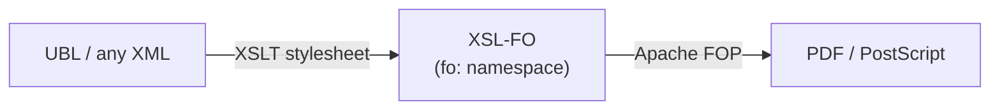
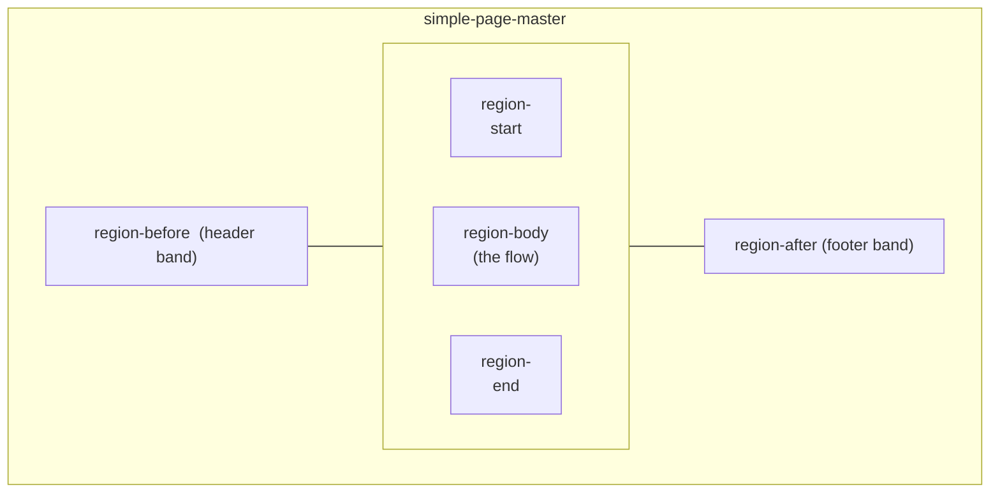

# XSL-FO and Apache FOP — a vocabulary you generate

Almost every vocabulary so far was meant to be *authored* — by a person or an
app. **XSL-FO** (the Formatting Objects half of XSL) is different: you rarely
write it by hand. You write [XSLT](../xslt/index.md) that *produces* it, and a
formatter — most often **Apache FOP** — turns it into a PDF. It is the natural
sequel to the XSLT chapter, and it closes the loop the
[e-invoicing section](../einvoicing/index.md) opened: the same UBL invoice you
validated can be transformed into a printable document.



## What FO looks like

XSL-FO lives in one namespace, `http://www.w3.org/1999/XSL/Format`, conventionally
prefixed `fo:`. A document declares its page geometry once, then pours content
into it.

``` xml title="invoice.fo" linenums="1"
<fo:root xmlns:fo="http://www.w3.org/1999/XSL/Format">
  <fo:layout-master-set>                                       <!-- (1)! -->
    <fo:simple-page-master master-name="A4"
                           page-width="210mm" page-height="297mm">
      <fo:region-body margin="20mm"/>
    </fo:simple-page-master>
  </fo:layout-master-set>
  <fo:page-sequence master-reference="A4">                     <!-- (2)! -->
    <fo:flow flow-name="xsl-region-body">                      <!-- (3)! -->
      <fo:block font-size="18pt" font-weight="bold" space-after="6pt">
        Invoice TOSL108</fo:block>
      <fo:block>Total: 100.00 EUR</fo:block>
    </fo:flow>
  </fo:page-sequence>
</fo:root>
```

1.  `layout-master-set` defines the *page templates* — size, margins, named
    regions (body, header, footer). You describe the paper before the content.
2.  A `page-sequence` binds a stream of content to a page master. A document can
    have several, e.g. a title page master then a body master.
3.  `flow` is the content that fills `region-body` and breaks across as many pages
    as needed. `fo:block` is the workhorse — roughly a paragraph — and its
    properties (`font-size`, `space-after`) are deliberately **CSS-like**, because
    XSL-FO and CSS share formatting heritage.

Read top to bottom it is almost a page description: a page master, then a flow of
blocks. Verbose, though — which is exactly why you let a machine generate it
rather than typing it.

## How the page is laid out

The single `region-body` above is the minimum. A real page master carves the
sheet into up to **five regions**, and the body flows *inside* the margins the
others reserve. This is the mental model worth internalising before anything
else: you size the regions once, then content drops into them.



The four side regions (`before`, `after`, `start`, `end`) are **fixed frames** —
their content repeats on every page. Only `region-body` holds the flowing,
page-breaking content. A crucial gotcha: `region-body` overlaps the others unless
you push its margins clear of them.

``` xml title="page-master with header and footer" linenums="1"
<fo:simple-page-master master-name="A4"
                       page-width="210mm" page-height="297mm">
  <fo:region-body margin-top="25mm" margin-bottom="20mm"            
                  margin-left="20mm" margin-right="20mm"/>           <!-- (1)! -->
  <fo:region-before extent="25mm"/>                                  <!-- (2)! -->
  <fo:region-after  extent="15mm"/>
</fo:simple-page-master>
```

1.  `region-body` margins must be **≥ the extent of each side region**, or the
    flowing text prints on top of the header and footer. The body has no idea the
    other regions exist — you reserve its space by hand.
2.  `extent` is how deep the band reaches in from the page edge: a 25 mm-tall
    header strip, a 15 mm footer strip.

### Repeating headers and footers

Side regions are filled by `fo:static-content`, matched to a region by name. It is
laid out once per page — the place for running headers, footers, and page numbers.

``` xml title="static content + page numbering" linenums="1"
<fo:page-sequence master-reference="A4">
  <fo:static-content flow-name="xsl-region-after">                   <!-- (1)! -->
    <fo:block text-align="center" font-size="9pt" color="#666">
      Invoice TOSL108 — page
      <fo:page-number/> of <fo:page-number-citation ref-id="last"/>  <!-- (2)! -->
    </fo:block>
  </fo:static-content>
  <fo:flow flow-name="xsl-region-body">
    …
    <fo:block id="last"/>                                            <!-- (3)! -->
  </fo:flow>
</fo:page-sequence>
```

1.  `flow-name` is how content finds its region. `xsl-region-before/after/start/
    end/body` are the five reserved names that map to the masters above.
2.  `fo:page-number` resolves to the current page; `page-number-citation` resolves
    to the page on which a given `id` finally lands — that is how "page 3 of 7"
    works without you knowing the total in advance.
3.  An empty anchor block at the very end gives the citation its `ref-id`.

### Tables — where invoice lines actually live

Most generated documents are tabular: invoice lines, statements, reports. FO's
table model is close to HTML's, but column widths are declared up front and
borders/padding live on each cell.

``` xml title="an invoice-line table" linenums="1"
<fo:table table-layout="fixed" width="100%">                         <!-- (1)! -->
  <fo:table-column column-width="60%"/>
  <fo:table-column column-width="15%"/>
  <fo:table-column column-width="25%"/>
  <fo:table-header>                                                  <!-- (2)! -->
    <fo:table-row font-weight="bold">
      <fo:table-cell><fo:block>Description</fo:block></fo:table-cell>
      <fo:table-cell><fo:block text-align="end">Qty</fo:block></fo:table-cell>
      <fo:table-cell><fo:block text-align="end">Amount</fo:block></fo:table-cell>
    </fo:table-row>
  </fo:table-header>
  <fo:table-body>
    <fo:table-row>
      <fo:table-cell padding="2pt" border-bottom="0.5pt solid #ccc">
        <fo:block>Widget, blue</fo:block></fo:table-cell>
      <fo:table-cell padding="2pt" border-bottom="0.5pt solid #ccc">
        <fo:block text-align="end">3</fo:block></fo:table-cell>
      <fo:table-cell padding="2pt" border-bottom="0.5pt solid #ccc">
        <fo:block text-align="end">100.00</fo:block></fo:table-cell>
    </fo:table-row>
  </fo:table-body>
</fo:table>
```

1.  `table-layout="fixed"` with explicit `table-column` widths is what print needs
    — the formatter must paginate without measuring every cell first. Every value
    is laid out into a column, never floating.
2.  `fo:table-header` (and `table-footer`) **repeat automatically** when the table
    spills onto the next page — so a long invoice keeps its column titles on every
    sheet. This is the single biggest reason to use a real table rather than
    aligning columns by hand.

### Spacing, alignment, and exact placement

Inside a block, the levers are CSS-shaped. A few that come up constantly:

- **Vertical rhythm** is space *between* blocks: `space-before` / `space-after`,
  not margins. FO collapses adjacent spacing the way CSS collapses margins.
- **Inline alignment** uses `text-align` with the writing-direction-relative
  values `start` / `end` (not `left` / `right`), plus `text-align-last` for the
  final line.
- **Dot leaders** — the row of dots between a label and a right-aligned figure —
  are a first-class object: `<fo:leader leader-pattern="dots"/>` between two
  inline runs, with the second run pushed to the `end` edge.

``` xml title="a total line with a dot leader" linenums="1"
<fo:block text-align-last="justify">
  Total due
  <fo:leader leader-pattern="dots"/>                                 <!-- (1)! -->
  <fo:inline font-weight="bold">100.00 EUR</fo:inline>
</fo:block>
```

1.  The leader expands to fill whatever horizontal space is left, pinning the
    amount to the right margin no matter how long the label is — the classic
    "label … value" line, done by the formatter rather than by counting spaces.

When you need to place something at an exact coordinate — a stamp, an address
window for a windowed envelope, an overlay — escape the flow with
`fo:block-container` and absolute positioning:

``` xml title="absolute placement" linenums="1"
<fo:block-container absolute-position="absolute"                     <!-- (1)! -->
                    top="40mm" left="120mm" width="70mm" height="25mm">
  <fo:block font-size="9pt">Acme Corp</fo:block>                      <!-- (2)! -->
  <fo:block font-size="9pt">PO Box 42</fo:block>
  <fo:block font-size="9pt">00100 Helsinki</fo:block>
</fo:block-container>
```

1.  `absolute-position="absolute"` lifts the container out of the normal flow and
    positions it relative to the region — coordinates in real units (`mm`, `pt`).
    Use it sparingly: the flow model is what makes content reflow across pages, and
    absolutely-positioned boxes do **not** move when the text around them grows.
2.  There is no `<br/>` in FO — each line is its own `fo:block`. A run of blocks
    stacks vertically by default, which is why "a paragraph" and "a line" are the
    same object.

## The stylesheet that emits it

This is where two namespaces share one document. The stylesheet is in the
**XSLT** namespace (`xsl:`); the *output* it constructs is in the **FO**
namespace (`fo:`). Both are declared on the root, and the processor copies the
non-`xsl:` elements through to the result.

``` xml title="invoice-to-fo.xsl" linenums="1"
<xsl:stylesheet version="3.0"
                xmlns:xsl="http://www.w3.org/1999/XSL/Transform"
                xmlns:fo="http://www.w3.org/1999/XSL/Format">
  <xsl:template match="/invoice">
    <fo:root>                                          <!-- (1)! -->
      <fo:layout-master-set>
        <fo:simple-page-master master-name="A4"
                               page-width="210mm" page-height="297mm">
          <fo:region-body margin="20mm"/>
        </fo:simple-page-master>
      </fo:layout-master-set>
      <fo:page-sequence master-reference="A4">
        <fo:flow flow-name="xsl-region-body">
          <fo:block font-size="18pt" font-weight="bold">
            Invoice <xsl:value-of select="@id"/>          <!-- (2)! -->
          </fo:block>
          <fo:block>Total: <xsl:value-of select="total"/> EUR</fo:block>
        </fo:flow>
      </fo:page-sequence>
    </fo:root>
  </xsl:template>
</xsl:stylesheet>
```

1.  Everything under here is **literal result output** — the processor emits these
    `fo:` elements verbatim because they are not in the `xsl:` namespace. This is
    the [producing-XML-output](../xslt/output.md) technique from the XSLT chapter,
    aimed at FO instead of HTML.
2.  The `xsl:` elements (`value-of`, `template`, `for-each`) are *instructions* —
    they are consumed, not copied. The namespace split is what lets the processor
    tell "build this" from "this is literal". It is the same mechanism behind every
    [XSLT template](../xslt/templates.md), now producing print.

!!! tip "The two `XSL/...` namespaces are easy to swap"
    `http://www.w3.org/1999/XSL/**Transform**` is XSLT (the program);
    `http://www.w3.org/1999/XSL/**Format**` is XSL-FO (the output). They differ by
    one word and are both from 1999 — a classic copy-paste trap. If FOP renders an
    empty page, check that your blocks are really in `…/Format`, not `…/Transform`.

## Running it

Apache FOP is the reference formatter. End to end:

``` bash
# 1. XML + XSLT  ->  FO     (any XSLT processor: Saxon, xsltproc, FOP itself)
fop -xml invoice.xml -xsl invoice-to-fo.xsl -pdf invoice.pdf
# or, if you already have the .fo:
fop invoice.fo invoice.pdf
```

FOP reads the `fo:` tree, lays out the pages, and writes PDF (also PostScript,
PCL, PNG). Because the FO is *generated*, the same stylesheet can render thousands
of invoices, and changing the page layout means editing the stylesheet's literal
`fo:` blocks — not every document.

## Things to note

- A vocabulary can be **produced**, not authored: the readable artifact is the
  stylesheet, the FO is intermediate.
- **One document, two namespaces with different roles** — `xsl:` instructions that
  run, `fo:` elements that are emitted — is the core of how XSLT builds any XML
  output ([HTML](../xslt/output.md), FO, or another vocabulary).
- The `XSL/Transform` vs `XSL/Format` near-collision is a real-world reminder that
  a namespace is identified by its *exact* URI.

Next: [XML Signature](xml-dsig.md), where the existence of namespaces forces a
whole extra step — **canonicalization** — before you can trust a signature.
