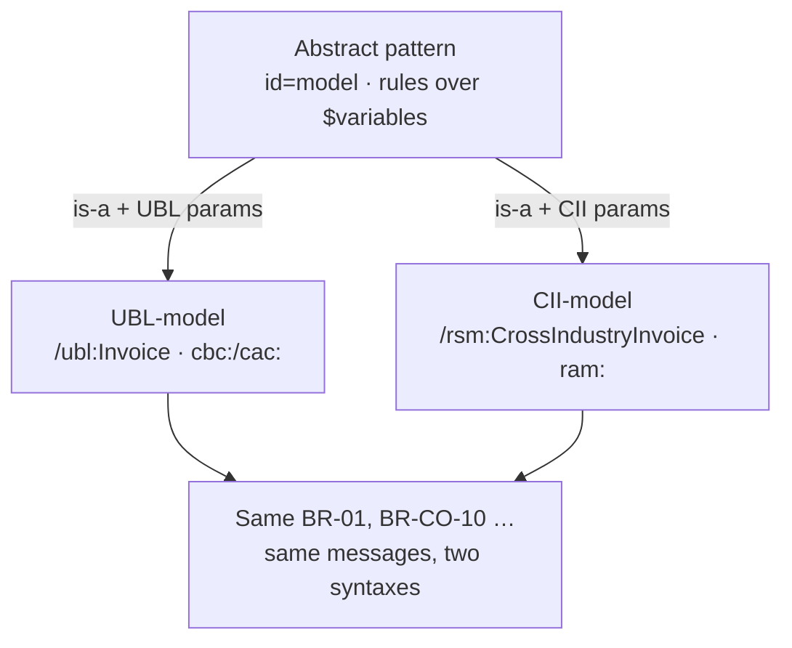
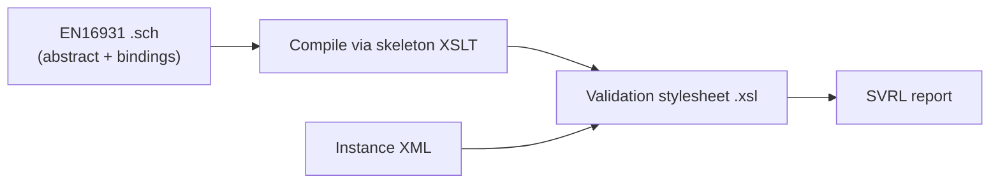

# Abstract patterns and EN16931

The previous pages built the language one element at a time. This page is the
payoff: it shows how a large, real validation artifact — the public CEN
**EN16931** Schematron for European e-invoicing — is actually assembled. The
trick that makes it scale is the **abstract pattern**: write each business rule
once against placeholder variables, then *bind* those variables to a concrete
XML vocabulary. EN16931 binds the same rulebook to two syntaxes — UBL and CII —
without rewriting a single rule.

## The schema header

The root `<schema>` declares the query binding and the namespace prefixes used
throughout. This is the authentic header of the public EN16931 UBL Schematron:

``` xml title="EN16931-UBL.sch" linenums="1"
<schema xmlns="http://purl.oclc.org/dsdl/schematron" queryBinding="xslt2">
  <ns prefix="cbc" uri="urn:oasis:names:specification:ubl:schema:xsd:CommonBasicComponents-2"/>
  <ns prefix="cac" uri="urn:oasis:names:specification:ubl:schema:xsd:CommonAggregateComponents-2"/>
  <ns prefix="ubl" uri="urn:oasis:names:specification:ubl:schema:xsd:Invoice-2"/>
</schema>
```

`queryBinding="xslt2"` fixes the expression language as XPath 2.0, which the
arithmetic rules need for sequences and `sum()`. The `<ns>` bindings are
declared once and apply to every `context`, `test` and `param` value below.

## Phases: choosing which patterns run

A `<phase>` names a subset of patterns to activate for a given validation run.
Each `<active>` points at a pattern by `id`; the caller selects the phase, and
only those patterns fire.

``` xml title="EN16931-UBL.sch" linenums="1"
<phase id="fatal">
  <active pattern="UBL-model"/>
</phase>
```

!!! tip "One schema, several profiles"
    Phases let one schema serve different runs — for example a *fatal-only*
    phase that activates just the blocking patterns, versus a *full* phase that
    also runs informational ones. If no phase is requested, every pattern is
    active.

## Abstract patterns: rules written against variables

This is the core EN16931 technique. An **abstract** pattern
(`abstract="true"`) states its rules in terms of *variables* — names prefixed
with `$` — instead of concrete XPath. Nothing here mentions UBL or CII; the
pattern is pure business logic with holes left to fill.

``` xml title="abstract.sch" linenums="1"
<pattern abstract="true" id="model">
  <rule context="$Invoice">                                   <!-- (1)! -->
    <assert test="$BR-01" flag="fatal" id="BR-01">             <!-- (2)! -->
      [BR-01]-An Invoice shall have a Specification identifier (BT-24).
    </assert>
    <assert test="$BR-CO-10" flag="fatal" id="BR-CO-10">       <!-- (3)! -->
      [BR-CO-10]-Sum of Invoice line net amount (BT-106) = &#931; Invoice line net amount (BT-131).
    </assert>
  </rule>
</pattern>
```

1.  The `context` is the variable `$Invoice`, not a path — *which* element is
    the invoice root depends on the syntax being bound.
2.  `$BR-01` is a placeholder for the presence test of the specification
    identifier. The message text is fixed; only the XPath behind the name
    changes per binding.
3.  `$BR-CO-10` stands in for the arithmetic check that the document-level sum
    equals the sum of the line amounts.

!!! note "The model knows the rule, not the syntax"
    `[BR-01]` and `[BR-CO-10]` are the same business rules whether the invoice
    arrives as UBL or as CII. The abstract pattern captures *what* must hold and
    *what* to say when it doesn't — leaving *how to find it* to the binding.

## Concrete patterns: binding the variables

A **concrete** pattern instantiates an abstract one with `is-a="model"` and
supplies a `<param>` for every variable, giving each its real XPath in the
target vocabulary. This is the UBL binding:

``` xml title="EN16931-UBL.sch" linenums="1"
<pattern is-a="model" id="UBL-model">                          <!-- (1)! -->
  <param name="Invoice" value="/ubl:Invoice"/>                 <!-- (2)! -->
  <param name="BR-01" value="normalize-space(cbc:CustomizationID) != ''"/>
  <param name="BR-CO-10"
         value="round(cbc:LegalMonetaryTotal/cbc:LineExtensionAmount * 100)
                = round(sum(cac:InvoiceLine/cbc:LineExtensionAmount) * 100)"/>
</pattern>
```

1.  `is-a="model"` means "instantiate the abstract pattern whose `id` is
    `model`, using the params below".
2.  Each `<param>` binds one `$variable` to a concrete XPath. `$Invoice` becomes
    the UBL document element; `$BR-01` becomes a real presence test on
    `cbc:CustomizationID`; `$BR-CO-10` becomes the UBL arithmetic.

The win lands when the **same** abstract `model` is bound a second time — to the
CII (UN/CEFACT) syntax — with different namespaces and paths but the identical
rule identities and messages:

``` xml title="EN16931-CII.sch" linenums="1"
<pattern is-a="model" id="CII-model">
  <param name="Invoice" value="/rsm:CrossIndustryInvoice"/>    <!-- (1)! -->
  <param name="BR-01"
         value="normalize-space(rsm:ExchangedDocumentContext
                /ram:GuidelineSpecifiedDocumentContextParameter/ram:ID) != ''"/>
  <param name="BR-CO-10" value="..."/>
</pattern>
```

1.  CII uses entirely different element names (`rsm:`/`ram:` namespaces), yet it
    reuses `[BR-01]` and `[BR-CO-10]` verbatim — only the param values differ.

This is exactly how EN16931 is organised: **one abstract rule model**, a **UBL
binding**, a **CII binding**, and shared **code lists** — the rulebook written
once, applied to two XML vocabularies.



## Splitting big schemas: `include`

A rulebook of several hundred rules is not kept in one file. `<include>` pulls
another fragment in at the point it appears — abstract model in one file,
each binding and the code lists in others:

``` xml title="EN16931-UBL.sch" linenums="1"
<include href="abstract.sch"/>
<include href="EN16931-UBL-syntax-binding.sch"/>
<include href="EN16931-codelist-bindings.sch"/>
```

!!! info "Authored in parts, compiled as one"
    Each `href` is resolved and spliced in before compilation, so the engine
    sees a single combined schema. It keeps the abstract model, the syntax
    bindings, and the code lists as separately maintained files.

## How it executes

A Schematron schema is never run directly. It is **compiled to an
[XSLT](../xslt/index.md) stylesheet** by a published ISO *skeleton*
implementation: every `<rule>` becomes a template and every `<assert>`/`<report>`
becomes a test that emits a result. The concrete params are substituted into the
abstract rules during this step, so the compiled stylesheet contains the real
UBL (or CII) [XPath](../xpath/index.md).



Running that stylesheet over an instance produces an **SVRL** report
(Schematron Validation Report Language) — an XML document listing which
assertions fired and with what message. Against the neutral invoice used through
this section:

<div class="xslt-result" markdown>
**Instance:** a UBL invoice with no `cbc:CustomizationID`.

**SVRL outcome:** one failed assertion —
*"\[BR-01]-An Invoice shall have a Specification identifier (BT-24)"* (flag
`fatal`). The abstract `$BR-01` was bound to `normalize-space(cbc:CustomizationID)
!= ''`, which is false, so the assert fires.
</div>

This closes the loop with the rest of the site: Schematron is powered by
[XSLT](../xslt/index.md) (its compilation target and runtime engine) and
[XPath](../xpath/index.md) (every `context`, `test` and bound `param`).

## Where next

You have now seen all four pieces and how they fit together:

- **[XSD](../xsd/index.md)** describes *structure* — which elements may appear,
  in what order, with which datatypes.
- **Schematron** enforces *business rules* — cross-field, arithmetic and
  conditional constraints a grammar cannot reach.
- **[XPath](../xpath/index.md)** powers both — it is the language XSD uses for
  identity constraints and the language every Schematron `context` and `test`
  is written in.
- **[XSLT](../xslt/index.md)** both *transforms* documents and is the *engine*
  Schematron compiles to: the skeleton turns a schema into a stylesheet that
  emits the SVRL report.

EN16931 ties them in one artifact: an XSD guarantees a well-formed, well-typed
invoice; an abstract Schematron model — bound to UBL and to CII — then enforces
the shared rulebook on top.

!!! tip "Read the real thing"
    With the language in hand, the public CEN EN16931 Schematron (EUPL/Apache-2.0)
    is now readable end to end: the abstract model, the two `is-a` syntax
    bindings, the code lists, and the phases that select what runs.

Return to the section [Overview](index.md) or the site [home](../index.md).
Natural topics beyond the current scope include **XQuery** (querying instead of
transforming), **JSON/XML** interchange, and **XSLT streaming** for documents
too large to hold in memory.
