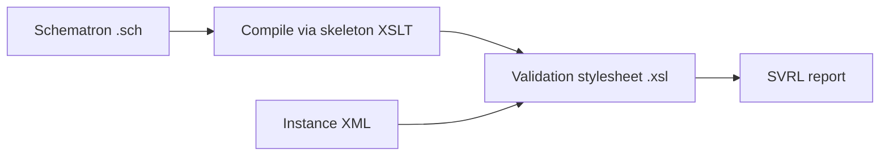

# Schematron

**Schematron** is a *rule-based* validation language for XML. Instead of
describing a grammar — which elements may appear, in what order, carrying which
data types — you write **assertions** about the document: natural-language-backed
claims, each tied to an XPath expression, of the form *"in this context, this
condition must hold."*

That makes it a tool for the rules a grammar cannot reach: cross-field and
co-occurrence constraints ("if payment means is card, then an account
identifier is required"), calculations ("the document total must equal the sum
of the lines"), and conditional requirements ("an invoice shall carry a
specification identifier"). Where a schema describes *shape*, Schematron checks
*meaning*.

!!! note "Assertions, not grammar"
    There is no list of allowed elements in a Schematron schema. You point at a
    node with XPath, then assert something that must be true about it. Anything
    you can express in XPath, you can assert — which is exactly why it reaches
    the business rules that structural schemas miss.

## Why it complements XSD

[XSD](../xsd/index.md) checks **structure and datatypes**: that an element is
declared, appears in the right place, and that its value is — say — a decimal.
It cannot easily express a rule that relates *several* values to each other.

The contrast is concrete in e-invoicing. UBL's XSD says a
`cbc:LineExtensionAmount` *may* appear and *must* be a decimal. It says nothing
about what that number should *equal*. The EN16931 Schematron does:

<div class="xslt-result" markdown>
**XSD says:** `cbc:LineExtensionAmount` is present and is a `decimal`. Valid.

**Schematron rule BR-CO-10 adds:** the document total must equal the sum of the
line amounts — *"\[BR-CO-10]-Sum of Invoice line net amount (BT-106) = Σ Invoice
line net amount (BT-131)."*
</div>

The two are layered, not competing: run the XSD first to guarantee a
well-formed, well-typed document, then run Schematron to enforce the business
logic on top of it.

## An ISO standard

Schematron is standardised as **ISO/IEC 19757-3** (part of the DSDL family).
A Schematron schema is itself an XML document in the namespace
`http://purl.oclc.org/dsdl/schematron`, rooted at `<schema>`. The root declares
a **`queryBinding`** — the flavour of XPath used in the assertions; e.g. EN16931
specifies `"xslt2"` to get XPath 2.0.

The namespace prefixes used inside the rules are declared once with `<ns>`
elements. This is the verbatim header of the public EN16931 UBL Schematron:

``` xml title="en16931-ubl.sch"
<schema xmlns="http://purl.oclc.org/dsdl/schematron" queryBinding="xslt2">
  <ns prefix="cbc" uri="urn:oasis:names:specification:ubl:schema:xsd:CommonBasicComponents-2"/>
  <ns prefix="cac" uri="urn:oasis:names:specification:ubl:schema:xsd:CommonAggregateComponents-2"/>
  <ns prefix="ubl" uri="urn:oasis:names:specification:ubl:schema:xsd:Invoice-2"/>
</schema>
```

!!! tip "`queryBinding=\"xslt2\"`"
    The query binding fixes which language the XPath inside `@context`, `@test`
    and `@select` is read as. `"xslt2"` unlocks XPath 2.0 — sequences, richer
    typing, and functions like `sum()` over a node sequence — which the
    arithmetic rules such as BR-CO-10 rely on.

## How it runs: Schematron rides on XSLT

A Schematron schema is not executed directly. The usual route is to **compile it
to [XSLT](../xslt/index.md)** using a published "skeleton" stylesheet: the
compiler turns each `<rule>` and `<assert>` into XSLT templates that walk the
instance and emit a result for every failed (or fired) assertion.



That validation stylesheet is then run against the instance, producing a
report — typically **SVRL** (Schematron Validation Report Language), an XML
vocabulary listing which assertions fired and with what message. This is why
Schematron ties the whole site together: it is built on
[XSLT Tutorial](../xslt/index.md) and the [XPath](../xpath/index.md) you write in
every test.

## A worked instance

Throughout this section we validate the same small UBL invoice used in the XSD
section — neutral, invented data:

``` xml title="invoice.xml"
<Invoice xmlns="urn:oasis:names:specification:ubl:schema:xsd:Invoice-2"
         xmlns:cac="urn:oasis:names:specification:ubl:schema:xsd:CommonAggregateComponents-2"
         xmlns:cbc="urn:oasis:names:specification:ubl:schema:xsd:CommonBasicComponents-2">
  <cbc:ID>INV-001</cbc:ID>
  <cbc:IssueDate>2026-06-20</cbc:IssueDate>
  <cbc:DocumentCurrencyCode>EUR</cbc:DocumentCurrencyCode>
  <cac:InvoiceLine>
    <cbc:ID>1</cbc:ID>
    <cbc:LineExtensionAmount currencyID="EUR">10.90</cbc:LineExtensionAmount>
  </cac:InvoiceLine>
</Invoice>
```

This document is perfectly valid against the UBL XSD. Against the EN16931
Schematron it fails — not on structure, but on a business rule:

<div class="xslt-result" markdown>
**XSD outcome:** valid — every element is declared and well-typed.

**Schematron outcome:** *failed* — rule **BR-01** fires fatally:
*"\[BR-01]-An Invoice shall have a Specification identifier (BT-24)."* The
invoice carries no `cbc:CustomizationID`, which the standard requires.
</div>

!!! info "Two halves of one promise"
    BR-01 is a *presence* rule a stricter XSD could in principle express;
    BR-CO-10 is an *arithmetic* rule it cannot. Schematron handles both with the
    same mechanism — an XPath test plus a human-readable message — which is what
    makes it the natural home for a published rulebook.

## Why EN16931

The European e-invoicing standard **EN16931** ships exactly this: an abstract
model of business rules, plus concrete **bindings** for the two main syntaxes,
UBL and CII. The rules — BR-01, BR-CO-10 and several hundred more — are
distributed as public Schematron under EUPL/Apache-2.0. This section builds up
the language piece by piece until you can open that file and read it.

## Where to go next

1. [Rules and assertions](rules-and-assertions.md) — `pattern`, `rule`,
   `assert`, `report`: the building blocks of a schema.
2. [Context and tests](context-and-tests.md) — writing the XPath that selects
   nodes and checks them.
3. [Variables and messages](variables-and-messages.md) — `let`, dynamic
   diagnostics, and assertion severities.
4. [Abstract patterns and EN16931](abstract-patterns-en16931.md) — how the real
   standard is assembled from abstract patterns.
