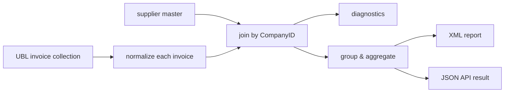

# Capstone: query a collection of UBL invoices

This chapter turns the pieces into one small reporting application. It reads a
collection of UBL invoices, joins each invoice to supplier master data, records
data-quality problems instead of silently dropping documents, aggregates valid
spend, and produces both XML and JSON views.

The pipeline is:



The query mechanics are standard XQuery 3.1. How the URI
`collection("invoices")` is bound to stored documents depends on the processor;
in BaseX you would commonly replace it with `db:get("invoices")`.

## The input shape

Assume the database contains invoices with the fields used below. These fragments
omit many mandatory EN16931 fields so the reporting paths stay visible; use the
[complete UBL anatomy](../einvoicing/ubl-invoice.md) for the real document shape.

``` xml title="INV-001.xml"
<Invoice xmlns="urn:oasis:names:specification:ubl:schema:xsd:Invoice-2"
         xmlns:cac="urn:oasis:names:specification:ubl:schema:xsd:CommonAggregateComponents-2"
         xmlns:cbc="urn:oasis:names:specification:ubl:schema:xsd:CommonBasicComponents-2">
  <cbc:ID>INV-001</cbc:ID>
  <cbc:IssueDate>2026-06-20</cbc:IssueDate>
  <cbc:DocumentCurrencyCode>EUR</cbc:DocumentCurrencyCode>
  <cac:AccountingSupplierParty>
    <cac:Party>
      <cac:PartyLegalEntity>
        <cbc:CompanyID>FI12345678</cbc:CompanyID>
      </cac:PartyLegalEntity>
    </cac:Party>
  </cac:AccountingSupplierParty>
  <cac:TaxTotal>
    <cbc:TaxAmount currencyID="EUR">5.45</cbc:TaxAmount>
    <cac:TaxSubtotal>
      <cbc:TaxableAmount currencyID="EUR">21.80</cbc:TaxableAmount>
      <cbc:TaxAmount currencyID="EUR">5.45</cbc:TaxAmount>
      <cac:TaxCategory>
        <cbc:ID>S</cbc:ID>
        <cbc:Percent>25</cbc:Percent>
      </cac:TaxCategory>
    </cac:TaxSubtotal>
  </cac:TaxTotal>
  <cac:LegalMonetaryTotal>
    <cbc:PayableAmount currencyID="EUR">27.25</cbc:PayableAmount>
  </cac:LegalMonetaryTotal>
</Invoice>
```

A second invoice has the same structure but `ID` `INV-002`, supplier
`SE55667788`, and payable amount `119.00 EUR`. A third deliberately refers to
unknown supplier `FI00000000`; it should appear in diagnostics, not in totals.

Supplier names live outside the invoices:

``` xml title="suppliers.xml"
<suppliers>
  <supplier id="FI12345678" country="FI">
    <name>Northwind Traders Oy</name>
  </supplier>
  <supplier id="SE55667788" country="SE">
    <name>Contoso Wholesale AB</name>
  </supplier>
</suppliers>
```

The join key is UBL `cbc:CompanyID` → supplier `@id`.

## Start with namespaces and external inputs

UBL uses namespaces on every business element, so declare them once:

``` xquery
xquery version "3.1";

declare namespace inv =
  "urn:oasis:names:specification:ubl:schema:xsd:Invoice-2";
declare namespace cac =
  "urn:oasis:names:specification:ubl:schema:xsd:CommonAggregateComponents-2";
declare namespace cbc =
  "urn:oasis:names:specification:ubl:schema:xsd:CommonBasicComponents-2";

declare variable $invoice-collection as xs:string external := "invoices";
declare variable $supplier-uri as xs:string external := "suppliers.xml";
declare variable $report-currency as xs:string external := "EUR";
```

External variables let a host application choose the collection and master-data
URI without editing query source. The types prevent an accidental node or
multi-value binding from leaking into URI resolution.

## Isolate UBL paths behind functions

Long namespace-heavy paths should not be copied throughout the report:

``` xquery
declare function local:invoice-number(
  $invoice as element(inv:Invoice)
) as xs:string* {
  $invoice/cbc:ID ! normalize-space(.)
};

declare function local:supplier-id(
  $invoice as element(inv:Invoice)
) as xs:string* {
  $invoice/cac:AccountingSupplierParty/cac:Party
          /cac:PartyLegalEntity/cbc:CompanyID
          ! normalize-space(.)
};

declare function local:currency(
  $invoice as element(inv:Invoice)
) as xs:string* {
  $invoice/cbc:DocumentCurrencyCode ! normalize-space(.)
};

declare function local:payable-node(
  $invoice as element(inv:Invoice)
) as element(cbc:PayableAmount)* {
  $invoice/cac:LegalMonetaryTotal/cbc:PayableAmount
};
```

The `*` return cardinalities are intentional. Each field *should* occur once, but
the diagnostic stage must be able to inspect both missing and duplicate values
without a type error stopping the whole collection.

This is a useful boundary: functions faithfully extract what the document
contains; a later stage decides whether that is acceptable.

## Build the supplier index once

Turn master data into a map before iterating invoices:

``` xquery
declare function local:supplier-index(
  $suppliers as element(suppliers)
) as map(xs:string, element(supplier)) {
  map:merge(
    for $supplier in $suppliers/supplier
    return map:entry(string($supplier/@id), $supplier),
    map { "duplicates": "reject" }
  )
};
```

`duplicates: reject` makes duplicate supplier IDs a hard master-data error.
Silently choosing one supplier would make every later total suspect.

The function's map type says each string key maps to exactly one supplier
element. This is stronger than `map(*)` and documents the join's expected
cardinality.

## Normalize one invoice into a row map

Rather than repeatedly navigate the invoice, convert it into a map containing the
fields and diagnostics the reports need:

``` xquery
declare function local:row(
  $invoice as element(inv:Invoice),
  $supplier-by-id as map(xs:string, element(supplier)),
  $required-currency as xs:string
) as map(*) {
  let $number := local:invoice-number($invoice)
  let $supplier-id := local:supplier-id($invoice)
  let $supplier :=
    if (count($supplier-id) eq 1)
    then map:get($supplier-by-id, $supplier-id)
    else ()
  let $currency := local:currency($invoice)
  let $payable := local:payable-node($invoice)
  let $payable-currency :=
    if (count($payable) eq 1)
    then normalize-space(string($payable/@currencyID))
    else ""
  let $errors := (
    if (count($number) ne 1)
    then concat("expected one invoice number, found ", count($number))
    else (),

    if (count($supplier-id) ne 1)
    then concat("expected one supplier CompanyID, found ", count($supplier-id))
    else if (empty($supplier))
    then concat("unknown supplier: ", $supplier-id)
    else (),

    if (count($payable) ne 1)
    then concat("expected one PayableAmount, found ", count($payable))
    else (),

    if (count($currency) ne 1)
    then concat("expected one document currency, found ", count($currency))
    else if ($currency ne $required-currency)
    then concat("document currency is ", $currency,
                ", expected ", $required-currency)
    else (),

    if (count($payable) eq 1
        and $payable-currency ne $required-currency)
    then concat("PayableAmount currency is ",
                if ($payable-currency eq "")
                then "[missing]"
                else $payable-currency,
                ", expected ", $required-currency)
    else (),

    if (count($payable) eq 1 and not($payable castable as xs:decimal))
    then concat("invalid PayableAmount: ", string($payable))
    else ()
  )
  return map {
    "invoice": $invoice,
    "number": ($number[1], "[missing]")[1],
    "supplier-id": ($supplier-id[1], "")[1],
    "supplier": $supplier,
    "currency": ($currency[1], "")[1],
    "payable":
      if (count($payable) eq 1 and $payable castable as xs:decimal)
      then xs:decimal($payable)
      else (),
    "errors": $errors,
    "valid": empty($errors)
  }
};
```

Several earlier topics meet here:

- optional paths return empty sequences;
- the supplier map performs the join;
- `castable as` checks lexical input without raising an error;
- the `errors` value is a sequence of strings;
- `valid` is derived from that sequence, not maintained separately;
- the original invoice node remains available for later drill-down.

This is *report validation*, not EN16931 validation. It checks only the
preconditions of this particular report. Run the standard
[validation pipeline](../einvoicing/validation-pipeline.md) separately.

## Read the collection once

Build all rows in one expression:

``` xquery
let $suppliers := doc($supplier-uri)/suppliers
let $supplier-by-id := local:supplier-index($suppliers)
let $rows :=
  for $invoice in collection($invoice-collection)/inv:Invoice
  order by local:invoice-number($invoice)
  return local:row($invoice, $supplier-by-id, $report-currency)
return $rows
```

`$rows` is a sequence of maps—one stable intermediate model shared by the XML
and JSON views. Keeping I/O and normalization here prevents either renderer from
quietly implementing different business rules.

## Emit diagnostics first

Bad input should remain visible:

``` xquery
<diagnostics>{
  for $row in $rows
  where not($row?valid)
  return
    <invoice number="{ $row?number }"
             supplier-id="{ $row?supplier-id }">{
      $row?errors ! <error>{ . }</error>
    }</invoice>
}</diagnostics>
```

``` xml title="result"
<diagnostics>
  <invoice number="INV-003" supplier-id="FI00000000">
    <error>unknown supplier: FI00000000</error>
  </invoice>
</diagnostics>
```

The invalid invoice is reported once with all of its errors. A fail-fast batch
could instead call `error()` when any invalid row exists, but a diagnostic report
is more useful during data cleanup.

## Group valid spend by supplier

Filter to valid rows, then group:

``` xquery
<suppliers>{
  for $row in $rows
  where $row?valid
  group by
    $supplier-id := $row?supplier-id,
    $supplier-name := string($row?supplier/name)
  let $total := sum($row ! .?payable)
  order by $total descending
  return
    <supplier id="{ $supplier-id }"
              name="{ $supplier-name }"
              invoices="{ count($row) }"
              currency="{ $report-currency }"
              total="{ format-number($total, '0.00') }"/>
}</suppliers>
```

After `group by`, `$row` is the sequence of row maps belonging to that supplier.
The simple map expression `$row ! .?payable` extracts each decimal amount for
`sum`.

``` xml title="result"
<suppliers>
  <supplier id="SE55667788" name="Contoso Wholesale AB"
            invoices="1" currency="EUR" total="119.00"/>
  <supplier id="FI12345678" name="Northwind Traders Oy"
            invoices="1" currency="EUR" total="27.25"/>
</suppliers>
```

Never add amounts in different currencies merely because they are all decimals.
This example rejects non-EUR documents before aggregation. A multi-currency
report should group by currency or apply a separately governed exchange-rate
conversion.

## Aggregate VAT categories

The row retains its source invoice, so another view can descend into VAT
subtotals:

``` xquery
<vat>{
  for $row in $rows
  where $row?valid
  for $subtotal in
    $row?invoice/cac:TaxTotal/cac:TaxSubtotal
  let $category := string($subtotal/cac:TaxCategory/cbc:ID)
  let $rate := xs:decimal($subtotal/cac:TaxCategory/cbc:Percent)
  let $taxable := xs:decimal($subtotal/cbc:TaxableAmount)
  let $tax := xs:decimal($subtotal/cbc:TaxAmount)
  group by $category, $rate
  order by $category, $rate
  return
    <category code="{ $category }"
              rate="{ $rate }"
              taxable="{ format-number(sum($taxable), '0.00') }"
              tax="{ format-number(sum($tax), '0.00') }"
              currency="{ $report-currency }"/>
}</vat>
```

The two `for` clauses flatten invoices into VAT-subtotal rows before grouping.
This is a one-to-many join inside each invoice: one normalized invoice row can
contribute several tax categories.

Production code should extend `local:row` diagnostics to confirm these VAT
amounts are present, numeric, and in the report currency before casting them.

## Assemble the XML report

Move each view into a function, then construct one document:

``` xquery
document {
  <invoice-report generated="{ current-dateTime() }"
                  currency="{ $report-currency }">
    { local:supplier-summary($rows, $report-currency) }
    { local:vat-summary($rows, $report-currency) }
    { local:diagnostics($rows) }
  </invoice-report>
}
```

The full functions are just the three FLWOR expressions above wrapped in typed
declarations:

``` xquery
declare function local:diagnostics($rows as map(*)*) as element(diagnostics) {
  <diagnostics>{
    for $row in $rows
    where not($row?valid)
    return
      <invoice number="{ $row?number }"
               supplier-id="{ $row?supplier-id }">{
        $row?errors ! <error>{ . }</error>
      }</invoice>
  }</diagnostics>
};
```

Use analogous return types `element(suppliers)` and `element(vat)` for the other
two. The main expression then reads as a report definition rather than a page of
paths.

## Build the JSON view from the same rows

Do not convert the finished XML report to JSON mechanically. Construct a JSON
shape that suits API consumers, while reusing the same normalized rows:

``` xquery
declare function local:json-report(
  $rows as map(*)*,
  $currency as xs:string
) as map(*) {
  map {
    "generated": string(current-dateTime()),
    "currency": $currency,
    "suppliers": array {
      for $row in $rows
      where $row?valid
      group by
        $id := $row?supplier-id,
        $name := string($row?supplier/name)
      let $total := sum($row ! .?payable)
      order by $total descending
      return map {
        "id": $id,
        "name": $name,
        "invoiceCount": count($row),
        "total": $total
      }
    },
    "diagnostics": array {
      for $row in $rows
      where not($row?valid)
      return map {
        "invoice": $row?number,
        "supplierId": $row?supplier-id,
        "errors": array { $row?errors }
      }
    }
  }
};
```

The array constructors preserve record boundaries; each supplier and diagnostic
is one map member. Serialize at the application boundary:

``` xquery
serialize(
  local:json-report($rows, $report-currency),
  map { "method": "json", "indent": true() }
)
```

Or make the map the query's only result and select JSON as the query output
method.

## Turn it into a library

The extraction, normalization, and reporting functions now form a natural
library module:

``` xquery title="invoice-report.xqm"
xquery version "3.1";

module namespace report = "https://example.org/invoice-report";

declare namespace inv = "...Invoice-2";
declare namespace cac = "...CommonAggregateComponents-2";
declare namespace cbc = "...CommonBasicComponents-2";

declare %private function report:row(...) as map(*) { ... };
declare %private function report:supplier-index(...) as map(*) { ... };

declare %public function report:xml(
  $invoices as element(inv:Invoice)*,
  $suppliers as element(suppliers),
  $currency as xs:string
) as document-node() {
  ...
};

declare %public function report:json(
  $invoices as element(inv:Invoice)*,
  $suppliers as element(suppliers),
  $currency as xs:string
) as map(*) {
  ...
};
```

Keep `collection()` and `doc()` out of the reusable functions. Passing nodes in
makes the module:

- testable with tiny constructed fixtures;
- usable with BaseX, eXist-db, Saxon, or an application API;
- independent of database names and filesystem layout;
- safe to reuse inside a RESTXQ endpoint.

The main query becomes the adapter:

``` xquery
import module namespace report =
  "https://example.org/invoice-report"
  at "invoice-report.xqm";

report:xml(
  collection($invoice-collection)/inv:Invoice,
  doc($supplier-uri)/suppliers,
  $report-currency
)
```

## Test the invariants, not just the formatting

A useful test set includes:

| Fixture | Expected result |
| --- | --- |
| known supplier, one numeric payable | included in supplier total |
| unknown supplier | diagnostic; excluded from totals |
| missing or duplicate payable | diagnostic; no cast failure |
| malformed decimal | diagnostic; query continues |
| wrong document or amount currency | diagnostic; excluded |
| duplicate supplier master ID | hard error while building the index |
| supplier with several valid invoices | one group with correct count and sum |
| invoice with several VAT categories | each category aggregated separately |

Then assert semantic results: valid-row count, invalid-row count, supplier totals,
VAT totals, and diagnostic codes/messages. Pretty indentation and attribute order
are serialization details; they should not be the main test oracle.

## What this capstone used

The query brought the section together:

- [FLWOR](flwor.md) for filtering, ordering, grouping, and projection;
- [sequences and cardinality](sequences-and-xdm.md) for optional and repeated
  fields;
- [joins](joins.md) for supplier enrichment;
- [maps and arrays](maps-arrays-json.md) for the intermediate model and JSON;
- [constructors](constructing-xml.md) for the XML report;
- [functions and modules](functions-modules-errors.md) for reusable boundaries;
- database [collections and indexes](updating-indexing.md) for scale.

What remains outside the query is equally important: EN16931 validation,
authentication and authorization, database transaction policy, observability,
and exchange-rate governance. XQuery handles the document computation; the
surrounding system still owns the workflow.

## Where to go next

- [XQuery vs XSLT](xquery-vs-xslt.md) revisits the choice now that you have seen a
  substantial tuple-oriented query.
- [XQuery in the real world](real-world.md) shows how this becomes a database job,
  RESTXQ endpoint, or embedded application query.
