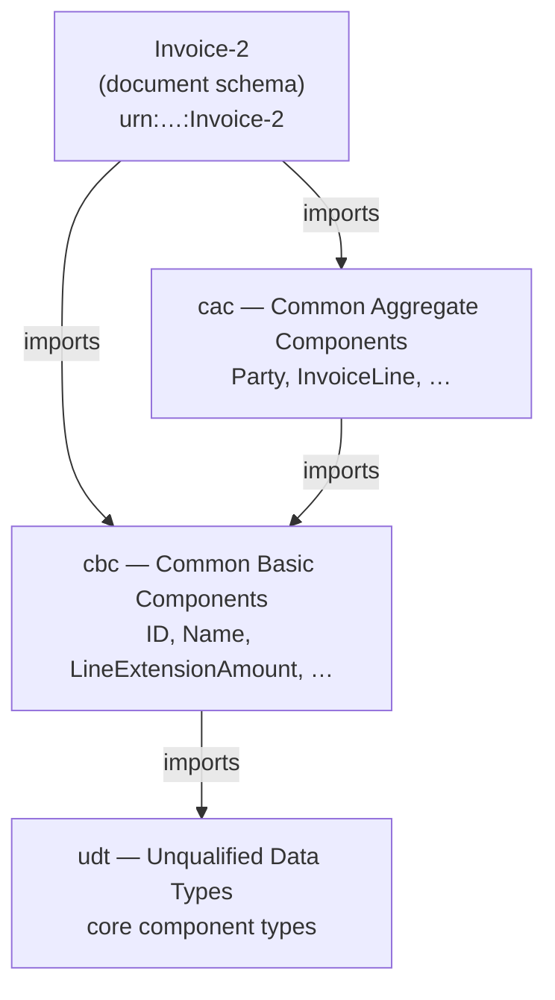

# Modular schemas

Real-world vocabularies are never one giant `.xsd` file. They are split across
many files and stitched together so that pieces can be reused, versioned, and
maintained independently. XSD gives you two tools for this — `xsd:include` and
`xsd:import` — and the difference between them comes down to a single question:
**same namespace, or a different one?**

This page closes the section by showing both mechanisms and then walking through
how the OASIS UBL invoice schemas use them to assemble a large vocabulary out of
small, layered building blocks.

## `xsd:include` — splitting one vocabulary across files

`xsd:include` pulls in another schema document that has the **same**
`targetNamespace` (or no `targetNamespace` at all). The result is exactly as if
the included definitions had been typed inline. Use it to break one large
vocabulary into manageable files.

``` xml title="amounts.xsd" linenums="1"
<xsd:schema xmlns:xsd="http://www.w3.org/2001/XMLSchema"
            targetNamespace="urn:example:billing"
            xmlns="urn:example:billing"
            elementFormDefault="qualified">

  <xsd:element name="LineExtensionAmount" type="xsd:decimal"/>

</xsd:schema>
```

``` xml title="invoice.xsd" linenums="1" hl_lines="6"
<xsd:schema xmlns:xsd="http://www.w3.org/2001/XMLSchema"
            targetNamespace="urn:example:billing"
            xmlns="urn:example:billing"
            elementFormDefault="qualified">

  <xsd:include schemaLocation="amounts.xsd"/>  <!-- (1)! -->

  <xsd:element name="Invoice">
    <xsd:complexType>
      <xsd:sequence>
        <xsd:element ref="LineExtensionAmount"/>  <!-- (2)! -->
      </xsd:sequence>
    </xsd:complexType>
  </xsd:element>

</xsd:schema>
```

1. Same `targetNamespace`, so no namespace argument is needed — just a location.
2. `LineExtensionAmount` came from the included file but lives in the *same*
   target namespace, so it is referenced with a plain (unprefixed) name here.

!!! note "There is no prefix because there is no second namespace"
    Because both files share `urn:example:billing`, the included components are
    "local" — you reference them as if you had written them in this file. No
    extra prefix is involved.

## `xsd:import` — referencing a different namespace

`xsd:import` declares that this schema wants to use components from a
**different** `targetNamespace`. You give the foreign namespace URI (and usually
a `schemaLocation` so the processor can find it), declare a prefix for it, and
then reference its components through that prefix.

``` xml title="Invoice-2.xsd (sketch)" linenums="1" hl_lines="3 4 9"
<xsd:schema xmlns:xsd="http://www.w3.org/2001/XMLSchema"
            targetNamespace="urn:oasis:names:specification:ubl:schema:xsd:Invoice-2"
            xmlns:cbc="urn:oasis:names:specification:ubl:schema:xsd:CommonBasicComponents-2"
            xmlns:cac="urn:oasis:names:specification:ubl:schema:xsd:CommonAggregateComponents-2"
            elementFormDefault="qualified">

  <xsd:import
      namespace="urn:oasis:names:specification:ubl:schema:xsd:CommonBasicComponents-2"
      schemaLocation="UBL-CommonBasicComponents-2.1.xsd"/>  <!-- (1)! -->

  <xsd:import
      namespace="urn:oasis:names:specification:ubl:schema:xsd:CommonAggregateComponents-2"
      schemaLocation="UBL-CommonAggregateComponents-2.1.xsd"/>

  <xsd:element name="Invoice">
    <xsd:complexType>
      <xsd:sequence>
        <xsd:element ref="cbc:ID"/>            <!-- (2)! -->
        <xsd:element ref="cac:InvoiceLine" maxOccurs="unbounded"/>
      </xsd:sequence>
    </xsd:complexType>
  </xsd:element>

</xsd:schema>
```

1. `import` carries a `namespace` because we are crossing a namespace boundary —
   this is the key difference from `include`.
2. Imported components are referenced through the prefix bound to their
   namespace (`cbc:`, `cac:`), declared as `xmlns:` attributes above.

!!! note "Include vs. import in one line each"
    | Mechanism      | Other schema's namespace | Typical use                              |
    | -------------- | ------------------------ | ---------------------------------------- |
    | `xsd:include`  | **Same** as this schema  | Split one vocabulary across files        |
    | `xsd:import`   | **Different**            | Reference and compose foreign namespaces |

## `targetNamespace` and `elementFormDefault`

Recall that `targetNamespace` is the namespace that a schema *defines* — every
global element and type it declares belongs to it. When another schema imports
that namespace, it is asking to use those globally declared components.

`elementFormDefault="qualified"` controls how **local** (nested) child elements
appear in instance documents. With `qualified`, those children also live in the
target namespace, so an instance must put them under the same namespace as the
top-level element. UBL uses `qualified` throughout, which is why a UBL instance
binds the document namespace and the `cbc`/`cac` namespaces and qualifies every
element:

``` xml title="instance (neutral data)" linenums="1"
<Invoice
    xmlns="urn:oasis:names:specification:ubl:schema:xsd:Invoice-2"
    xmlns:cbc="urn:oasis:names:specification:ubl:schema:xsd:CommonBasicComponents-2"
    xmlns:cac="urn:oasis:names:specification:ubl:schema:xsd:CommonAggregateComponents-2">

  <cbc:ID>INV-001</cbc:ID>
  <cac:InvoiceLine>
    <cbc:ID>1</cbc:ID>
    <cbc:LineExtensionAmount currencyID="EUR">100.00</cbc:LineExtensionAmount>
  </cac:InvoiceLine>
</Invoice>
```

!!! warning "Qualified means the children carry namespaces too"
    If the schema were `unqualified`, the nested `cbc:`/`cac:` elements would
    appear *without* prefixes in the instance. Because UBL is `qualified`, every
    element — not just the root — is namespace-qualified. Forgetting this is a
    common cause of "element not expected" validation errors.

## How real UBL is layered

This is the payoff of the section. The UBL invoice is not defined in one file —
it is assembled by importing successively lower layers, each a separate
namespace with a single responsibility.



Reading the diagram top to bottom:

- **`Invoice-2`** is the *document schema*. It defines the `Invoice` root element
  and **imports** both `cac` (aggregate components) and `cbc` (basic
  components), referencing things like `cbc:ID` and `cac:InvoiceLine`.
- **`cac`** (Common Aggregate Components) holds the structured, reusable
  building blocks — `Party`, `InvoiceLine`, and so on. An aggregate is built
  from smaller pieces, so `cac` **imports** `cbc`.
- **`cbc`** (Common Basic Components) holds the leaf-level fields — `ID`,
  `Name`, `LineExtensionAmount`. Their content rests on shared data types, so
  `cbc` **imports** `udt`.
- **`udt`** (Unqualified Data Types) provides the core component types that give
  `cbc` elements their value space and attributes (currency codes, identifier
  schemes, and the like).

The import statement at each layer is the same mechanism shown above, just
pointing one level down:

``` xml title="UBL-CommonAggregateComponents (sketch)" linenums="1"
<xsd:schema xmlns:xsd="http://www.w3.org/2001/XMLSchema"
            targetNamespace="urn:oasis:names:specification:ubl:schema:xsd:CommonAggregateComponents-2"
            xmlns:cbc="urn:oasis:names:specification:ubl:schema:xsd:CommonBasicComponents-2"
            elementFormDefault="qualified">

  <xsd:import
      namespace="urn:oasis:names:specification:ubl:schema:xsd:CommonBasicComponents-2"
      schemaLocation="UBL-CommonBasicComponents-2.1.xsd"/>

  <xsd:element name="Party">
    <xsd:complexType>
      <xsd:sequence>
        <xsd:element ref="cac:PartyName"/>
        <!-- aggregates compose cbc leaves and other cac aggregates -->
      </xsd:sequence>
    </xsd:complexType>
  </xsd:element>

</xsd:schema>
```

The result is a clean separation: change a basic field's type once in `cbc`/`udt`
and every aggregate and document that composes it follows automatically.

## Tracing one leaf down to its base type

The diagram stops at `udt`, but the real interest is *how* a leaf value reaches
it. Earlier you saw aggregates composing **by reference** — `cac:Party` points at
`cac:PartyName` points at `cbc:Name`. The data types work the other way: they
compose **by derivation**, each type pointing at a `base` one level more generic.
This is the one place UBL genuinely uses a derivation hierarchy.

Take the amount from the running example, `cbc:LineExtensionAmount`. Its type is
not `xsd:decimal` directly — it sits on a four-level chain, each level in a
different schema module.

The **`cbc` element type** names the business term and adds nothing of its own:

``` xml title="UBL-CommonBasicComponents-2.1.xsd (excerpt)" linenums="1"
<xsd:element name="LineExtensionAmount" type="LineExtensionAmountType"/>

<xsd:complexType name="LineExtensionAmountType">
  <xsd:simpleContent>
    <xsd:extension base="udt:AmountType"/>   <!-- (1)! -->
  </xsd:simpleContent>
</xsd:complexType>
```

1.  Pure naming: every cbc business term gets its own named type that extends a
    shared `udt` type but adds no content. That is why `LineExtensionAmount` and
    `TaxAmount` are *distinct* types yet behave identically — both are just
    `udt:AmountType` under a different name.

The **`udt` type** profiles that generic data type for UBL. Here it does so by
*restriction*, forcing `currencyID` to be present and dropping the looser
attribute:

``` xml title="UBL-UnqualifiedDataTypes-2.1.xsd (excerpt)" linenums="1"
<xsd:complexType name="AmountType">
  <xsd:simpleContent>
    <xsd:restriction base="ccts-cct:AmountType">   <!-- (1)! -->
      <xsd:attribute name="currencyID"
                     type="xsd:normalizedString"
                     use="required"/>               <!-- (2)! -->
    </xsd:restriction>
  </xsd:simpleContent>
</xsd:complexType>
```

1.  `restriction`, not `extension`: the `udt` layer *tightens* the core type
    rather than adding to it.
2.  The core type left `currencyID` optional; UBL makes it **required**. The
    other core attribute (`currencyCodeListVersionID`) is simply not repeated, so
    the restriction drops it.

The **CCT type** is the generic, reusable core component — a decimal body plus
every *supplementary component* the standard allows, all optional:

``` xml title="CCTS_CCT_SchemaModule-2.1.xsd (excerpt)" linenums="1"
<xsd:complexType name="AmountType">
  <xsd:simpleContent>
    <xsd:extension base="xsd:decimal">             <!-- (1)! -->
      <xsd:attribute name="currencyID"
                     type="xsd:normalizedString" use="optional"/>
      <xsd:attribute name="currencyCodeListVersionID"
                     type="xsd:normalizedString" use="optional"/>
    </xsd:extension>
  </xsd:simpleContent>
</xsd:complexType>
```

1.  **Here is the real base type.** Everything above bottoms out in
    `xsd:decimal`. This module — the UN/CEFACT Core Component Types, namespace
    `urn:un:unece:uncefact:data:specification:CoreComponentTypeSchemaModule:2` —
    is shared far beyond UBL, and is where the `simpleContent` pattern from
    [Complex types](complex-types.md#simplecontent-a-value-plus-an-attribute)
    actually lives.

Read bottom to top, the full chain is:

```
cbc:LineExtensionAmountType    names the business term
   └─ udt:AmountType           UBL profile: currencyID required
        └─ ccts-cct:AmountType core type: decimal + optional supplementary components
             └─ xsd:decimal    the primitive base
```

!!! note "The `simpleContent` example earlier was the flattened version"
    [Complex types](complex-types.md) built an `AmountType` that extends
    `xsd:decimal` directly. That is this same shape *collapsed into one step*.
    Real UBL spreads it over three named types in three modules so the core type
    can be shared and the UBL profile can tighten it independently.

## Why some `udt` types restrict and others just extend

Not every `udt` type tightens its core type. The identifier chain *extends* with
no additions, so it inherits the full set of optional attributes unchanged:

``` xml title="udt:IdentifierType — pass-through extension" linenums="1"
<xsd:complexType name="IdentifierType">
  <xsd:simpleContent>
    <xsd:extension base="ccts-cct:IdentifierType"/>   <!-- (1)! -->
  </xsd:simpleContent>
</xsd:complexType>
```

1.  Nothing added or removed. `cbc:IDType` then extends *this*, so a `cbc:ID` may
    carry any of the seven `scheme*` attributes the core type defines.

Those attributes come from the CCT type — note it rests on `xsd:normalizedString`,
not a numeric base:

``` xml title="ccts-cct:IdentifierType (excerpt)" linenums="1"
<xsd:complexType name="IdentifierType">
  <xsd:simpleContent>
    <xsd:extension base="xsd:normalizedString">
      <xsd:attribute name="schemeID"         type="xsd:normalizedString" use="optional"/>
      <xsd:attribute name="schemeName"       type="xsd:string"           use="optional"/>
      <xsd:attribute name="schemeAgencyID"   type="xsd:normalizedString" use="optional"/>
      <xsd:attribute name="schemeAgencyName" type="xsd:string"           use="optional"/>
      <xsd:attribute name="schemeVersionID"  type="xsd:normalizedString" use="optional"/>
      <xsd:attribute name="schemeDataURI"    type="xsd:anyURI"           use="optional"/>
      <xsd:attribute name="schemeURI"        type="xsd:anyURI"           use="optional"/>
    </xsd:extension>
  </xsd:simpleContent>
</xsd:complexType>
```

The rule of thumb:

- **Restriction** when a value is meaningless without a qualifier — an amount
  needs a currency, a measure needs a unit. The `udt` layer makes that attribute
  `use="required"` and prunes the rest.
- **Extension with no change** when the qualifiers are genuinely optional — an
  identifier or code *may* name its scheme, but a bare value is still valid.

## The unqualified data types worth knowing

UBL defines a small, fixed set of `udt` types; every `cbc` leaf resolves to one
of them. The ones you meet most often:

| `udt` type | Base | Carries | Notable rule |
| --- | --- | --- | --- |
| `AmountType` | `xsd:decimal` | `currencyID` | currency **required** |
| `QuantityType` | `xsd:decimal` | `unitCode`, `unitCodeListID`, … | unit optional (pass-through) |
| `MeasureType` | `xsd:decimal` | `unitCode` | unit **required** |
| `NumericType` | `xsd:decimal` | — | plain number (cf. `PercentType`, `RateType`) |
| `IdentifierType` | `xsd:normalizedString` | seven × `scheme*` | *which* identifier scheme |
| `CodeType` | `xsd:normalizedString` | nine × `list*` | *which* code list |
| `TextType` | `xsd:string` | `languageID`, `languageLocaleID` | human-readable text |
| `NameType` | a `TextType` | `languageID`, … | a name *is* text with a language |
| `DateType` / `TimeType` | `xsd:date` / `xsd:time` | — | extend the primitive directly, no CCT |
| `IndicatorType` | `xsd:boolean` | — | true/false flag |
| `BinaryObjectType` | `xsd:base64Binary` | `mimeCode` (**required**), `filename`, `encodingCode`, … | embedded attachments |

A few worth pulling out:

- **`CodeType` is the richest.** Its nine `list*` attributes (`listID`,
  `listAgencyID`, `listVersionID`, `listURI`, `languageID`, …) say *which* code
  list a value belongs to — the schema-level companion to the Genericode
  mechanism in [Code lists](../einvoicing/genericode-codelists.md).
- **`NameType` has no core of its own** — it extends the CCT `TextType`. In UBL a
  *name* is literally *text that may declare a language*, nothing more.
- **`DateType`, `TimeType`, and `IndicatorType` skip the CCT layer**, extending
  `xsd:date` / `xsd:time` / `xsd:boolean` directly. The core-component module
  only defines a combined `DateTimeType`, so UBL builds the split-out date and
  time straight on the primitives.

!!! tip "How to read any `cbc` leaf"
    Hit an unfamiliar `cbc:` element? Find its type in the cbc schema, follow its
    `udt` base, and you immediately know two things: its **value space** (decimal?
    normalizedString? boolean?) and the **attributes** it may carry (a currency? a
    scheme? a language?). Every leaf in a UBL document resolves through exactly
    this `cbc → udt → CCT → primitive` path.

## `substitutionGroup` (brief)

XSD also lets a global element declare itself a substitute for another via
`substitutionGroup`, so it may appear wherever the head element is allowed in a
content model. UBL largely avoids this and instead composes documents by
*referencing* shared global elements (`ref="cbc:ID"`, `ref="cac:Party"`), which
is the pattern you saw above.

## `xsd:redefine` / `xsd:override`

For completeness: `xsd:redefine` (and its XSD 1.1 successor `xsd:override`) exist
to adapt the components of an included or imported schema — they are how you
extend or restrict someone else's definitions in place. You will rarely need
them for reading UBL; just recognize the keywords.

## Where next

You can now both **read and write XSD** — simple and complex types, element and
attribute declarations, content models, namespaces, and the modular `include` /
`import` mechanisms — and you understand how a large, real-world vocabulary like
**UBL** is assembled by layering document schemas over aggregate, basic, and
data-type components.

From here:

- [XSLT Tutorial](../xslt/index.md) — transform XML documents into other formats.
- [XPath](../xpath/index.md) — the addressing language those transforms (and
  many tools) rely on.
- **Schematron** is the natural next step: rule-based, assertion-style validation
  that expresses business rules grammar and XSD cannot (for example, "if the
  tax category is exempt, an exemption reason must be present"). The site will
  cover it next.

Return to the [Overview](index.md) to revisit any part of the XSD section.
