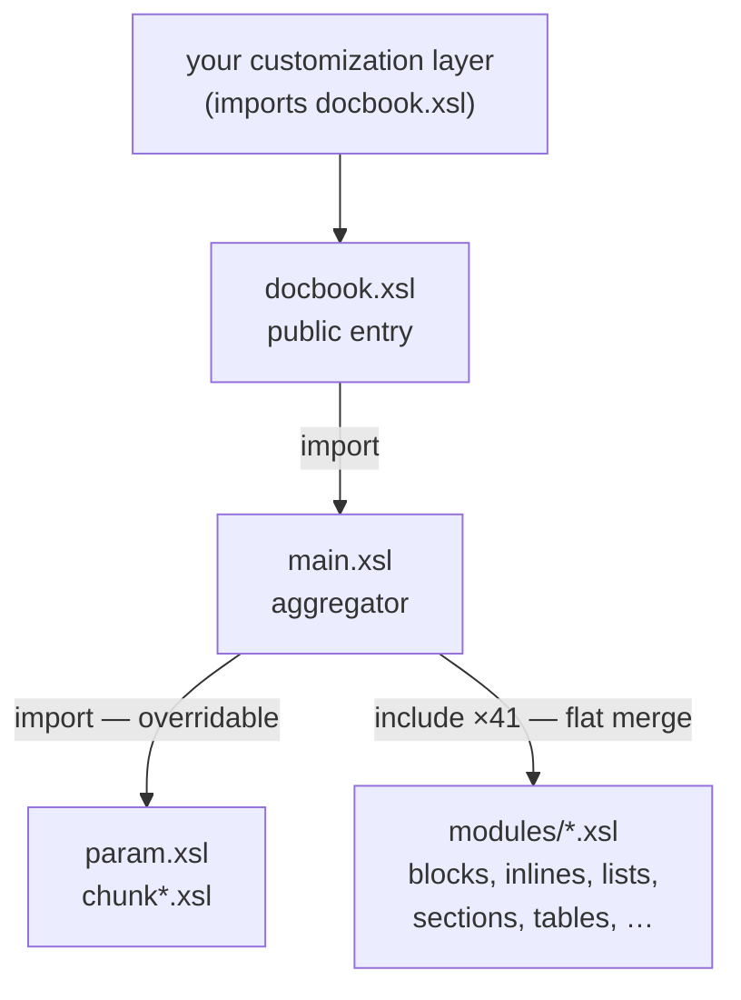

# XSLT at scale

Every other page in this section teaches one feature in isolation —
[functions](functions.md), [modes](modes.md), [maps](maps-and-arrays.md),
[packages](packages.md). This page does what the
[*UBL invoice in detail*](../einvoicing/ubl-invoice-detail.md) page does for a
data vocabulary: it takes a **real, maximal specimen** and walks it, so you can
see those features *deployed together* the way a working codebase uses them.

The specimen is the **DocBook xslTNG** stylesheets — the project that turns a
DocBook XML document into HTML, paged media, and EPUB. It is one of the largest
freely readable XSLT codebases in the world: a single entry stylesheet, an
import of one aggregator, and **48 modules** behind it. And it is written in
modern **XSLT 3.0**, so it is a guided tour of exactly the features this section
has been building toward.

!!! info "Source"
    [DocBook xslTNG](https://github.com/docbook/xslTNG) ("next generation"), by
    Norman Walsh — the XSLT 3.0 successor to the classic DocBook XSL
    stylesheets. Source under `src/main/xslt/`. MIT-licensed. All code shown here
    is quoted from the `main` branch; line counts and module names are from the
    repository as published. The companion
    [xslTNG reference guide](https://xsltng.docbook.org/) documents the
    extension points.

## Why a documentation toolkit is the right specimen

DocBook is a publishing pipeline. The same input — `<book>`, `<chapter>`,
`<section>`, `<para>`, `<programlisting>` — has to become clean HTML *and* paged
print *and* EPUB, while staying customizable by every project that adopts it.
That set of pressures is what forces a stylesheet to grow real structure:

- **Breadth of input.** DocBook has hundreds of elements. You cannot hold them
  in one file, so you get **modular decomposition** by concern.
- **Multiple outputs.** HTML vs. print vs. EPUB share most logic and differ at
  the edges — the textbook case for **import precedence** and overridable
  layers.
- **Third-party customization.** Thousands of downstream projects override a
  handful of things without forking. That demands a **public/private surface**.

Those three forces produce three architectural decisions, and the rest of this
page is each one in turn.

### The 1.0 → 3.0 evolution

The original DocBook XSL stylesheets (still widely used) are **XSLT 1.0**, and
the way they solve these problems is itself the lesson — by contrast. In 1.0:

- there is no `xsl:function`, so shared logic is **named templates called
  recursively** (string splitting, list joining, all hand-rolled);
- there are no maps, so lookup tables are elements you `key()` into or long
  `xsl:choose` ladders;
- modes are plain names with no namespace, so collisions are avoided by
  convention only;
- customization is **entirely** import precedence — override a `<xsl:param>` or
  a template in a layer that imports `docbook.xsl`.

xslTNG keeps the import-precedence backbone but replaces the hand-rolled parts
with the 3.0 toolkit. Watch for that swap as we go: every place 1.0 would
recurse, 3.0 calls a function or a map.

## The entry path

Three files form the spine. The file a user actually points Saxon at is
`docbook.xsl`, and it is deliberately tiny:

``` xml title="docbook.xsl (the public entry point)"
<xsl:stylesheet xmlns:xsl="http://www.w3.org/1999/XSL/Transform"
                version="3.0"
                exclude-result-prefixes="#all">

<xsl:import href="main.xsl"/>          <!-- (1)! -->

<xsl:mode name="mp:remove-ghosts"/>    <!-- (2)! -->

<!-- ...a few top-level hooks... -->
</xsl:stylesheet>
```

1.  The entry point **imports** the aggregator. Because it is an *import* (not an
    *include*), everything in `main.xsl` sits at **lower precedence** than rules
    written here — so this file, and anything that in turn imports *it*, can
    override the whole stylesheet. That is the customization layer, built into
    the front door. See [`xsl:include` vs `xsl:import`](reuse.md).
2.  Even the entry point declares its modes in a namespace (`mp:` = *modes,
    private*). More on that below.

`main.xsl` is the aggregator. Its header already shows two of the three big
decisions:

``` xml title="main.xsl (the aggregator)"
<xsl:stylesheet xmlns:xsl="http://www.w3.org/1999/XSL/Transform"
                version="3.0"
                default-mode="m:docbook"          <!-- (1)! -->
                exclude-result-prefixes="#all">

<xsl:import href="param.xsl"/>                     <!-- (2)! -->

<xsl:include href="modules/variable.xsl"/>         <!-- (3)! -->
<xsl:include href="modules/titles.xsl"/>
<xsl:include href="modules/sections.xsl"/>
<xsl:include href="modules/blocks.xsl"/>
<xsl:include href="modules/inlines.xsl"/>
<xsl:include href="modules/lists.xsl"/>
<!-- ...41 includes in all... -->

<xsl:import href="modules/chunk.xsl"/>             <!-- (4)! -->
<xsl:import href="modules/chunk-cleanup.xsl"/>
<xsl:import href="modules/chunk-output.xsl"/>
<xsl:import href="modules/xform-locale.xsl"/>
</xsl:stylesheet>
```

1.  A **declared default mode**. Instead of the anonymous default mode, the whole
    pipeline runs in a *named* mode, `m:docbook`. Every `apply-templates` with no
    `mode=` runs here. See [template modes](modes.md).
2.  `param.xsl` is **imported** — it holds the hundreds of overridable
    parameters, and import precedence is what lets a downstream layer replace any
    of them. Import = overridable.
3.  The 41 `xsl:include`s are the element-handling modules. Include = flat
    textual merge at the same precedence, because these are *not* meant to be
    individually overridden; they collectively *are* the stylesheet.
4.  The chunking strategy (how output is split across files) is **imported**, not
    included — and, in the real file, at the *bottom*. Textual position does not
    affect import precedence; what matters is that it arrives by `import`, so a
    project can swap the whole chunking scheme.



The split between `import` and `include` is not stylistic — it *is* the
extension model. Imports are the seams a downstream user is invited to cut along;
includes are welded shut.

## Decision 1 — namespaces partition the codebase

The single most striking thing in the headers above is that almost every name is
**prefixed**. xslTNG uses XML namespaces not just for the source vocabulary but
to carve the *stylesheet's own* names into labelled, access-controlled buckets:

| Prefix | Namespace role | Example |
|--------|----------------|---------|
| `db:`  | the **source** DocBook vocabulary | `db:section` |
| `f:` / `fp:`   | **f**unctions — public / private | `f:is-true()` |
| `m:` / `mp:`   | **m**odes — public / private | `m:docbook` |
| `t:` / `tp:`   | **t**emplates (named) — public / private | `t:titlepage` |
| `v:` / `vp:`   | **v**ariables / params — public / private | `v:bridgehead-map` |

This is how a 50-file codebase stays navigable. A name's prefix tells you, at a
glance, *what kind of thing it is* and *whether you are allowed to depend on it*.
The `p` (private) variants are the convention's teeth: `fp:` and `vp:` names are
internal plumbing that may change between releases; `f:` and `v:` names are the
promised, stable surface. XSLT has no `private` keyword — xslTNG manufactures one
out of namespaces.

XSLT 1.0 had none of this discipline available for functions (there were no
functions) and rarely used it for modes. The namespace-per-category convention
is a 2.0/3.0-era idiom, and at this scale it is essential rather than decorative.

## Decision 2 — modes are the dispatch backbone

The pipeline does not walk the tree once. It walks it many times, each pass in a
different **mode**, each mode a separate concern. The `default-mode="m:docbook"`
declaration makes the *main* walk implicit; the named modes are the specialised
passes. Here is a real section template:

``` xml title="modules/sections.xsl"
<xsl:template match="db:sect1|db:sect2|db:sect3|db:sect4|db:sect5
                     |db:section|db:simplesect">
  <section>
    <xsl:apply-templates select="." mode="m:attributes"/>          <!-- (1)! -->
    <xsl:apply-templates select="." mode="m:generate-titlepage"/>  <!-- (2)! -->
    <xsl:apply-templates/>                                         <!-- (3)! -->
  </section>
</xsl:template>
```

1.  Pass over *this same element* in `m:attributes` mode — a template elsewhere
    knows how to turn DocBook attributes into HTML `class`/`id`. The element is
    visited again, for one job.
2.  Another single-purpose pass: build the section's title block in
    `m:generate-titlepage` mode.
3.  *Then* the default `m:docbook` mode resumes on the children.

This is the structural pattern the [modes](modes.md) page introduces, scaled up:
a mode per cross-cutting job (attributes, titles, table-of-contents generation,
cross-reference text, chunk routing), and templates that fan a node out across
those modes. The 48 modules are *organised by element family* (a file per
concern: `blocks.xsl`, `inlines.xsl`, `lists.xsl`, `tablecals.xsl`,
`footnotes.xsl`, `xref.xsl`, …), and *connected by modes*. Files give you
locality; modes give you the wiring between them.

??? note "The 48 modules, by concern"
    Structure: `divisions.xsl`, `components.xsl`, `sections.xsl`,
    `blocks.xsl`, `lists.xsl`. Inline & text: `inlines.xsl`, `links.xsl`,
    `xlink.xsl`, `xref.xsl`, `space.xsl`, `verbatim.xsl`. Apparatus:
    `toc.xsl`, `footnotes.xsl`, `index.xsl`, `glossary.xsl`, `bibliography.xsl`,
    `biblio690.xsl`, `annotations.xsl`, `admonitions.xsl`. Reference docs:
    `refentry.xsl`, `msgset.xsl`, `programming.xsl`. Tables: `tablecals.xsl`
    (CALS model), `tablehtml.xsl` (HTML model). Titles & metadata:
    `titles.xsl`, `titlepage.xsl`, `info.xsl`, `head.xsl`, `publishers.xsl`.
    Machinery: `functions.xsl`, `templates.xsl`, `variable.xsl`, `attributes.xsl`,
    `numbers.xsl`, `units.xsl`, `gentext.xsl`, `l10n.xsl`, `errors.xsl`,
    `objects.xsl`, `highlight.xsl`, `unhandled.xsl`. Chunking & output:
    `chunk.xsl`, `chunk-cleanup.xsl`, `chunk-output.xsl`, `epub-chunk.xsl`,
    `epub-metadata.xsl`, `epub-tidy.xsl`, `xform-locale.xsl`.

## Decision 3 — functions replace recursion

Where the 1.0 stylesheets would call a named template and recurse, xslTNG calls
an `xsl:function`. `modules/functions.xsl` is a library of them, and the
`visibility` attribute makes the public/private contract real:

``` xml title="modules/functions.xsl"
<xsl:function name="f:is-true" as="xs:boolean" visibility="public">  <!-- (1)! -->
  <xsl:param name="value"/>
  <xsl:choose>
    <xsl:when test="empty($value)">
      <xsl:sequence select="false()"/>
    </xsl:when>
    <xsl:when test="$value castable as xs:boolean">
      <xsl:sequence select="xs:boolean($value)"/>
    </xsl:when>
    <xsl:when test="string($value) = ('true', 'yes')">
      <xsl:sequence select="true()"/>
    </xsl:when>
    <xsl:otherwise>
      <xsl:sequence select="false()"/>
    </xsl:otherwise>
  </xsl:choose>
</xsl:function>
```

1.  A typed (`as="xs:boolean"`), public function. `f:is-true('yes')`,
    `f:is-true(1)`, and `f:is-true(())` all answer the recurring "is this
    attribute switched on?" question in one call instead of a copy-pasted
    `xsl:choose` at every use site. See [user-defined functions](functions.md).

Functions also classify nodes — the kind of predicate that would otherwise be a
long disjunction repeated across templates:

``` xml title="modules/functions.xsl"
<xsl:function name="f:section" as="xs:boolean" visibility="public">
  <xsl:param name="node" as="element()"/>
  <xsl:sequence select="$node/self::db:section
                        or $node/self::db:sect1
                        or $node/self::db:sect2
                        or $node/self::db:sect3
                        or $node/self::db:sect4
                        or $node/self::db:sect5
                        or f:refsection($node)"/>
</xsl:function>
```

And lookup tables that 1.0 would build as elements become **maps**, queried with
`map:get`:

``` xml title="modules/sections.xsl (bridgehead, simplified)"
<xsl:when test="empty(map:get($v:bridgehead-map, $renderas))">
  <!-- not a known heading level: fall back to a div -->
</xsl:when>
<xsl:otherwise>
  <xsl:element name="{map:get($v:bridgehead-map, $renderas)}"/>  <!-- (1)! -->
</xsl:otherwise>
```

1.  `$v:bridgehead-map` maps a logical level (`"sect1"`) to an HTML element name
    (`"h2"`). A constant-time lookup replaces a `xsl:choose` ladder. See
    [maps and arrays](maps-and-arrays.md).

## Zooming out with `unxml --xslt`

The close-ups above are raw XSLT — the right way to *learn* a construct. But to
*read* a stylesheet at scale, the angle brackets get in the way: `xsl:include`,
`xsl:choose`/`xsl:when`, `xsl:value-of select="…"`, `xsl:function` with nested
`xsl:param` — all of it is ceremony around a little structure. [`unxml
--xslt`](https://github.com/vivainio/unxml-rs) (the same tool the
[real-world section](../realworld/index.md) uses to render schemas) rewrites that
ceremony into terse pseudocode, so a *wider* span of code fits on one screen. The
notation:

| `unxml --xslt` | XSLT it stands for |
|----------------|--------------------|
| `match X:`     | `xsl:template match="X"` |
| `apply` / `apply .` | `xsl:apply-templates` (of children / of self) |
| `<-- expr`     | `xsl:value-of` / `xsl:sequence select="expr"` |
| `name as T := …` | a typed `xsl:variable` / `xsl:param` |
| `function f:n(args) -> T:` | `xsl:function name="f:n" as="T"` |
| `@x`, `element {…}` | an attribute / computed element in the result |
| `choose: / when X: / else:` | `xsl:choose` / `xsl:when` / `xsl:otherwise` |

!!! info "Generated, not hand-written"
    Every rendered block below is the verbatim output of running the current
    `unxml` on the actual xslTNG source — which is how the module count and import
    order on this page were checked. It is genuinely faithful, not a paraphrase.

### The whole spine, in one view

`main.xsl` is 173 lines of XSLT. Rendered, its skeleton is a flat list — and the
**import-vs-include split is visible at a glance**: one import on top, the
element modules included, then the chunking strategy imported at the bottom.

``` text title="unxml --xslt main.xsl (the wiring, trimmed)"
  xsl:import(href="param.xsl")
  xsl:include(href="VERSION.xsl")
  xsl:include(href="modules/variable.xsl")
  xsl:include(href="modules/space.xsl")
  xsl:include(href="modules/unhandled.xsl")
  xsl:include(href="modules/errors.xsl")
  xsl:include(href="modules/head.xsl")
  xsl:include(href="modules/titles.xsl")
  xsl:include(href="modules/numbers.xsl")
  xsl:include(href="modules/units.xsl")
  xsl:include(href="modules/gentext.xsl")
  xsl:include(href="modules/l10n.xsl")
  xsl:include(href="modules/functions.xsl")
  xsl:include(href="modules/toc.xsl")
        … 28 more module includes …
  xsl:import(href="modules/chunk.xsl")
  xsl:import(href="modules/chunk-cleanup.xsl")
  xsl:import(href="modules/chunk-output.xsl")
  xsl:import(href="modules/xform-locale.xsl")
```

41 includes, 5 imports — and you can see at a glance *which is which*, the one
thing the raw `<xsl:stylesheet>` header buries under namespace declarations.

### A whole template, end to end

The simplified `bridgehead` snippet earlier showed only the `map:get` punchline.
Here is the **entire template** — the `renderas` variable's `choose` ladder *and*
the map dispatch — at a size that is hopeless to follow in raw XSLT but fits in a
screen here. Maps, modes, and a typed variable, all on one page:

``` text title="unxml --xslt --select xsl:template sections.xsl (bridgehead)"
match db:bridgehead:
  renderas as string :=
    choose:
      when @renderas:
        <-- @renderas/string()
      when parent::db:section:
        <-- 'sect' || (count(ancestor::db:section)+1)
      when parent::db:sect5:
        <-- 'sect5'
      when parent::db:sect1|parent::db:sect2|parent::db:sect3|parent::db:sect4:
        <-- 'sect' || (xs:integer(substring(local-name(parent::*), 5, 1)) + 1)
      when parent::db:article|parent::db:chapter|parent::db:appendix
                    |parent::db:preface|parent::db:partintro
                    |parent::db:part|parent::db:reference:
        <-- 'sect1'
      else:
        <-- 'block'
  choose:
    when empty(map:get($v:bridgehead-map, $renderas)):
      xsl:message(select="'Unknown bridgehead renderas:', $renderas")
      div
        apply .
        apply
    when map:get($v:bridgehead-map, $renderas) = 'div':
      div
        apply .
        apply
    else:
      element {map:get($v:bridgehead-map, $renderas)}:
        apply .
        apply
```

Read top to bottom: figure out a logical level (`sect1`…`sect5`, or `block`),
then map that level to an HTML element (`h2`…`h5`, or `div`) and emit it around
the processed content. That is one screen for a template that is ~50 lines of
angle brackets in the source — which is exactly the point of reading at scale
this way.

## Putting it together: how one element gets rendered

Trace `<db:section>` from input to HTML, and the whole architecture is visible at
once:

1.  Saxon starts on `/`. The root template (in `m:docbook`, the declared default
    mode) sets up the page and `apply-templates` into the body.
2.  It reaches `db:section`. The matching template lives in **`sections.xsl`**,
    found because that module was `xsl:include`d into `main.xsl`.
3.  That template fans the element out: a pass in **`m:attributes`** mode (HTML
    `class`/`id`), a pass in **`m:generate-titlepage`** mode (the heading), then
    the default mode on the children.
4.  Along the way, predicates like `f:section(.)` and switches like
    `f:is-true($numbered)` — functions from **`functions.xsl`** — and lookups in
    **`v:`** maps decide the details.
5.  If your project imported `docbook.xsl` and overrode `v:section-numbered` or
    the section template, **import precedence** silently selected your version
    instead — without you touching any of the 48 modules.

Every feature in this section is on that path: a declared mode, mode dispatch,
typed functions, maps, import precedence, namespaced names.

## What to take from it

You will rarely write something this large, but the same five moves scale *down*
to any stylesheet past a few hundred lines:

- **Split by concern into modules**, and wire them with `xsl:include`. One file,
  one element family.
- **Keep a thin, importable entry point.** Put the parts users override
  (parameters, a few key templates) behind `xsl:import` so import precedence does
  the overriding for free.
- **Use a declared default mode**, and a named mode per cross-cutting pass,
  instead of overloading the anonymous mode.
- **Lift repeated logic into typed `xsl:function`s**, and mark the internal ones
  `private` (or by `fp:` convention) so the public surface is small.
- **Make lookup tables maps**, not `xsl:choose` ladders.

The DocBook *format itself* — what those `<section>`s and `<para>`s mean as an
XML vocabulary, and the single-source-to-many-outputs idea behind it — is a
[chapter of its own](../realworld/docbook.md) in the real-world applications
section. This page was about the *engine*; that one is about the *language* it
consumes.
