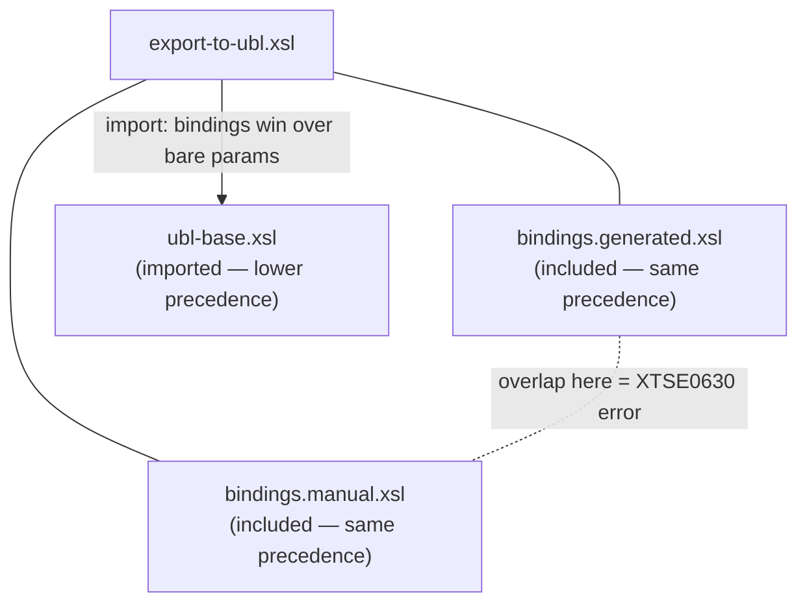

# Case study: generated + hand-written mappings

[Reusing stylesheets](reuse.md) showed *how* `xsl:include` and `xsl:import`
compose top-level declarations. This page is a worked architecture for a problem
they solve together: a transformation where **most of the code is machine-generated
and a minority is hand-written**, and the two must coexist without ever clobbering
each other.

The setting is a format mapping — turning some source vocabulary into a
[UBL](../einvoicing/ubl-invoice.md) invoice by binding named business terms. It is
the shape behind every [e-invoicing](../einvoicing/index.md) converter, but the
lesson is general: any time you generate the boring 90% of a stylesheet from a
spec and hand-write the interesting 10%, this is how you wire them.

## The problem

The source here is a flat legacy export; the target is UBL. Each source binds the
same set of canonical terms — *invoice id*, *currency*, *seller name*,
*payable total*, *issue date*, *tax category* — to wherever they live in the
source tree. Most bindings are mechanical: term → XPath, one line each. A few need
real logic: a date split across separate year/month/day elements has to be
reassembled into an `xs:date`; a source rate has to be translated to a UBL tax
category code. So you split the work:

- a **generator** emits the mechanical bindings from a mapping spreadsheet — the
  bulk, regenerated whenever the spec changes;
- a **human** writes the handful that need logic.

Two requirements fall out of that split, and they pull in opposite directions:

1.  **Regenerating must never touch hand-written code.** The two live in
    separate files.
2.  **Accidental overlap must be caught, not swallowed.** If the generator starts
    emitting a term you also hand-wrote, you want to be *told* — not have one
    silently win while the other rots.

Requirement 2 is the one that decides `include` vs `import`.

## Two tools, two jobs

| | `xsl:include` | `xsl:import` |
| --- | --- | --- |
| Role | **partition** — disjoint files, no overlap | **layer** — one file overrides another |
| Precedence of pulled-in code | **same** as host | **lower** than host |
| Same-name declaration in two files | **static error** (`XTSE0630`) | resolved silently by precedence |

The generated and hand-written binding files are a **partition** — every term is
declared in exactly one of them. That is `include` territory, and the
"duplicate global parameter" error is exactly the guardrail requirement 2 asks
for. The shared scaffold underneath is a **layer** the bindings override, so it
comes in by `import`. One real stylesheet uses both.

## The pieces

### 1. The scaffold — hand-authored, imported

It owns all the UBL output and declares each term as a **bare parameter with no
`select`** (the pattern from [reuse.md](reuse.md#worked-example-override-parameters-not-templates)).
It is the lowest layer, so everything else overrides it.

``` xml title="ubl-base.xsl" linenums="1"
<?xml version="1.0" encoding="UTF-8"?>
<xsl:stylesheet version="3.0"
                xmlns:xsl="http://www.w3.org/1999/XSL/Transform"
                xmlns:xs="http://www.w3.org/2001/XMLSchema"
                xmlns="urn:oasis:names:specification:ubl:schema:xsd:Invoice-2"
                xmlns:cbc="urn:oasis:names:specification:ubl:schema:xsd:CommonBasicComponents-2"
                xmlns:cac="urn:oasis:names:specification:ubl:schema:xsd:CommonAggregateComponents-2"
                expand-text="yes">

  <xsl:output method="xml" indent="yes"/>

  <!-- Every canonical term: a named slot, no value of its own. -->
  <xsl:param name="invoice-id"   as="xs:string?"/>
  <xsl:param name="currency"     as="xs:string?"/>
  <xsl:param name="seller-name"  as="xs:string?"/>
  <xsl:param name="total"        as="xs:decimal?"/>
  <xsl:param name="issue-date"   as="xs:date?"/>
  <xsl:param name="tax-category" as="xs:string?"/>

  <xsl:template match="/">                          <!-- (1)! -->
    <Invoice>
      <xsl:if test="exists($invoice-id)"><cbc:ID>{$invoice-id}</cbc:ID></xsl:if>
      <xsl:if test="exists($issue-date)"><cbc:IssueDate>{$issue-date}</cbc:IssueDate></xsl:if>
      <xsl:if test="exists($currency)"><cbc:DocumentCurrencyCode>{$currency}</cbc:DocumentCurrencyCode></xsl:if>
      <xsl:if test="exists($seller-name)">
        <cac:AccountingSupplierParty><cac:Party><cac:PartyName>
          <cbc:Name>{$seller-name}</cbc:Name>
        </cac:PartyName></cac:Party></cac:AccountingSupplierParty>
      </xsl:if>
      <xsl:if test="exists($tax-category)">
        <cac:TaxTotal><cac:TaxSubtotal><cac:TaxCategory>
          <cbc:ID>{$tax-category}</cbc:ID>
        </cac:TaxCategory></cac:TaxSubtotal></cac:TaxTotal>
      </xsl:if>
      <xsl:if test="exists($total)">
        <cac:LegalMonetaryTotal>
          <cbc:PayableAmount currencyID="{$currency}">{$total}</cbc:PayableAmount>
        </cac:LegalMonetaryTotal>
      </xsl:if>
    </Invoice>
  </xsl:template>

</xsl:stylesheet>
```

1.  The only output template in the whole system lives here. An unbound term hits
    its `exists()` guard and emits nothing — so a source that binds half the
    terms produces a valid partial result, no errors.

### 2. The generated bindings — the bulk, machine-emitted

A flat list of `xsl:param` with `select`, one per mechanical term. Nothing in
this file is ever edited by hand; it is overwritten on every regeneration.

``` xml title="bindings.generated.xsl  (DO NOT EDIT — generated from mapping.csv)" linenums="1"
<?xml version="1.0" encoding="UTF-8"?>
<xsl:stylesheet version="3.0"
                xmlns:xsl="http://www.w3.org/1999/XSL/Transform"
                xmlns:xs="http://www.w3.org/2001/XMLSchema">

  <xsl:param name="invoice-id"  select="/export/invoice/number"/>
  <xsl:param name="currency"    select="/export/invoice/currency"/>
  <xsl:param name="seller-name" select="/export/seller/name"/>
  <xsl:param name="total"       select="xs:decimal(/export/totals/gross)"/>

</xsl:stylesheet>
```

### 3. The hand-written bindings — the rest, with logic

The two terms the generator can't produce: `issue-date` needs three elements
reassembled into an `xs:date`, `tax-category` needs a rate translated to a UBL
code. These are written by hand and live in their own file, **disjoint** from the
generated one.

``` xml title="bindings.manual.xsl" linenums="1"
<?xml version="1.0" encoding="UTF-8"?>
<xsl:stylesheet version="3.0"
                xmlns:xsl="http://www.w3.org/1999/XSL/Transform"
                xmlns:xs="http://www.w3.org/2001/XMLSchema"
                xmlns:m="urn:example:map"
                exclude-result-prefixes="xs m">

  <xsl:function name="m:date" as="xs:date">         <!-- (1)! -->
    <xsl:param name="d" as="element()"/>
    <xsl:sequence select="xs:date(string-join(
      ($d/year, format-number($d/month, '00'), format-number($d/day, '00')), '-'))"/>
  </xsl:function>

  <xsl:param name="issue-date"
             select="m:date(/export/invoice/date)"/>          <!-- (2)! -->
  <xsl:param name="tax-category"
             select="if (xs:decimal(/export/invoice/vat-rate) gt 0) then 'S' else 'Z'"/>

</xsl:stylesheet>
```

1.  Logic the generator has no business emitting — a helper function. It lives
    here because this is the hand-written file; the generated file stays a pure
    term → XPath table.
2.  These two params are *not* in `bindings.generated.xsl`. Each term is declared
    exactly once across the two files — that is the partition.

### 4. Wiring it together — `import` the scaffold, `include` the bindings

``` xml title="export-to-ubl.xsl" linenums="1"
<?xml version="1.0" encoding="UTF-8"?>
<xsl:stylesheet version="3.0"
                xmlns:xsl="http://www.w3.org/1999/XSL/Transform">

  <xsl:import  href="ubl-base.xsl"/>             <!-- (1)! -->

  <xsl:include href="bindings.generated.xsl"/>   <!-- (2)! -->
  <xsl:include href="bindings.manual.xsl"/>      <!-- (3)! -->

</xsl:stylesheet>
```

1.  **Import** — the scaffold drops to *lower* precedence, so the bindings below
    override its bare params. (`import` must come before any `include`.)
2.  **Include** — the generated bindings join at *this* module's precedence:
    higher than the scaffold (so they win over its empty params), equal to…
3.  …the hand-written bindings, also **included** here. Equal precedence is the
    whole point — if a term ever appears in *both* included files, that is a
    same-precedence collision and a **static error**.



The generated and hand-written files sit **side by side** at equal precedence —
that is the partition, and overlap between them is an error. The scaffold sits
**below** them by import — that is the layer the bindings are allowed to override,
silently and by design. Two relationships, two mechanisms, in four lines.

## The guardrail in action

Suppose the mapping spreadsheet gains a `tax-category` row, so the generator now
emits it too — while you still have it by hand. Both included files declare
`tax-category` at the same import precedence, and Saxon refuses to compile:

``` text title="saxon ... -xsl:export-to-ubl.xsl"
Static error in stylesheet:
  XTSE0630: Duplicate global parameter declaration: a global parameter named
  'tax-category' has already been declared (bindings.generated.xsl line 6)
  at xsl:param on line 14 of bindings.manual.xsl
```

That is requirement 2 satisfied: the drift is caught at compile time, naming both
files and both lines, before a single invoice is transformed. With `import` instead
of `include`, one declaration would have silently shadowed the other and the
conflict would have shipped.

!!! warning "Why not `import` everywhere?"
    `import` looks more flexible — it never errors on overlap. That flexibility is
    exactly what you *don't* want between generated and hand-written code: a
    silent winner hides the fact that they now disagree. Reach for `include`
    precisely *because* it is strict. Use `import` only where you genuinely mean
    "this layer overrides that one."

## When you *do* want to override a generated term

Sometimes the generated binding is wrong for one source and you want to replace
it by hand — *without* editing the generated file. That is a genuine override, so
it is an `import` layer, not a partition. Keep the include-based file as-is and
stack one more module **on top**:

``` xml title="export-to-ubl-custom.xsl" linenums="1"
<?xml version="1.0" encoding="UTF-8"?>
<xsl:stylesheet version="3.0"
                xmlns:xsl="http://www.w3.org/1999/XSL/Transform"
                xmlns:xs="http://www.w3.org/2001/XMLSchema">

  <xsl:import href="export-to-ubl.xsl"/>              <!-- (1)! -->

  <xsl:param name="total" select="xs:decimal(/export/totals/gross-adjusted)"/>  <!-- (2)! -->

</xsl:stylesheet>
```

1.  Everything from before — scaffold, generated, manual — drops to lower
    precedence as one combined unit.
2.  Re-bind `total`. This sits *above* the included `total` from
    `bindings.generated.xsl`, so it wins by precedence — **no error**, because the
    two are now at different precedences. The generated file is untouched.

The decision in one line: **same job, no overlap → `include` and let the error
guard you; deliberately replacing a lower layer → `import` and let precedence
resolve it.** A real converter often does both — `include` the disjoint bulk,
then `import` a thin override layer for the few exceptions.

## Why this shape is generator-friendly

The generated file is nothing but `<xsl:param name="…" select="…"/>` lines — a
flat *term → XPath* table with no control flow, no templates, no ordering
constraints among the lines. That is about the easiest XSLT there is to emit from
a spreadsheet, a CSV, or a few lines of script. Everything that needs judgment —
the UBL output structure and its types (the scaffold), the bindings with logic
(`bindings.manual.xsl`) — stays hand-written and out of the generator's way. The
two halves meet only at parameter *names*, and the `include` guardrail keeps that
contract honest as both sides evolve.

## Next

[XSLT at scale](at-scale.md) is the companion to this page: there you *read* a
50-module stylesheet (DocBook xslTNG) and see import precedence used as a
customization surface across a large real codebase; here you *build* a small one
where generated and hand-written code share the same precedence rules.
