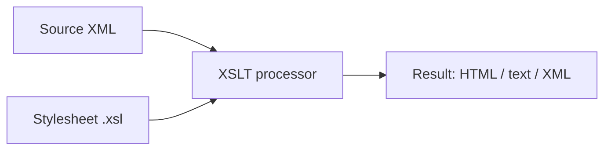

# XSLT Tutorial

**XSLT** (Extensible Stylesheet Language Transformations) is a language for
transforming XML documents into other formats — most commonly HTML for display
in a browser, but also plain text or a different shape of XML.

You write a *stylesheet*: a set of rules that an XSLT processor applies to a
*source document* to produce a *result document*.



## XSLT versions

- **1.0** is universally supported — every browser and processor handles it.
- **2.0 / 3.0** add grouping, regular expressions, and a much richer function
  library, but need a processor like Saxon.

This tutorial is 1.0 unless noted, so the examples run anywhere.

## The running example

Every page in this tutorial transforms the same little CD catalog, so you can
focus on the XSLT rather than re-learning the data each time.

``` xml title="catalog.xml"
<?xml version="1.0" encoding="UTF-8"?>
<catalog>
  <cd>
    <title>Empire Burlesque</title>
    <artist>Bob Dylan</artist>
    <price>10.90</price>
  </cd>
  <cd>
    <title>Hide your heart</title>
    <artist>Bonnie Tyler</artist>
    <price>9.90</price>
  </cd>
  <cd>
    <title>Greatest Hits</title>
    <artist>Dolly Parton</artist>
    <price>9.90</price>
  </cd>
</catalog>
```

## Where to go next

1. [Your first transformation](first-transformation.md) — the smallest complete stylesheet.
2. [Templates](templates.md) — splitting rules per element with `apply-templates`.
3. [Named templates and parameters](named-templates.md) — reusable routines you call by name.
4. [Variables](variables.md) — binding values and node-sets with `xsl:variable`.
5. [Loops and output](loops-and-output.md) — `for-each` and `value-of`.
6. [Conditionals](conditionals.md) — `if`, and `choose`/`when`/`otherwise`.
7. [XPath predicates](predicates.md) — filtering node selections with `[…]`.
8. [String functions](strings.md) — `concat`, `substring`, `translate`, `normalize-space`, …
9. [Producing XML output](output.md) — `xsl:output`, namespaces, `xsl:copy`, the identity transform.
10. [Sorting](sorting.md) — ordering output with `xsl:sort`.
11. [Number formatting](number-formatting.md) — `format-number` and `xsl:decimal-format`.
12. [Whitespace and xsl:text](whitespace.md) — controlling the spaces and newlines in your output.
13. [Template modes](modes.md) — processing the same nodes several ways.
14. [Reusing stylesheets](reuse.md) — `xsl:include` and `xsl:import`.
15. [External documents](external-documents.md) — lookups with `document()`.

### XSLT 2.0 & 3.0

16. [Moving to XSLT 2.0 and 3.0](moving-to-3.md) — sequences, the `as=` type system, what changed.
17. [User-defined functions](functions.md) — `xsl:function`, callable from any XPath.
18. [Grouping](grouping.md) — `xsl:for-each-group`, `current-group()`.
19. [Regular expressions and strings](regex.md) — `tokenize`, `replace`, `xsl:analyze-string`.
20. [Modern identity and text](modern-identity.md) — `on-no-match="shallow-copy"`, text value templates.
21. [Reading and writing JSON](json.md) — `parse-json`, maps & arrays, the `?` operator, `method="json"`.
