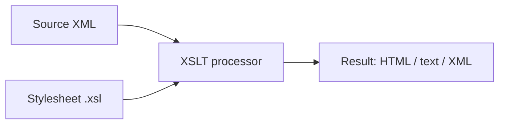

# XSLT Tutorial

**XSLT** (Extensible Stylesheet Language Transformations) is a language for
transforming XML documents into other formats — most commonly HTML for display
in a browser, but also plain text or a different shape of XML.

You write a *stylesheet*: a set of rules that an XSLT processor applies to a
*source document* to produce a *result document*.



## XSLT versions

- **1.0** is universally supported — every browser and processor handles it.
- **2.0 / 3.0** add grouping, regular expressions, and a much richer function
  library, but need a processor like Saxon.

This tutorial is 1.0 unless noted, so the examples run anywhere.

## The running example

Every page in this tutorial transforms the same little CD catalog, so you can
focus on the XSLT rather than re-learning the data each time.

``` xml title="catalog.xml"
<?xml version="1.0" encoding="UTF-8"?>
<catalog>
  <cd>
    <title>Empire Burlesque</title>
    <artist>Bob Dylan</artist>
    <price>10.90</price>
  </cd>
  <cd>
    <title>Hide your heart</title>
    <artist>Bonnie Tyler</artist>
    <price>9.90</price>
  </cd>
  <cd>
    <title>Greatest Hits</title>
    <artist>Dolly Parton</artist>
    <price>9.90</price>
  </cd>
</catalog>
```

## Where to go next

1. [Your first transformation](first-transformation.md) — the smallest complete stylesheet.
2. [Templates](templates.md) — splitting rules per element with `apply-templates`.
3. [Loops and output](loops-and-output.md) — `for-each` and `value-of`.
4. [Conditionals](conditionals.md) — `if`, and `choose`/`when`/`otherwise`.
5. [Sorting](sorting.md) — ordering output with `xsl:sort`.
