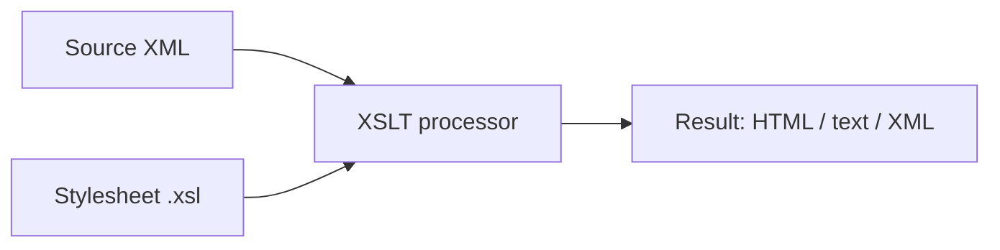

# XSLT Tutorial

**XSLT** (Extensible Stylesheet Language Transformations) is a language for
transforming XML documents into other formats — most commonly HTML for display
in a browser, but also plain text or a different shape of XML.

You write a *stylesheet*: a set of rules that an XSLT processor applies to a
*source document* to produce a *result document*.


```mermaid
flowchart LR
  X[Source XML] --> P[XSLT processor]
  S[Stylesheet .xsl] --> P
  P --> R[Result: HTML / text / XML]
```

## XSLT versions

- **1.0** has the broadest processor support and is the common portability
  baseline. Browsers historically included it, but native browser XSLT is now
  being deprecated and removed; use a dedicated processor for a dependable
  workflow.
- **2.0 / 3.0** add grouping, regular expressions, and a much richer function
  library, but need a processor like Saxon.

This tutorial is 1.0 unless noted, so the examples run with any conforming XSLT
processor and do not lock you to one implementation.

## The running example

Most pages in this tutorial transform the same little CD catalog, so you can
focus on the XSLT rather than re-learning the data each time. A few chapters
extend it with one or two fields when the topic needs them — for example, a
`genre` attribute for filtering or an optional `year` element for existence
tests. Those additions are always shown at the point where they are introduced;
the basic shape remains the same.

``` xml title="catalog.xml"
<?xml version="1.0" encoding="UTF-8"?>
<catalog>
  <cd>
    <title>Empire Burlesque</title>
    <artist>Bob Dylan</artist>
    <price>10.90</price>
  </cd>
  <cd>
    <title>Hide your heart</title>
    <artist>Bonnie Tyler</artist>
    <price>9.90</price>
  </cd>
  <cd>
    <title>Greatest Hits</title>
    <artist>Dolly Parton</artist>
    <price>9.90</price>
  </cd>
</catalog>
```

## Where to go next

1. [Your first transformation](first-transformation.md) — the smallest complete stylesheet.
2. [Templates](templates.md) — splitting rules per element with `apply-templates`.
3. [Loops and output](loops-and-output.md) — `for-each`, `value-of`, and computed attributes.
4. [Variables](variables.md) — binding values and node-sets with `xsl:variable`.
5. [Conditionals](conditionals.md) — `if`, and `choose`/`when`/`otherwise`.
6. [XPath predicates](predicates.md) — filtering node selections with `[…]`.
7. [Named templates and parameters](named-templates.md) — reusable routines, arguments, and recursion.
8. [String functions](strings.md) — `concat`, `substring`, `translate`, `normalize-space`, …
9. [Producing XML output](output.md) — `xsl:output`, namespaces, `xsl:copy`, the identity transform.
10. [Sorting](sorting.md) — ordering output with `xsl:sort`.
11. [Number formatting](number-formatting.md) — `format-number` and `xsl:decimal-format`.
12. [Whitespace and xsl:text](whitespace.md) — controlling the spaces and newlines in your output.
13. [Template modes](modes.md) — processing the same nodes several ways.
14. [Reusing stylesheets](reuse.md) — `xsl:include` and `xsl:import`.
15. [External documents](external-documents.md) — lookups with `document()`.
16. [Keys and indexed lookup](keys.md) — `xsl:key` and `key()`, the scalable join.

Those sixteen pages are **XSLT 1.0** — they run in any conforming processor.
The examples do not rely on 2.0/3.0-only instructions. Some current browsers
can still run them natively, but browser vendors are removing that facility, so
browser execution is not the portability promise this tutorial relies on.

When you are comfortable with them, the
[**Modern XSLT (2.0 & 3.0)**](moving-to-3.md) section picks up where they leave
off: sequences and a real type system, `xsl:function`, grouping, regular
expressions, JSON, streaming, packages, and the rest of what a current processor
like Saxon adds. It also contains the
[case study on reusing match templates](reuse-templates.md), which begins with
the 1.0 instruction `xsl:apply-imports` but continues to the 2.0
`xsl:next-match`; keeping it in the modern section makes that version boundary
explicit. Start at [Moving to XSLT 2.0 and 3.0](moving-to-3.md).
